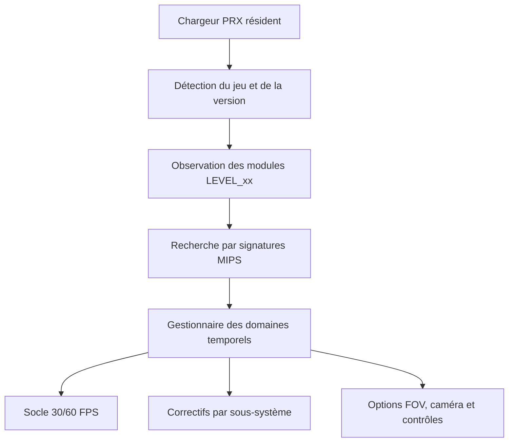
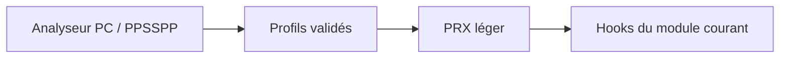
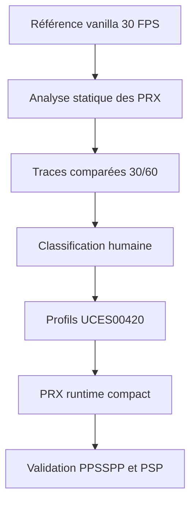

# Système PRX MIPS

Source: https://chatgpt.com/c/6a86dce7-2998-83eb-bf81-229c2835c35d

Messages historiques : les instructions ci-dessous appartiennent aux anciens échanges.
Les pièces jointes ne sont pas incluses dans cet export.

## Tour a304dc09-559b-4fe6-a4a4-78e2313738cc

### Utilisateur

Hello, j'aimerais aborder une autre branche de solution qui pourrait être intéressante? On en a déjà parlé plus tôt dans une conversation mais récemment GOG a sorti un patch pour Prince of Persia : The Sands of Time qui débloque le framerate et plusieurs autres fonctionnalités grâce à un wrapper DirectX qui serait, selon leurs dires "game-agnostic" donc qui pourrait être porté sur d'autres jeux PC soumis aux mêmes contraintes (framerate fixe, animations et éléments de jeu liés au framerate et à des ticks fixes, etc.).

https://www.youtube.com/watch?v=1XgvnwCs2Cw
https://www.neowin.net/news/gog-updates-prince-of-persia-sands-of-time-for-modern-pcs/

Le patch note :
181 GOG v2 (18 August 2026)

- Implemented a lightweight wrapper to resolve modern hardware incompatibilities.
- Added native widescreen and ultrawide support for all modern resolutions and aspect ratios.
- Implemented camera scaling that automatically adjusts the field of view (FOV) based on monitor aspect ratio.
- Added a multi-monitor mouse lock option to confine the cursor to the game window.
- Added an FPS limiter to lock the frame rate to a chosen value.
- Introduced a lightweight, real-time in-game overlay (press **F11 to open, ESC to close**) for instant adjustments to FPS limits and FOV multipliers.
- Locked the main menu to its original 4:3 bounds to preserve hard-coded UI assets.
- Capped the manual FOV slider at roughly 110% on ultrawide displays to prevent engine stretching and graphical glitches.
- Verified stability.
- Verfiied controller support.

L'idée serait de voir si un système PRX/MIPS pourrait fonctionner pour des jeux PSP comme Size Matters qui ont un paquet de logiques liées au framerate.

### Assistant

Oui, cette branche est crédible — et notre dispatcher persistant en constitue déjà un embryon. La forme réaliste ne serait toutefois pas un « wrapper universel du temps » capable de rendre automatiquement n’importe quel jeu PSP indépendant du framerate, mais une couche PRX réutilisable chargée de détecter les modules, d’appliquer des hooks MIPS et d’orchestrer plusieurs domaines temporels selon un profil propre à chaque jeu.

## Ce que signifie probablement « game-agnostic » chez GOG

Le terme employé par GOG peut être trompeur. Les informations publiques décrivent une architecture de wrapper réutilisable, avec gestion des résolutions, du FOV, de la limitation du framerate, de l’overlay et de certains problèmes de compatibilité DirectX ; elles ne démontrent pas qu’un algorithme générique aurait automatiquement identifié et corrigé toutes les animations ou logiques liées aux frames. [Neowin](https://www.neowin.net/news/gog-updates-prince-of-persia-sands-of-time-for-modern-pcs/) parle bien d’une « reusable platform », tandis que [Polygon](https://www.polygon.com/prince-of-persia-sands-of-time-gog-preservation-program-widescreen-support/) reprend la qualification « game-agnostic ».

Il faut vraisemblablement comprendre deux étages :

- un socle générique intercepte DirectX, fournit l’overlay, le stockage des options, le limiteur et les outils de manipulation de la caméra ;
- un profil spécifique à *Sands of Time* indique où trouver les paramètres du jeu, quelles valeurs modifier et quelles limites respecter.

Le simple fait que le menu demeure volontairement en 4:3 et que le FOV ultrawide soit plafonné montre déjà que le wrapper contient des règles particulières au jeu. Sa plomberie est générique ; sa connaissance du comportement attendu ne l’est pas.

## L’équivalent PSP serait possible

Sur PPSSPP, un plugin PRX peut être chargé pour un identifiant de jeu donné, lire et modifier la RAM, injecter des hooks et utiliser les mêmes fonctions utilisateur que le jeu. PPSSPP précise toutefois qu’il ne prend pas en charge les plugins PSP traditionnels dépendant étroitement du kernel : il utilise des PRX conçus spécialement pour l’émulateur, installés dans `PSP/PLUGINS`. [La documentation officielle de PPSSPP](https://www.ppsspp.org/docs/reference/plugins/) cite justement des plugins ajoutant widescreen, framerate amélioré et second stick.

Sur une vraie PSP sous CFW, une architecture apparentée reste possible, mais elle nécessite généralement un bootstrap kernel pour charger un module utilisateur. [PSPModBase](https://github.com/xan1242/PSPModBase) fournit déjà ce double modèle PSP/PPSSPP et des bibliothèques d’injection MIPS. Les correctifs PPSSPP de ThirteenAG montrent également l’usage concret de signatures binaires, de remplacements de `jal`, de wrappers inline et d’une invalidation des caches après modification du code, par exemple dans [The Warriors FusionFix](https://github.com/ThirteenAG/WidescreenFixesPack/blob/master/source/TheWarriors.PPSSPP.FusionFix/main.c).

La différence fondamentale avec DirectX demeure néanmoins importante :

| Wrapper DirectX PC | Couche PRX/MIPS PSP |
|---|---|
| Intercepte une API graphique stable entre le jeu et Windows | Intervient dans le code MIPS propre au jeu |
| Peut remplacer la création de fenêtre, les modes vidéo et la présentation des frames | Peut neutraliser le VBlank, modifier le delta et hooker les routines internes |
| Dispose d’une frontière graphique relativement universelle | Ne dispose d’aucune API universelle pour la simulation, les armes ou les animations |
| Une DLL peut rester chargée durant toute l’exécution | Les `LEVEL_xx.PRX` sont chargés, relocalisés et remplacés |
| Le socle est largement partagé entre jeux | Le moteur d’injection est partagé, mais les signatures et les corrections restent spécifiques |

## Ce que montrent les fichiers de *Size Matters*

J’ai vérifié les modules fournis dans `BIN`. Il s’agit bien de PRX ELF 32 bits MIPS relocalables, avec un module `FRONTEND.PRX` et les modules `LEVEL_01.PRX` à `LEVEL_24.PRX`; tous ceux présents importent `sceDisplay` et `ThreadManForUser`, tandis que treize modules de niveau importent également `sceRtc`.

Cela nous donne trois enseignements :

1. L’interception de `sceDisplay` pourrait contrôler la présentation des images et le VBlank, mais pas corriger à elle seule le gameplay. Si nous supprimons simplement l’attente pour obtenir 60 FPS, les systèmes comptant une unité par frame continuent de progresser deux fois plus vite.

2. L’interception de `sceRtc` serait encore moins suffisante. Certaines parties utilisent vraisemblablement un temps réel ou un delta moteur, tandis que d’autres reposent sur des compteurs locaux, des incréments constants, des boucles exécutées deux fois et des dégâts appliqués à chaque appel.

3. Les WAD et les PAK du HUD seront utiles pour le FOV, le menu et un éventuel overlay intégré visuellement, mais le cœur de la correction temporelle se trouve dans l’EBOOT et les `LEVEL_xx.PRX`. Il n’est donc pas nécessaire de « wrapper le WAD » pour maîtriser le framerate.

## L’architecture que je retiendrais



Le chargeur resterait actif pendant toute la session. Lorsqu’un niveau est chargé, il identifierait le module par son nom, sa taille, son empreinte et plusieurs signatures MIPS, puis appliquerait le profil correspondant après relocation et avant ou juste après son initialisation.

Le gestionnaire temporel ne fournirait pas un unique multiplicateur, mais plusieurs notions de temps :

- `render_dt` : rythme de rendu, typiquement `1/60` ;
- `simulation_dt` : delta général du monde ;
- `legacy_tick` : tick logique vanilla équivalent à `1/30` ;
- `frame_scale` : rapport entre framerate vanilla et framerate cible ;
- compteurs ou accumulateurs spécialisés pour les dégâts continus, les particules et les animations.

Cette séparation est capitale pour *Size Matters*. Nous savons déjà que le jeu combine delta temporel, nombres de passes, compteurs de frames, incréments constants et appels répétés : remplacer partout `1/30` par `1/60` ne peut pas préserver tous ces comportements.

## Notre dispatcher actuel est déjà la première version de cette couche

Le dispatcher persistant que nous avions construit remplit une partie de cette fonction :

- hook EBOOT à `0x08806DA4` ;
- routine résidente à `0x08802000` ;
- table de patchs à `0x08802080` ;
- index du module courant à `0x08841120` ;
- application des écritures après chargement et relocation du PRX, avant son initialisation.

Sa faiblesse actuelle n’est pas conceptuelle : il est limité à une table statique et au module index `1`, donc à Pokitaru. Pour devenir un véritable wrapper PRX, il faudrait remplacer la simple table d’adresses par un moteur comprenant des profils, des recherches par signatures, des hooks typés et un suivi de l’état des modules.

Le résultat pourrait alors être beaucoup plus robuste qu’un énorme fichier CWCheat. Il saurait notamment vérifier le mot vanilla avant chaque écriture, refuser un profil incompatible, produire un journal de diagnostic et restaurer proprement son propre état lors d’un changement de niveau.

## Le cas des 55 appels du wrapper global

La neutralisation de la deuxième passe du wrapper partagé à `0x09148094` couvrait environ 55 appels directs. Cette variante est séduisante parce qu’une modification unique normalise automatiquement beaucoup d’objets, mais elle peut aussi toucher la navigation, la caméra, les rotations, certains ennemis et des éléments de décor qui n’ont pas encore été validés.

Une couche PRX ne supprimerait pas ce risque par magie. En revanche, elle permettrait de transformer ce wrapper aveugle en wrapper sélectif :

1. Le hook intercepte l’appel partagé.
2. Il récupère l’adresse de retour, l’identité de la classe ou le pointeur de l’objet.
3. Il consulte une table de politiques.
4. Il exécute une ou deux passes selon le sous-système identifié.
5. Les cas inconnus conservent par défaut le comportement vanilla ou utilisent une politique de test explicite.

L’adresse de retour est particulièrement intéressante : elle permet de distinguer les quelque 55 sites appelants sans devoir nécessairement reconnaître parfaitement chaque objet à l’exécution. Nous pouvons donc dresser statiquement la liste des `jal` vers le wrapper, attribuer une catégorie à chacun, puis laisser le PRX décider dynamiquement du nombre de passes.

Cela constituerait une amélioration nette par rapport aux deux solutions déjà testées :

- le wrapper global, compact mais trop large ;
- les 15 `Local JAL`, sûrs mais fastidieux et incomplets.

La nouvelle solution serait un wrapper global dans son emplacement, mais local dans sa politique.

## Pour les armes et les dégâts continus

Les armes illustrent parfaitement pourquoi il faut plusieurs politiques temporelles. Une arme qui tire un projectile toutes les 15 frames, un laser qui applique des dégâts à chaque update et une mine dont le rayon s’étend par incrément fixe ne peuvent pas être corrigés avec la même opération.

Le plugin pourrait fournir trois modèles :

- **cadence normalisée** : les cooldowns utilisent un temps ou un compteur adapté au framerate cible ;
- **dégâts normalisés** : `damage_per_update` est multiplié par `30 / FPS` ;
- **tick vanilla accumulé** : la logique de dégâts n’est déclenchée qu’à chaque tranche virtuelle de `1/30` seconde, même si le rendu tourne à 60 FPS.

Le troisième modèle est souvent le plus fidèle lorsque la fonction produit plusieurs effets secondaires simultanés — dégâts, son, particules, recul et détection de collision. Diviser uniquement les dégâts par deux préserverait le DPS, mais pourrait doubler les tests de collision, les réactions de l’ennemi ou la génération d’effets.

## Ce qui peut réellement être « générique »

Le futur socle pourrait être réutilisé sur *Secret Agent Clank*, *Jak and Daxter: The Lost Frontier* et d’autres jeux PSP, mais seulement pour les mécanismes suivants :

- chargement et surveillance des PRX ;
- recherche de signatures ;
- injection de branches, `jal` et wrappers inline ;
- allocation de trampolines MIPS ;
- vérification des delay slots et des registres ;
- invalidation des caches d’instructions et de données ;
- lecture d’un fichier de configuration ;
- overlay et commandes ;
- sélection d’un profil selon l’ID, la région et la version du jeu ;
- journalisation des signatures trouvées ou manquantes.

En revanche, les signatures, la signification des fonctions, les domaines temporels et les exceptions resteront propres à chaque jeu. On pourrait parler d’un **framework game-agnostic**, alimenté par des **profils game-specific**.

## Les limites à ne pas sous-estimer

Le coût CPU du plugin lui-même resterait faible si les signatures étaient recherchées une seule fois au chargement. Il faudrait éviter de scanner plusieurs mégaoctets à chaque frame ou d’exécuter une longue classification pour chaque objet ; les résultats devraient être mis en cache sous forme de tables ou de trampolines spécialisés.

Les modifications MIPS conserveraient nos contraintes actuelles : respect des delay slots, sauvegarde des registres vivants, branchement dans le bon segment, traitement des PRX relocalisés et invalidation des caches. Il faudrait également empêcher tout cumul entre le PRX, les anciens INI, les `Local JAL` et la variante `Global Wrapper`, sous peine d’appliquer deux fois certaines corrections.

Enfin, un réglage entièrement libre comme « 30 à 240 FPS » serait irréaliste au départ. Pour *Size Matters*, je viserais d’abord deux modes formellement validés — vanilla 30 FPS et 60 FPS 1:1 — avant d’envisager un framerate dynamique ou 120 FPS sous PPSSPP.

## Verdict

La piste est non seulement possible, mais probablement meilleure à long terme que l’accumulation de patchs CWCheat. Elle ne supprimera pas le travail d’analyse du PRX : elle donnera une architecture durable pour exprimer, appliquer, vérifier et configurer les résultats de cette analyse.

Le bon objectif serait donc un **Size Matters Runtime Compatibility Layer** comprenant :

- un moteur PRX réutilisable ;
- un profil UCES00420 ;
- une détection par signatures plutôt que par adresses absolues ;
- un gestionnaire de modules ;
- un wrapper sélectif des 55 appelants ;
- des politiques temporelles distinctes pour joueur, caméra, objets, ennemis, armes et cosmétiques ;
- à terme, un petit overlay de configuration.

La prochaine étude concrète devrait porter sur les 55 appels : les retrouver dans `LEVEL_02.PRX`, relever pour chacun l’adresse de retour et la fonction englobante, puis déterminer si cette identité suffit à choisir automatiquement une ou deux passes. Si c’est le cas, nous aurions la preuve technique la plus forte qu’une couche PRX peut remplacer à la fois le wrapper global aveugle et une grande partie des corrections locales.

## Tour 83f915b4-bf7b-443f-af9e-09a4940d5116

### Utilisateur

Après je pense que dans LEVEL_02 y aura pas 55 appels, il peut y en avoir plus puisque le nombre d'appels est lié aux éléments du niveau qui sont différents du LEVEL_01. Il peut y avoir des communs mais ça risque d'être compliqué.

Puis il faudrait vraisembablement écrire un PRX customisé, très complet, prenant en compte un paquet de choses mais surtout qui ne soit pas interférant avec la mémoire utilisée de la PSP. Ce serait quelque chose de phénoménal mais si c'est une logique game-agnostic ça signifierait que le PRX arriverait à identifier de lui même tout ce qui fonctionne par frame et tout ce qui fonctionne en delta time, ce qui est je pense trop compliqué, mais dans la mécanique globale des choses ça devrait pouvoir se retrouver... Mais je veux pas non plus aller trop loin dans quelque chose que je ne connais pas. Tu peux faire des recherches à ce sujet et voir ce qu'il serait théoriquement possible de faire ?

### Assistant

Tu as raison : les « 55 appels » ne doivent surtout pas être transformés en constante globale du jeu. Ils correspondaient aux appels directs observés vers un wrapper précis dans `LEVEL_01.PRX`; chaque autre module peut embarquer un assortiment différent de classes et donc un nombre différent de sites d’appel.

Il faut aussi distinguer le nombre de sites d’appel compilés du nombre d’objets présents dans le niveau. Le PRX contient les fonctions et les classes disponibles, tandis que le WAD décrit notamment leurs instances et leurs paramètres : une unique fonction `Update` peut servir à cinquante objets, mais rester un seul site dans le code.

## Les modules confirment que LEVEL_02 est différent

J’ai effectué un comptage purement structurel dans les sections `.text` des PRX fournis. La colonne `jal` désigne ici tous les appels directs MIPS du module, pas seulement ceux qui visent notre wrapper.

| Module | Taille du code `.text` | Total de `jal` directs |
|---|---:|---:|
| `LEVEL_01.PRX` | 1 831 340 octets | 20 458 |
| `LEVEL_02.PRX` | 1 919 924 octets | 21 337 |
| `LEVEL_08.PRX` | 2 085 288 octets | 22 880 |
| `LEVEL_15.PRX` | 1 238 568 octets | 14 684 |
| `LEVEL_21.PRX` | 1 238 568 octets | 14 684 |

`LEVEL_02` contient donc 88 584 octets de code et 879 appels directs de plus que `LEVEL_01`. À l’inverse, `LEVEL_15` et `LEVEL_21` possèdent des sections de code strictement identiques, jusqu’à la même empreinte cryptographique : le jeu réutilise parfois exactement un module, mais ailleurs il recompose réellement son code.

Notre outil ne devrait donc jamais chercher « les 55 appels ». Il devrait :

- retrouver le wrapper dans le module courant par signature ;
- parcourir la section de code ;
- recenser automatiquement les `jal` qui le ciblent ;
- accepter que leur nombre soit 40, 55, 70 ou autre ;
- reconnaître les appelants déjà documentés ;
- laisser les appelants inconnus dans leur comportement vanilla.

Les appels indirects par `jalr` ou par pointeur de callback exigeraient une deuxième méthode. Ils peuvent être retrouvés à partir des descripteurs de classes ou par observation dynamique dans PPSSPP.

## Ce que « game-agnostic » ne peut pas vouloir dire

Un PRX ne peut pas regarder une instruction comme :

```text
âge = âge + 1
```

et comprendre spontanément si `âge` représente :

- l’âge d’une particule ;
- un cooldown d’arme ;
- une frame d’animation ;
- un nombre de tentatives ;
- un index de tableau ;
- un compteur qui doit volontairement progresser une fois par image.

L’intention du programmeur n’existe pas dans l’instruction MIPS. Même une analyse parfaite du flux de données pourrait dire « cette valeur ne dépend pas du delta principal », mais pas « elle devrait en dépendre ».

C’est la limite fondamentale de l’idée. La propriété importante n’est pas seulement ce que fait le code, mais ce qu’il devrait faire pour reproduire le comportement vanilla après une seconde réelle. Cette dernière information vient d’une référence extérieure : mesures à 30 FPS, comportement observé, données de conception ou comparaison 30/60.

Le caractère « game-agnostic » du wrapper de GOG doit donc très vraisemblablement être compris comme celui d’une infrastructure réutilisable. Les éléments publics annoncent un socle réemployable, mais les restrictions propres à *Sands of Time* — menu maintenu en 4:3, plafond spécifique du FOV — montrent que le jeu fournit encore ses règles particulières. [Neowin](https://www.neowin.net/news/gog-updates-prince-of-persia-sands-of-time-for-modern-pcs/) parle d’une architecture réutilisable, pas d’un système qui redécouvre automatiquement la sémantique du jeu.

## Ce qui peut vraiment être reconnu automatiquement

Une analyse automatique pourrait néanmoins accomplir beaucoup de travail préparatoire. Elle pourrait attribuer un niveau de suspicion aux fonctions sans prétendre les corriger seule.

| Observation automatique | Ce qu’elle permet de conclure | Ce qu’elle ne prouve pas |
|---|---|---|
| Une fonction lit le delta principal | Elle dépend directement ou indirectement du temps | Que toutes ses opérations sont correctement normalisées |
| Un champ reçoit `+1.0` à chaque frame | Il est probablement frame-based | Qu’il doit être divisé par deux |
| Une fonction est appelée deux fois plus souvent à 60 FPS | Sa fréquence suit le rendu | Que ses effets doivent être réduits |
| Un état évolue deux fois plus loin après une seconde | Forte suspicion de dépendance au framerate | Quelle instruction doit être corrigée |
| Une boucle consomme un accumulateur temporel | Probable tick fixe ou sous-pas physique | Que changer le nombre de passes est sans effet secondaire |
| Une fonction correspond à une fonction validée d’un autre PRX | La connaissance peut probablement être transférée | Que les champs et appelants environnants sont identiques |

L’outil pourrait donc identifier les candidats avec une assez bonne efficacité. En revanche, la décision finale — appliquer un demi-delta, exécuter une frame sur deux, réduire le nombre de passes, diviser les dégâts ou ne rien faire — resterait associée à une politique validée.

## Comment trouver les logiques temporelles

La méthode la plus prometteuse serait une analyse dynamique effectuée dans PPSSPP. Elle partirait de sources temporelles déjà connues :

- attente du VBlank ;
- compteur de VBlank ;
- fonctions `sceRtc` ;
- delta moteur principal ;
- constantes `1/30`, `1/60`, `30.0` ou certains seuils ;
- compteurs d’update déjà identifiés.

On marquerait ensuite le delta principal comme une donnée suivie, puis on observerait sa propagation à travers les registres, les calculs et les écritures mémoire. C’est une adaptation de l’analyse dynamique de dépendances, souvent appelée *dynamic taint analysis* : elle permet de retrouver les valeurs affectées par une source donnée. Les travaux de Schwartz, Avgerinos et Brumley en décrivent le principe et insistent également sur ses pièges, ses choix d’implémentation et ses problèmes non résolus. [Le papier de référence](https://edmcman.github.io/papers/oakland10.pdf) rappelle surtout qu’une analyse dynamique ne voit que les chemins effectivement exécutés.

Dans notre cas, le marquage fournirait deux familles :

- les fonctions dont les calculs dépendent du delta ;
- les fonctions qui modifient des états temporels sans dépendre du delta connu.

La deuxième famille serait très intéressante, mais resterait seulement une liste de suspects. Une fonction peut recevoir le temps par un autre champ, par un registre préparé plus tôt, par une condition de branchement ou par un compteur virtuel que notre marquage initial n’aurait pas reconnu.

## La comparaison 30/60 serait encore plus utile

Il serait possible de lancer le même scénario depuis le même état initial, avec les mêmes commandes, d’abord en vanilla 30 FPS puis avec le socle 60 FPS. L’analyseur comparerait les états après une même durée réelle, par exemple après exactement deux secondes.

Il chercherait notamment :

- les fonctions exécutées 2× plus souvent ;
- les champs modifiés 2× plus souvent ;
- les déplacements ou compteurs présentant un rapport proche de 2 ;
- les fonctions utilisant le delta et celles qui l’ignorent ;
- les divergences qui apparaissent immédiatement après une action ;
- les différences limitées au rendu, à la simulation ou aux effets sonores.

PPSSPP possède désormais un débogueur distant par WebSocket capable de lire et rechercher la mémoire, placer des breakpoints, piloter le CPU et injecter des commandes. Son interpréteur MIPS est plus lent que le JIT, mais il convient précisément à ce genre d’instrumentation et rend les breakpoints plus fiables. [La documentation des outils de développement](https://www.ppsspp.org/docs/development/developer-tools/) et [celle du dépôt PPSSPP](https://github.com/hrydgard/ppsspp/blob/master/AGENTS.md) décrivent cette interface.

Pour un véritable suivi instruction par instruction, il serait probablement nécessaire de modifier temporairement l’interpréteur de PPSSPP. Ce serait lent, mais ce ralentissement n’aurait aucune importance pour un analyseur de laboratoire exécuté sur PC.

## La comparaison entre les PRX peut aussi être largement automatisée

Une fois une fonction comprise dans `LEVEL_01`, nous n’avons pas nécessairement à la rechercher manuellement dans les dix-neuf autres modules. Des outils de comparaison binaire peuvent faire correspondre les fonctions d’après :

- leurs blocs d’instructions ;
- leur graphe de contrôle ;
- leurs fonctions appelées ;
- leurs chaînes de caractères ;
- leur position dans le graphe d’appels ;
- leurs constantes et accès de champs.

[BinDiff](https://github.com/google/bindiff) prend en charge MIPS et peut travailler avec des analyses Ghidra. Sa documentation explique comment il combine hashes, graphes de fonctions, appels, blocs et références de chaînes pour retrouver du code identique ou ressemblant entre deux binaires. Cela correspond presque exactement à notre problème : transférer les connaissances acquises sur une classe de Pokitaru vers son équivalent dans les autres PRX, même lorsque toutes les adresses ont changé.

Cette opération resterait imparfaite pour les fonctions fusionnées, inlinées ou légèrement spécialisées. Elle pourrait cependant répartir les résultats en trois groupes simples :

- correspondance forte : transfert automatique proposé ;
- correspondance probable : validation humaine demandée ;
- fonction nouvelle ou ambiguë : analyse séparée.

## L’architecture réaliste doit être divisée en deux



### 1. L’analyseur externe

Ce serait la partie ambitieuse et relativement générique. Elle pourrait contenir Ghidra/BinDiff, un désassembleur MIPS, les traces 30/60, le suivi du delta, la comparaison de mémoire et une base de connaissances sur les classes.

Ses résultats seraient un manifeste compact indiquant, pour chaque module ou famille de fonctions :

- comment reconnaître la routine ;
- combien de correspondances sont attendues ;
- quel mot vanilla doit être présent ;
- quelle politique appliquer ;
- quels registres doivent être préservés ;
- quelles preuves expérimentales justifient la correction.

### 2. Le PRX final

Le PRX ne ferait aucune analyse sémantique lourde. Il détecterait le module chargé, scannerait quelques signatures, vérifierait les mots vanilla, installerait les hooks et appliquerait les politiques déjà validées.

C’est exactement ainsi que fonctionnent les plugins PSP existants : le plugin de ThirteenAG pour *The Warriors* recherche des signatures, remplace des instructions, installe des wrappers puis invalide les caches. Il ne « comprend » pas le jeu à l’exécution ; il applique une connaissance préétablie. [Son code source](https://github.com/ThirteenAG/WidescreenFixesPack/blob/master/source/TheWarriors.PPSSPP.FusionFix/main.c) montre aussi qu’un même PRX peut réunir 60 FPS, widescreen, second stick et accélération des chargements.

## Les politiques que le PRX pourrait appliquer

Une fois une classe reconnue, elle pourrait recevoir l’une de ces politiques :

| Politique | Fonctionnement |
|---|---|
| `DELTA_60` | Exécution chaque frame avec delta `1/60` |
| `LEGACY_30_TICK` | Exécution une fois toutes les deux frames |
| `SINGLE_PASS_60` | Exécution à 60 FPS, mais une seule passe interne |
| `SCALE_INCREMENT` | Incrément fixe multiplié par `30 / FPS` |
| `SCALE_DAMAGE` | Dégâts continus normalisés par le temps |
| `VANILLA` | Aucun changement |
| `UNKNOWN_SAFE` | Aucun changement et entrée dans le journal de diagnostic |

Ce modèle réglerait élégamment le problème du wrapper partagé. Le PRX pourrait en intercepter l’entrée, examiner l’adresse de retour ou l’identifiant de classe et choisir la politique correspondante, sans supposer qu’il existe exactement 55 appelants dans chaque niveau.

Les classes déjà validées récupéreraient leur politique. Tout nouvel appelant rencontré dans `LEVEL_02` resterait intact jusqu’à ce qu’il soit identifié, ce qui serait infiniment plus sûr qu’un `nop` global appliqué aveuglément.

## Pourquoi il ne faut pas embarquer l’analyse dans la PSP

Une analyse instruction par instruction exigerait des tables de dépendances, un suivi des registres et de la mémoire, des traces volumineuses et beaucoup de CPU. Même sur un ordinateur moderne, les analyses symboliques ou de taint peuvent provoquer un surcoût important ; leur place n’est donc absolument pas dans un PRX de production.

Sur PSP, une instrumentation aussi lourde modifierait elle-même le timing que nous cherchons à étudier. Elle consommerait aussi une quantité de mémoire disproportionnée et pourrait faire apparaître des bugs qui n’existent pas dans le jeu normal.

Le PRX livré devrait au contraire respecter quelques règles strictes :

- aucune allocation par frame ;
- une arène fixe et petite ;
- chargement d’un seul profil de niveau à la fois ;
- absence de longues traces en RAM ;
- journalisation minimale et désactivable ;
- aucun recours à l’extension mémoire PPSSPP ;
- désinstallation propre des hooks lors du remplacement du module ;
- abandon complet du patch si une signature est absente ou ambiguë.

PPSSPP permet aux plugins de demander davantage de mémoire émulée, mais sa propre documentation avertit que cela change la mémoire disponible pour le jeu et peut affecter les cheats et la gestion mémoire. Nous devrions donc éviter cette option si nous voulons conserver une compatibilité réelle avec la PSP. [Documentation des plugins PPSSPP](https://www.ppsspp.org/docs/reference/plugins/).

## Un PRX correctement chargé n’écrase pas la mémoire du jeu

Un module PRX n’a pas besoin de s’installer arbitrairement dans une zone que le jeu pourrait réutiliser. Le gestionnaire de modules lui réserve son code et ses données, tandis que ses buffers supplémentaires peuvent être obtenus par les fonctions système d’allocation.

PSPSDK fournit notamment :

- `sceKernelTotalFreeMemSize()` ;
- `sceKernelMaxFreeMemSize()` ;
- `sceKernelAllocPartitionMemory()` ;
- les placements `PSP_SMEM_Low`, `PSP_SMEM_High` et à adresse définie.

Ces fonctions permettraient de mesurer le budget disponible avant et après le chargement, puis de réserver proprement les éventuels buffers du plugin. [La documentation PSPSDK](https://pspdev.github.io/pspsdk/group__SysMem.html) confirme également qu’on peut distinguer la mémoire totale libre du plus grand bloc contigu disponible.

Il y aurait donc bien un coût mémoire, mais pas nécessairement une collision. Le véritable risque serait de réduire la marge disponible au point de faire échouer une allocation ultérieure du jeu, d’où la nécessité de mesurer le frontend et les niveaux les plus exigeants avant de fixer la taille maximale du PRX.

Je ne proposerais pas encore un chiffre arbitraire comme 64 ou 128 Kio. Un minuscule PRX de diagnostic devrait d’abord relever la mémoire totale et le plus grand bloc libre :

- avant le chargement d’un niveau ;
- après le chargement ;
- après l’apparition des ennemis et effets ;
- pendant un changement de niveau ;
- sur PPSSPP et sur PSP réelle.

## Deux builds seraient probablement nécessaires

PPSSPP ne simule pas complètement le kernel PSP et ne prend donc pas en charge tous les anciens plugins CFW. Il accepte des PRX spécifiques pouvant utiliser les fonctions accessibles aux jeux, lire la RAM et injecter du code. Sur vraie PSP, [PSPModBase](https://github.com/xan1242/PSPModBase) utilise un petit bootstrap kernel pour charger le module utilisateur.

On pourrait néanmoins partager presque tout le code :

- même scanner de signatures ;
- mêmes profils ;
- mêmes hooks MIPS ;
- mêmes politiques temporelles ;
- chargeur PPSSPP d’un côté ;
- bootstrap CFW de l’autre.

Le bootstrap réel devrait rester minuscule et ne contenir aucune logique de gameplay. Tout le code important demeurerait dans le module utilisateur commun.

## Une autre solution globale existe, mais elle est moins réaliste

La seule manière véritablement générale de préserver toutes les logiques frame-based serait de conserver la simulation à 30 Hz et de produire 60 images interpolées entre deux états. Le jeu continuerait alors à fonctionner exactement comme en vanilla, tandis que le rendu créerait des positions intermédiaires.

En pratique, cela demanderait de séparer rendu et simulation dans un moteur qui ne l’a pas forcément prévu, de conserver deux états pour tous les objets, d’interpoler caméra, squelette, particules et matrices, puis d’empêcher toute interaction supplémentaire. Un wrapper DirectX ou un émulateur peut parfois intervenir très bas dans le rendu, mais un PRX PSP général n’aurait pas assez d’informations pour reconstruire correctement les états intermédiaires.

Cette piste pourrait produire une expérimentation PPSSPP spécifique, éventuellement en interceptant les listes GE et certaines matrices. Elle ne constituerait toutefois pas une bonne base pour la version PSP de *The Big Package*.

## Mon verdict après recherche

| Proposition | Faisabilité |
|---|---|
| PRX qui découvre seul toutes les logiques temporelles | Pratiquement impossible |
| PRX qui s’auto-profile puis corrige le jeu sans validation | Techniquement expérimental, beaucoup trop dangereux |
| Analyseur PC qui classe automatiquement les candidats | Réaliste et très utile |
| Comparaison 30/60 automatisée dans PPSSPP | Réaliste, avec des scénarios contrôlés |
| Transfert des fonctions entre PRX par comparaison binaire | Réaliste, avec validation des ambiguïtés |
| PRX compact appliquant des profils validés | Très réaliste |
| Wrapper sélectif reconnaissant ses appelants | Probablement la meilleure évolution de notre solution |
| Même infrastructure pour d’autres jeux PSP | Oui, mais avec de nouveaux profils propres à chaque jeu |

La bonne ambition n’est donc pas de construire une intelligence universelle dans la PSP. Ce serait plutôt de créer une chaîne semi-automatique capable de transformer nos recherches en profils fiables, puis un PRX extrêmement sobre qui les applique sans connaître leur signification.

Le premier prototype rationnel ne serait d’ailleurs pas encore le PRX complet. Il consisterait à prouver trois choses indépendantes : retrouver le wrapper dans tous les `LEVEL_xx.PRX` et compter automatiquement ses appelants, mesurer proprement la mémoire libre pendant plusieurs niveaux, puis tracer une mécanique simple à 30 et 60 FPS pour voir si l’analyseur classe correctement son comportement. Si ces trois expériences fonctionnent, la couche PRX ne serait plus une idée phénoménale mais vague : elle deviendrait un projet d’ingénierie réellement maîtrisable.

## Tour 3ed61c3b-8901-45dc-866f-fce7ef22127d

### Utilisateur

Ce serait quoi ton approche détaillée, point par point et par quelle méthode ?

### Assistant

Mon approche serait de fabriquer deux outils distincts : un analyseur lourd exécuté sur PC avec PPSSPP, puis un PRX très léger qui applique uniquement les décisions validées. Le principe directeur serait simple : l’analyseur observe et propose, nous validons, le PRX exécute sans improviser.



# Phase I — Définir précisément le projet

## 1. Séparer ce qui est générique de ce qui appartient à *Size Matters*

Le framework générique comprendrait uniquement les fonctions techniques réutilisables :

- détecter le jeu, sa région et sa version ;
- surveiller les chargements et déchargements de modules ;
- identifier un PRX et sa section de code ;
- rechercher des signatures MIPS ;
- installer des hooks, trampolines et remplacements d’instructions ;
- synchroniser les caches ;
- gérer un fichier de configuration ;
- journaliser les erreurs ;
- charger un profil propre à chaque module.

Les profils propres à UCES00420 contiendraient la connaissance du jeu :

- signature du VBlank ;
- emplacement du delta principal ;
- boucle `2 → 1` ;
- wrapper une ou deux passes ;
- appelants connus ;
- classes et callbacks identifiés ;
- correctifs de caméra, d’armes, d’ennemis et d’objets ;
- tests qui ont validé chaque correction.

Le PRX ne chercherait donc jamais à déterminer seul le rôle d’une fonction. Une fonction inconnue resterait vanilla jusqu’à son analyse.

## 2. Limiter le premier objectif à 30 et 60 FPS

Je figerais initialement deux modes seulement :

- **30 FPS vanilla**, sans changement temporel ;
- **60 FPS 1:1**, avec conservation des vitesses, durées, cadences et dégâts vanilla.

Le framerate dynamique, le 120 FPS et les multiplicateurs libres viendraient beaucoup plus tard. Tant que nous ne savons pas exprimer formellement une mécanique à 30 et 60 FPS, la rendre compatible avec une infinité de framerates n’a aucun sens.

## 3. Définir le comportement de sécurité

Chaque profil aurait trois états :

- **Validé** : la signature est unique, les opcodes vanilla correspondent et le patch peut être appliqué ;
- **Inconnu** : le code n’est pas reconnu et reste intact ;
- **Incompatible** : une signature ressemble au profil mais ne satisfait pas tous les contrôles, donc tout le profil du module est refusé.

Le comportement par défaut doit toujours être « ne rien modifier ». Ce principe empêcherait un profil Pokitaru d’écrire accidentellement dans `LEVEL_02` ou un trampoline ancien d’être appelé après un changement de niveau.

# Phase II — Construire la référence vanilla

## 4. Créer une batterie de scénarios reproductibles

Avant d’analyser davantage le code, je constituerais une référence fonctionnelle à 30 FPS. Chaque scénario mesurerait un comportement en secondes réelles, en distance, en nombre de tirs ou en dégâts, jamais seulement en frames.

Les premiers scénarios seraient :

| Domaine | Test de référence |
|---|---|
| Joueur | course pendant 5 secondes |
| Saut | durée, hauteur et distance |
| Caméra | rotation complète avec entrée constante |
| Téléportation | durée et position finale |
| Porte | temps d’ouverture et de fermeture |
| Ascenseur | durée du trajet |
| Bateau/dropship | durée entre deux points |
| Ennemi | fréquence d’attaque et déplacement |
| Arme projectile | cadence, vitesse, portée, durée de vie |
| Arme continue | dégâts infligés pendant 1, 2 et 5 secondes |
| Déployable | durée de vie, fréquence d’action, nombre de hits |
| Cosmétique | durée d’animation, clignotement, particules |

Les tests de validation commenceraient depuis un cold boot ou une sauvegarde normale chargée proprement. Un savestate pris dans un niveau déjà patché resterait réservé au diagnostic, car il peut conserver du code, des données ou un état de plugin qui ne correspondent plus à la version testée.

## 5. Enregistrer trois exécutions par scénario

Chaque test serait exécuté dans trois configurations :

- **A — Vanilla 30 FPS** ;
- **B — Socle 60 FPS sans correctif local** ;
- **C — Socle 60 FPS avec la correction candidate**.

La comparaison A/B montre ce que le socle dérègle. La comparaison A/C détermine si le correctif restitue réellement le comportement vanilla.

Cette méthode reprend le principe qui a le mieux fonctionné dans nos recherches : observation, hypothèse temporelle, plus petite modification possible, mesure, puis révision. Elle évite le brute force sur des centaines de valeurs flottantes.

# Phase III — Cataloguer tous les modules

## 6. Produire un inventaire statique des PRX

Un script PC lirait les ELF MIPS et créerait, pour chaque module :

- nom du module ;
- taille de `.text`, `.rodata`, `.data` et `.bss` ;
- hash des différentes sections ;
- imports `sceDisplay`, `sceRtc`, `ThreadManForUser`, etc. ;
- relocations ;
- nombre total de `jal` et `jalr` potentiels ;
- chaînes de debug et noms de classes conservés ;
- constantes temporelles remarquables ;
- fonctions ou blocs ressemblant aux ancres connues.

Le résultat serait un catalogue du type :

```text
LEVEL_02
  text_size: 0x1D4BB4
  direct_jal: 21337
  imports: sceDisplay, sceRtc, ThreadManForUser...
  candidates:
    vblank_wait: signature_03
    master_delta: signature_07
    multipass_loop: signature_11
    shared_wrapper: signature_18
```

Les adresses RAM ne seraient jamais utilisées comme identité définitive. Elles ne serviraient qu’à retrouver une première fois la fonction dans le PRX correspondant.

## 7. Utiliser nos fonctions connues comme ancres

Nous disposons déjà d’un ensemble d’ancres très utile :

- VBlank du socle ;
- delta `1/30 → 1/60` ;
- `f12` observé autour de `0x0916DD20` ;
- boucle `slti ..., 2 → 1` à Ryllus ;
- wrapper deux passes et version une passe ;
- appels locaux Pokitaru ;
- callbacks d’armes ;
- fonctions liées au bateau, au dropship, aux portes et à certaines animations.

Dans Ghidra, chaque ancre serait transformée en fonction nommée et commentée. [BinDiff](https://github.com/google/bindiff) ou une comparaison structurelle équivalente chercherait ensuite ses correspondances dans les autres modules, en se fondant sur les blocs, le graphe de contrôle, les fonctions appelées et les références aux chaînes.

Les résultats recevraient un score :

- **A** : fonction pratiquement identique ;
- **B** : même structure avec quelques différences ;
- **C** : correspondance possible mais ambiguë ;
- **D** : aucune correspondance fiable.

Seuls les scores A seraient transférés automatiquement dans un profil provisoire. Les B et C seraient présentés pour vérification dans Ghidra.

# Phase IV — Cartographier le wrapper dans chaque niveau

## 8. Retrouver le wrapper par signature

Pour chaque `LEVEL_xx.PRX`, l’analyseur chercherait la fonction correspondant au wrapper partagé. La signature devrait inclure plusieurs blocs et pas seulement quatre ou cinq instructions, afin d’éviter de trouver un motif générique présent à des dizaines d’endroits.

Le scanner demanderait exactement une correspondance. Zéro correspondance signifierait « wrapper absent ou différent », tandis que plusieurs correspondances signifieraient « signature trop faible ».

## 9. Énumérer automatiquement les appels directs

Une instruction MIPS `jal` encode sa destination dans ses 26 bits inférieurs. Pour chaque instruction de la section `.text`, le scanner reconstruirait la destination ainsi :

```text
destination =
    ((adresse_instruction + 4) & 0xF0000000)
    | ((instruction & 0x03FFFFFF) << 2)
```

Si la destination correspond au wrapper retrouvé, le site est ajouté à la liste. Le scanner n’attendrait aucun nombre fixe : il retournerait le nombre réel pour `LEVEL_01`, `LEVEL_02`, etc.

Pour chaque site, il conserverait :

- offset dans le module ;
- adresse de retour ;
- instructions précédentes et suivantes ;
- fonction englobante ;
- chaîne ou classe voisine éventuelle ;
- registres préparés avant le `jal` ;
- objet transmis dans `a0`, `s0`, `s1`, `s2`, etc.

## 10. Rechercher séparément les appels indirects

Les callbacks appelés par `jalr` ne contiennent pas directement la destination dans l’instruction. Il faudrait les retrouver de deux façons complémentaires :

- analyser les tables de descripteurs `Init/Destroy/Update` et les pointeurs de fonctions ;
- enregistrer dynamiquement les destinations des `jalr` pendant l’exécution.

Un appel indirect observé serait relié à :

- son descripteur ;
- la classe ou le type d’objet ;
- l’adresse de retour ;
- le pointeur d’instance ;
- sa fréquence d’exécution.

Cela permettrait de comprendre les callbacks réellement utilisés par les objets du WAD, même lorsque leur appel ne figure pas parmi les appels directs au wrapper.

# Phase V — Construire l’analyseur dynamique PPSSPP

## 11. Commencer par un traceur ciblé

Je ne commencerais pas par une analyse exhaustive de toutes les instructions. La première version surveillerait seulement :

- les frontières de frame ;
- le wrapper partagé ;
- les callbacks étudiés ;
- le delta principal ;
- quelques zones mémoire d’objets connus ;
- les fonctions de dégâts et de cooldown ;
- les changements de modules.

Le débogueur distant de PPSSPP permet de piloter l’émulateur, rechercher et lire la mémoire, poser des breakpoints et injecter des entrées. Il suffirait pour automatiser les tests simples ; une modification de l’interpréteur PPSSPP deviendrait nécessaire seulement pour enregistrer chaque instruction sans interrompre continuellement le jeu. [Outils de développement PPSSPP](https://www.ppsspp.org/docs/development/developer-tools/).

Chaque événement de trace contiendrait par exemple :

```text
temps réel
numéro de frame
module et génération
PC
adresse de retour
pointeur d’objet
classe éventuelle
valeur de f12
fonction appelée
écritures mémoire observées
```

Les traces seraient enregistrées sur le PC. Aucun journal volumineux ne transiterait par le futur PRX PSP.

## 12. Comparer la fréquence des fonctions

Après un scénario identique en 30 et 60 FPS, l’analyseur calculerait pour chaque fonction :

- appels par seconde ;
- appels par frame ;
- nombre d’objets distincts reçus ;
- quantité d’écritures mémoire ;
- évolution moyenne des champs suivis ;
- dépendance à la valeur de `f12`.

Une fonction appelée 30 fois par seconde en vanilla et 60 fois au socle serait signalée. Si un champ augmente également deux fois plus vite, la suspicion deviendrait forte ; s’il évolue à la même vitesse, la fonction est probablement déjà normalisée.

## 13. N’utiliser le suivi de delta que sur les suspects

Pour les fonctions ambiguës, une version instrumentée de l’interpréteur MIPS marquerait la valeur du delta principal. Le marquage se propagerait à travers les registres FPU, les opérations arithmétiques et les écritures mémoire.

L’analyse répondrait alors à des questions précises :

- ce déplacement dépend-il du delta principal ?
- le cooldown provient-il d’une valeur temporelle ou d’un compteur ?
- le champ écrit dans l’objet est-il calculé à partir de `f12` ?
- le seuil est-il comparé à un temps ou à un nombre de frames ?
- le nombre de passes dépend-il d’un accumulateur ?

Je limiterais cette analyse à une fonction et à ses appelants immédiats. Suivre tout le jeu en permanence serait trop lent, produirait énormément de bruit et ne faciliterait pas forcément la compréhension.

# Phase VI — Classifier les fonctions

## 14. Attribuer une logique temporelle explicite

Chaque fonction étudiée recevrait une catégorie :

| Catégorie | Exemple | Correction typique |
|---|---|---|
| `DELTA_BASED` | `timer -= dt` | généralement aucune |
| `FIXED_STEP` | pas constant de `1/30` | adapter le pas ou la fréquence |
| `FRAME_COUNTER` | `age += 1` | doubler le seuil ou réduire la fréquence |
| `FRAME_MOVEMENT` | `pos += speed` | réduire l’incrément |
| `MULTIPASS` | boucle de deux updates | passer de deux à une passe |
| `LEGACY_30HZ` | fonction conçue pour 30 appels/s | exécuter une frame sur deux |
| `EVENT_BASED` | dégâts lors d’un hit réel | ne pas diviser aveuglément |
| `HYBRID` | delta + seuil en frames | correctifs multiples |
| `PRESENTATION` | particules ou clignotement | choix esthétique/optionnel |
| `UNKNOWN` | preuves insuffisantes | aucun patch |

La classification ne serait acceptée qu’avec une preuve statique et/ou dynamique. Par exemple, « appelée deux fois plus souvent » ne suffirait pas sans observer également ses effets.

## 15. Associer une politique de correction

Une fois la catégorie validée, le profil indiquerait la politique à appliquer :

- `USE_HALF_DELTA` ;
- `SCALE_INCREMENT_0_5` ;
- `DOUBLE_THRESHOLD` ;
- `EXECUTE_EVERY_OTHER_FRAME` ;
- `FORCE_SINGLE_PASS` ;
- `ACCUMULATE_30HZ_TICKS` ;
- `KEEP_VANILLA` ;
- `CUSTOM_HOOK`.

Les armes continues recevraient probablement des hooks personnalisés. Diviser un montant de dégâts est parfois correct, mais pas lorsque le même appel déclenche aussi collision, XP, réactions, son et particules.

# Phase VII — Générer des profils compacts

## 16. Définir le contenu d’une entrée

Une entrée de profil pourrait conceptuellement ressembler à ceci :

```text
module: LEVEL_02
feature: multipass_player
signature: [...]
expected_matches: 1
offset_from_match: +0x34
expected_opcode: 0x2C820002
replacement_opcode: 0x2C820001
policy: DIRECT_WRITE
evidence: RYLLUS_PLAYER_LOOP
```

Pour un hook :

```text
module: LEVEL_01
feature: weapon_lacerator_update
signature: [...]
expected_matches: 1
hook_type: JAL_REPLACE
preserve: s0,s1,s2,f12,ra
policy: FORCE_SINGLE_PASS
test_suite: WPN_LACERATOR_01
```

Le fichier de travail pourrait rester lisible en JSON ou YAML sur PC. Lors de la compilation, un générateur le convertirait en structure C ou en petit format binaire afin que le PRX n’embarque pas un parseur complexe ni des kilomètres de texte.

## 17. Conserver les preuves avec le profil

Chaque entrée devrait pointer vers :

- désassemblage vanilla ;
- fonction Ghidra ;
- trace 30 FPS ;
- trace 60 FPS avant correction ;
- trace 60 FPS après correction ;
- résultat du test ;
- niveau de confiance ;
- date et version du PRX étudié.

Le PRX n’embarquerait pas ces preuves, mais le dépôt GitHub oui. Cela permettrait de savoir plus tard pourquoi `54` a remplacé `27`, ou pourquoi une fonction a été placée en tick 30 Hz au lieu de recevoir un demi-delta.

# Phase VIII — Écrire d’abord un PRX sans correctifs

## 18. Créer un moniteur de cycle de vie

La première version du PRX ne modifierait aucun comportement du jeu. Elle devrait seulement :

- confirmer qu’elle est chargée ;
- détecter `FRONTEND.PRX` et chaque `LEVEL_xx.PRX` ;
- relever leur adresse de base et leur taille ;
- incrémenter une génération à chaque changement ;
- mesurer la mémoire libre ;
- écrire un journal minimal ;
- survivre aux morts, rechargements et changements de planète.

Sur PPSSPP, elle serait chargée par le système `PSP/PLUGINS`. Sur vraie PSP, un bootstrap CFW minimal chargerait le même module utilisateur, comme le permet [PSPModBase](https://github.com/xan1242/PSPModBase).

## 19. Réutiliser l’emplacement EBOOT comme pont minimal

Le hook actuel à `0x08806DA4` est un bon point d’observation, car il intervient après chargement et relocation du PRX et avant son initialisation. Je ne conserverais cependant pas à long terme tout le dispatcher dans la cave EBOOT.

La cave `0x08802000–0x08803FFF` contiendrait seulement un petit pont :

1. sauvegarder les registres nécessaires ;
2. charger l’adresse du gestionnaire situé dans le PRX ;
3. l’appeler par `jalr` ;
4. restaurer les registres ;
5. reproduire l’appel original vers `0x08807360` ;
6. retourner dans le flux normal.

L’adresse du PRX pouvant varier, elle serait stockée dans un mot de données du pont. Le hook `0x08806DA4` serait écrit en dernier, une fois le pont complètement préparé.

## 20. Résoudre définitivement le problème des changements de niveau

Le PRX maintiendrait une structure de session :

```text
module_generation
module_index
module_base
module_text_size
profile_id
profile_valid
hooks_installed
```

Lorsqu’un nouveau module apparaît :

1. `profile_valid` passe immédiatement à faux ;
2. toutes les anciennes adresses sont oubliées ;
3. la génération est incrémentée ;
4. le nouveau module est identifié ;
5. son profil est scanné et vérifié ;
6. les nouveaux hooks sont préparés ;
7. `profile_valid` ne repasse à vrai qu’après succès complet.

Chaque hook persistant vérifierait la génération active avant d’utiliser un pointeur vers le module. Cela vise directement le crash que nous avons observé après un changement de niveau : le 60 FPS global survivait, mais une action différée pouvait encore atteindre une adresse ou un trampoline rattaché à l’ancien PRX.

# Phase IX — Prouver la sécurité mémoire

## 21. Mesurer avant de fixer un budget

Le moniteur enregistrerait :

- mémoire totale libre ;
- taille du plus grand bloc libre ;
- coût du PRX ;
- coût des tables ;
- coût des trampolines ;
- évolution après plusieurs changements de niveau.

Les mesures seraient prises dans le frontend, à Pokitaru, à Ryllus, dans les PRX les plus volumineux, pendant des combats chargés et après plusieurs transitions. Les fonctions `sceKernelTotalFreeMemSize()` et `sceKernelMaxFreeMemSize()` existent précisément pour cela dans [PSPSDK](https://pspdev.github.io/pspsdk/group__SysMem.html).

## 22. Imposer une architecture sans allocation dynamique en jeu

Le runtime utiliserait :

- une arène fixe créée au chargement ;
- une capacité maximale de signatures ;
- une capacité maximale de hooks ;
- une petite table de trampolines ;
- un seul profil de niveau en mémoire ;
- aucun `malloc` dans les fonctions exécutées par frame ;
- aucun long journal conservé en RAM.

Les profils non utilisés resteraient sur la Memory Stick. Le changement de niveau remplacerait la table active au lieu de conserver les profils de toutes les planètes.

L’option PPSSPP augmentant artificiellement la RAM ne serait pas utilisée. Une fonctionnalité incapable de tenir dans le budget réel de la PSP serait considérée comme incompatible avec la version PSP, même si PPSSPP peut la faire fonctionner.

# Phase X — Construire le moteur transactionnel de patchs

## 23. Séparer préparation et activation

Pour chaque module, le PRX suivrait cet ordre :

1. charger le profil ;
2. rechercher toutes les signatures ;
3. contrôler le nombre de résultats ;
4. vérifier tous les opcodes vanilla ;
5. préparer les trampolines ;
6. sauvegarder les mots originaux ;
7. effectuer les écritures secondaires ;
8. synchroniser les caches ;
9. installer les branches principales en dernier ;
10. déclarer le profil actif.

S’il manque une signature à l’étape 3 ou 4, aucune écriture n’est effectuée. Si une erreur exceptionnelle survient après le début des écritures, les mots sauvegardés permettent une restauration avant activation.

## 24. Ne jamais cumuler les anciens systèmes

Pendant les essais PRX, les variantes suivantes resteraient désactivées :

- INI CWCheat appliquant les mêmes corrections ;
- ancien dispatcher complet ;
- Local JAL manuel ;
- Global Wrapper manuel ;
- correctifs d’armes dupliqués.

Le PRX pourrait même vérifier certains opcodes attendus et afficher « code déjà modifié » si un ancien patch est actif. Cela éviterait des doubles divisions, des `jal` redirigés deux fois et des seuils multipliés deux fois.

# Phase XI — Réaliser une tranche verticale minimale

## 25. Commencer par une seule correction Pokitaru

Le premier test ne serait pas le wrapper global. Je choisirais une mécanique Pokitaru déjà comprise et corrigée localement, avec un comportement vanilla mesurable.

La tranche verticale devrait prouver toute la chaîne :

- reconnaissance de `LEVEL_01` ;
- localisation par signature ;
- vérification de l’opcode ;
- installation du hook ;
- comportement correct à 60 FPS ;
- changement vers `LEVEL_02` ;
- inva

## Tour 0cee7bc8-3d3d-4e6f-a4ea-a6285cb92cd8

### Utilisateur

Du coup de quoi t'as besoin concrètement ?

### Assistant

Concrètement, j’ai déjà assez de matière pour commencer le catalogue statique des `LEVEL_xx.PRX`. Pour étudier sérieusement le chargement des modules et préparer le PRX, il me manque surtout l’EBOOT, le moteur partagé et les derniers patchs exacts.

## Ce que j’ai déjà

- `RAM.dump` et son analyse `RAM.dump.gzf` ;
- `FRONTEND.PRX` et les `LEVEL_xx.PRX` du dossier `BIN` ;
- `LEVEL_01.PRX` pour Pokitaru ;
- un `LEVEL_02.PRX` placé à la racine de l’archive ;
- les WAD globaux ;
- les fichiers HUD/PAK ;
- les anciennes listes de ressources PPSSPP.

Avec cela, je peux déjà mesurer les sections, comparer les modules, chercher des signatures communes et inventorier les `jal`.

## Ce qu’il me faut maintenant

| Priorité | Fichier | Pourquoi |
|---|---|---|
| Indispensable | `UCES00420_EBOOT.BIN` déchiffré | Étudier le loader, le hook `0x08806DA4` et remplacer proprement le dispatcher par un pont vers le PRX |
| Indispensable | `RCPM.PRX` déchiffré | Vérifier quelles fonctions temporelles sont réellement partagées hors des niveaux |
| À confirmer | `LEVEL_02_clean.PRX` | Le `LEVEL_02.PRX` fourni est daté du 19 août 2026 ; il faut confirmer qu’il est totalement vanilla |
| Indispensable | Les derniers INI réellement testés | Reconstituer exactement ce qui fonctionne, ce qui ne fonctionne pas et ce qui a provoqué le crash |
| Très utile | `RAM2.dump` de Pokitaru | Comparer Pokitaru et Ryllus dans deux états runtime propres |
| Très utile | `POKITARU.MB.WAD` | Relier les fonctions compilées aux classes et instances réellement utilisées dans Pokitaru |

Pour l’EBOOT et `RCPM.PRX`, il faut les versions ELF/PRX déchiffrées que Ghidra peut ouvrir, pas les exécutables encore chiffrés provenant directement de l’ISO.

## Les patchs exacts à joindre

Idéalement, il me faudrait ces fichiers s’ils existent encore :

- `UCES00420_Pokitaru_V1.1_dispatcher_local-jal.ini` ;
- `UCES00420_Pokitaru_V1.1_dispatcher_global-wrapper.ini` ;
- la version intégrant les armes ;
- le patch Ryllus ou socle utilisé lors du changement de niveau ;
- la version précise qui conservait les 60 FPS mais plantait à la première action ;
- `prx_timing_audit.py`, si tu l’as encore.

Un petit fichier texte pourrait simplement indiquer :

```text
Nom du fichier :
Niveau de départ :
Niveau d’arrivée :
Cold boot ou savestate :
Résultat :
Crash éventuel :
Version PPSSPP :
```

Cela évitera de confondre une variante expérimentale avec la dernière base recommandée.

## L’ambiguïté importante sur LEVEL_02

Dans `BIN(1).zip`, `LEVEL_02.PRX` n’est pas rangé dans le dossier `BIN` comme les autres et porte une date récente. Il me suffit que tu me dises s’il s’agit :

- du PRX vanilla simplement extrait ou déchiffré récemment ;
- d’un PRX déjà modifié ;
- d’un export issu d’une autre version du jeu.

S’il a été modifié, il faudrait joindre `LEVEL_02_clean.PRX`. S’il est bien vanilla, aucun nouvel envoi n’est nécessaire pour ce module.

## Ce qui pourra attendre

Les éléments suivants ne sont pas nécessaires pour commencer :

- tous les WAD de tous les niveaux ;
- les fichiers HUD supplémentaires ;
- un overlay graphique ;
- les données US et japonaises ;
- une vraie PSP et son CFW ;
- les tests exhaustifs de toutes les armes ;
- des vidéos de gameplay ;
- l’ISO complète.

Les WAD de niveaux deviendront utiles au moment de relier une classe à ses instances. La PSP réelle interviendra seulement après la création d’un PRX moniteur qui ne modifie encore aucun comportement.

## Le paquet idéal

Tu pourrais regrouper le prochain envoi ainsi :

```text
PRX_RESEARCH_INPUT/
├── clean/
│   ├── UCES00420_EBOOT.BIN
│   ├── RCPM.PRX
│   └── LEVEL_02_clean.PRX
├── patches/
│   ├── dispatcher_local-jal.ini
│   ├── dispatcher_global-wrapper.ini
│   ├── weapons.ini
│   └── crash_level_transition.ini
├── dumps/
│   └── RAM2_Pokitaru.dump
├── wad/
│   └── POKITARU.MB.WAD
├── scripts/
│   └── prx_timing_audit.py
└── NOTES_TESTS.txt
```

Tout n’est pas obligatoire. Le minimum réellement bloquant est :

1. l’EBOOT déchiffré ;
2. `RCPM.PRX` ;
3. la confirmation ou la copie propre de `LEVEL_02` ;
4. les derniers INI exacts.

Avec ces quatre éléments, je pourrai établir le parcours réel du loader, comparer le dispatcher actuel à une architecture PRX, retrouver le wrapper dans chaque module sans supposer 55 appelants et définir le premier profil `LEVEL_01/LEVEL_02`.

## Tour 3ed81881-2513-4e20-bd21-d0f3e93b1fc4

### Utilisateur

Juste pour info, voici l'article de GOG au sujet du wrapper de Prince of Persia.
https://www.gog.com/blog/preserving-sands-of-time/

### Assistant

Merci, l’article confirme très clairement notre interprétation — et élimine l’idée d’un wrapper qui comprendrait automatiquement le jeu. GOG précise explicitement que seule l’infrastructure est game-agnostic ; l’identification des calculs physiques, du FOV et des valeurs à corriger exige toujours du reverse engineering propre à chaque jeu. [Article technique de GOG](https://www.gog.com/blog/preserving-sands-of-time/)

Leur architecture comporte trois niveaux :

- des DLL proxy interceptent `BeginScene`, `EndScene`, `Present` et d’autres interfaces DirectX ;
- ces appels donnent une frontière de frame fiable, sans polling externe ;
- des correctifs C++ spécifiques à *Sands of Time* utilisent cette information pour contrôler les ticks physiques, le framerate et le FOV.

GOG dit que cela a « fortement réduit » les patchs assembleur, pas qu’ils ont disparu. Le véritable gain vient du fait qu’une fois quelques points du jeu redirigés vers le wrapper, la logique complexe peut être écrite proprement en C++ plutôt qu’en longues séries de modifications assembleur.

Pour *Size Matters*, l’équivalent exact serait donc :

| GOG / DirectX 9 | Notre solution PSP |
|---|---|
| DLL proxy DirectX | PRX utilisateur |
| `BeginScene/EndScene/Present` | VBlank, présentation framebuffer et boucle moteur |
| Correctifs C++ | Fonctions C compilées en MIPS |
| Profil *Sands of Time* | Profil UCES00420 |
| Reverse engineering par jeu | Analyse EBOOT/RCPM/LEVEL_xx |
| Frame boundary fiable | Hook du loader et compteur de frames fiable |

Cela renforce l’intérêt du PRX, mais pour une raison légèrement différente de l’auto-détection : il permettrait de remplacer plusieurs caves MIPS et dizaines d’écritures par quelques hooks allant vers des fonctions C lisibles. Par exemple, un handler pourrait recevoir l’adresse de retour, reconnaître la classe appelante et choisir une ou deux passes sans devoir réécrire séparément chaque calcul.

L’article ne révèle toutefois pas si la physique de *Sands of Time* reste à son tick original, passe à 60 Hz ou utilise un ordonnanceur hybride. Il explique le principe de l’interception, mais pas l’implémentation précise des correctifs propres au jeu.

Cela ne change donc pas les fichiers dont j’ai besoin. Au contraire, cela confirme que `UCES00420_EBOOT.BIN`, `RCPM.PRX`, les PRX vanilla et les derniers INI constituent exactement l’équivalent de la phase de reverse engineering spécifique que GOG reconnaît devoir réaliser pour chaque titre.

## Tour b026ba73-b4fd-42bc-b62f-8169998465b2

### Utilisateur

Je pense que tu as tout ce qui est demandé ou presque !

[User attached 6 files; file contents were not included]

### Assistant

Oui : nous avons maintenant tout ce qu’il faut pour commencer sérieusement. Rien de bloquant ne manque.

J’ai vérifié les éléments essentiels :

- `UCES00420_EBOOT.BIN`, `RCPM.PRX` et `LEVEL_02_clean.PRX` sont bien des ELF MIPS déchiffrés et exploitables.
- `LEVEL_02_clean.PRX` est strictement identique au `LEVEL_02.PRX` de l’archive `BIN` — même SHA-256.
- `RAM.dump` contient l’index de module `2` à `0x08841120` : Ryllus.
- `RAM2.dump` contient l’index `1` : Pokitaru. Nous avons donc une excellente paire de référence dynamique.
- `ALLLEVELS` contient bien `POKITARU.MB.WAD`, `JUNGLERUINS.MB.WAD` et les autres niveaux, courses et variantes.
- Les paquets v0.1.0, v0.2.0 et v0.2.1 passent leurs validations statiques complètes contre les PRX propres.
- Le `UCES00420.ini` séparé est fonctionnellement identique au profil expérience v0.2.1. Les différences sont uniquement BOM, fins de ligne CRLF et dernière ligne sans retour chariot.

La validation v0.2.1 couvre notamment :

- 1 386 mots MIPS vérifiés dans les PRX ;
- 30 relocations de sauts MIPS26 ;
- 77 valeurs initialisées dynamiquement ;
- 84 retours de caves d’armes ;
- 15 retours de caves pour les breakables ;
- 16 simulations du dispatcher et du premier passage CWCheat pour chaque profil.

Cela valide la cohérence statique, pas encore le comportement réel à 60 FPS.

Je commencerais maintenant par :

1. établir le corpus de référence Pokitaru/Ryllus ;
2. cartographier EBOOT, RCPM et le cycle de chargement/déchargement des PRX ;
3. reconstruire précisément la chaîne du wrapper commun et tous ses appelants ;
4. séparer les corrections véritablement globales des profils spécifiques ;
5. créer un prototype PRX minimal ne traitant d’abord que Pokitaru ;
6. sécuriser la transition Pokitaru → Ryllus avant d’ajouter armes, particules et autres niveaux.

Les seuls renseignements qui seront utiles plus tard — sans bloquer l’analyse — sont la version exacte de PPSSPP et ses réglages, puis le modèle de PSP/CFW visé pour tester le véritable PRX.

## Tour 6b9717b2-bf06-4046-b90d-12a9972b9daf

### Utilisateur

C'est quoi pour toi établir le corpus de référence ?
Comment comptes-tu cartographier ce que je viens de te filer ?

Et peux tu réaliser cela ?

### Assistant

Oui, c’est réalisé sous la forme d’un premier corpus v0.1.0 reproductible. Il ne s’agit pas encore d’une décompilation complète du jeu, mais d’un atlas technique reliant chaque source, module, adresse, patch et capture RAM.

- :chatgpt-content-reference{index="0"}
- :chatgpt-content-reference{index="1"}

## Ce qu’est le corpus de référence

Le corpus fixe un état de départ incontestable grâce aux SHA-256 des fichiers propres. Il permet de savoir exactement quel EBOOT, quel PRX, quel WAD, quel dump et quelle génération du patch servent de référence.

Chaque adresse dispose ensuite de plusieurs coordonnées :

- adresse d’exécution PSP/PPSSPP ;
- RVA relatif au module ;
- offset dans le fichier ELF/PRX ;
- offset dans le dump RAM correspondant.

Par exemple, l’adresse Ryllus `0x0914F2E4` devient :

| Coordonnée | Valeur |
|---|---:|
| Base du PRX | `0x09139D00` |
| RVA | `0x000155E4` |
| Offset fichier | `0x00015658` |
| Offset dans le dump | `0x0094F2E4` |

## Comment les fichiers ont été cartographiés

Le générateur analyse automatiquement :

- les sections ELF, tailles, entrypoints, BSS et occupation mémoire ;
- les tables PSP d’imports et d’exports, jusqu’aux bibliothèques, NID et stubs ;
- les relocations MIPS, notamment `R_MIPS_26` pour reconstruire les cibles réelles des `jal` ;
- les cibles d’appels directs et les signatures de fonctions communes entre PRX ;
- les chemins WAD présents dans chaque PRX, puis leur correspondance avec `ALLLEVELS` ;
- les 1 485 écritures logiques du manifeste v0.2.1, avec recalcul de leurs coordonnées ;
- les valeurs effectivement présentes dans Pokitaru et Ryllus au moment des dumps.

La lecture structurelle des PRX suit notamment l’implémentation de référence de [PSPSDK `psp-prxgen`](https://github.com/pspdev/pspsdk/blob/master/tools/psp-prxgen.c). Le corpus distingue systématiquement ce qui est observé en RAM, confirmé dans les binaires ou seulement inféré par signature.

## Principaux résultats

| Élément | Résultat |
|---|---:|
| ELF/EBOOT/PRX cartographiés | 23 |
| Imports PSP identifiés | 4 617 |
| Exports identifiés | 267 |
| Entrées de fonctions fortes | 81 901 |
| Groupes de signatures multi-PRX | 6 501 |
| Appelants directs du wrapper | 493 |
| Écritures logiques v0.2.1 | 1 485 |
| Conteneurs d’assets indexés | 38 |
| Correspondances PRX↔WAD | 20/20 |
| Contrôles bloquants réussis | 33/33 |

La différence avec les « 1 386 mots » évoqués précédemment est une différence de métrique : 1 485 correspond aux écritures logiques du profil expérience, soit 1 408 compactes et 77 continues. Les 1 386 représentent les mots vanilla vérifiés directement contre les PRX propres.

## Le cas des 55 appels

Ton intuition était exacte : ce nombre n’est pas fixe. Le scanner retrouve notamment :

- Pokitaru : 55 appelants ;
- Ryllus : 57 ;
- Dayni Moon : 57 ;
- Challax : 46 ;
- Giant Clank : 6 par variante ;
- total des quinze modules couverts : 493.

Les 493 sites sont exportés avec leur adresse RAM, RVA, offset fichier, entrée du wrapper, routine une-passe et fonction parente estimée. Cette dernière reste une heuristique faute de symboles, tandis que les coordonnées et les instructions `jal` sont exactes.

## Ce que révèlent les dumps

`RAM.dump` correspond bien à Ryllus, avec l’index module 2 et le PRX chargé à `0x09139D00`. Les 121 emplacements connus de ce module contiennent leur valeur vanilla.

`RAM2.dump` correspond à Pokitaru, avec l’index module 1 à la même base. Il contient déjà 10 valeurs équivalentes au profil patché et 112 valeurs vanilla, ce qui confirme qu’il ne s’agit pas d’une capture entièrement propre.

Dans les deux captures, l’EBOOT est retrouvé à `0x08804000`, son hook reste vanilla et la plage `0x08800000–0x08803FFF` est entièrement nulle. Cela explique pourquoi le dispatcher CWCheat peut y résider, mais ne prouve pas encore que cette zone serait une allocation sûre pour un PRX réel.

## Limites actuelles

RCPM n’est pas chargé de façon identifiable dans les deux dumps ; sa structure statique est cartographiée, mais sa base d’exécution reste inconnue. Les appels indirects `jalr` ne sont pas non plus attribués automatiquement, car ils demanderont une analyse de flot ou des traces d’exécution.

Enfin, ce corpus ne décide pas encore qu’une fonction est frame-based, delta-time ou fixed-step. La prochaine couche consiste précisément à regrouper les 493 appelants par signature et par fonction parente, puis à comparer leur exécution à 30 et 60 FPS sur Pokitaru et Ryllus.

## Tour 2e530b76-03bb-4893-b5ea-b172a92d4487

### Utilisateur

OK, c'est quoi lasuite ?

### Assistant

La prochaine étape consiste à passer d’une carte d’adresses à une carte de comportements. Avant d’écrire le PRX final, nous devons déterminer quelles familles d’appelants du wrapper correspondent réellement à une logique exécutée par frame, lesquelles utilisent déjà un delta time et lesquelles ne doivent surtout pas être divisées par deux.

## 1. Réduire les 493 appels en familles

Le corpus montre que la situation est beaucoup plus abordable que 493 analyses indépendantes :

| Périmètre | Appels | Fonctions parentes |
|---|---:|---:|
| Pokitaru | 55 | 27 |
| Ryllus | 57 | 29 |
| Pokitaru + Ryllus | 112 | 38 familles uniques |
| Tous les modules | 493 | 58 familles uniques |

Pokitaru et Ryllus partagent 18 familles, couvrant 33 appels dans chaque niveau. Sur l’ensemble du jeu, 31 familles multi-modules couvrent 437 des 493 appels ; les 27 familles propres à un seul module ne représentent que 56 appels.

Pour chaque famille, je dois maintenant relever :

- sa fonction parente et ses sous-fonctions ;
- les constantes temporelles qu’elle emploie ;
- ses lectures éventuelles de delta time ;
- les imports et fonctions moteur appelés ;
- les chaînes de debug, noms de classes ou fichiers source encore présents ;
- les niveaux dans lesquels elle existe ;
- les correctifs déjà connus qui se trouvent dans la même fonction ;
- une hypothèse de mécanique et un niveau de confiance.

Le livrable serait un `wrapper_families.html/csv` compréhensible, avec des catégories comme joueur, caméra, ennemis, projectiles, breakables, plateformes, particules ou système inconnu. Je peux réaliser cette première classification avec les fichiers actuels, sans nouveau test de ta part.

## 2. Construire un profileur du wrapper

L’analyse statique ne suffira pas à prouver qu’une famille est exécutée une fois par frame. Je propose donc un profileur MIPS temporaire, destiné d’abord à PPSSPP, qui intercepterait une seule fois l’entrée du wrapper.

À chaque appel, il enregistrerait dans une petite table :

- l’adresse de retour `$ra`, donc le site appelant ;
- le nombre total d’appels ;
- le premier et le dernier numéro de frame ;
- l’index du module chargé ;
- un compteur de débordement pour détecter une table insuffisante.

Il ne produirait pas un journal texte à chaque appel, ce qui ralentirait fortement le jeu. Une table fixe d’environ 128 entrées, vidée à chaque changement de PRX, devrait rester légère et permettrait de récupérer les fréquences exactes.

## 3. Comparer trois scénarios

Chaque scène serait testée pendant une durée fixe, par exemple dix secondes :

| Test | Configuration | Objectif |
|---|---|---|
| A | 30 FPS vanilla | Fréquence de référence |
| B | 60 FPS avec le socle, wrapper deux-passes | Repérer ce qui double |
| C | 60 FPS avec une passe sélective | Vérifier la correction |

L’interprétation serait la suivante :

- fréquence doublée à 60 FPS : forte candidate à la passe unique ;
- fréquence stable autour de 30 Hz : conserver les deux passes ;
- fréquence liée à un événement : correction locale éventuelle ;
- fonction utilisant déjà un delta time : ne pas la diviser arbitrairement ;
- résultat dépendant du nombre d’ennemis ou d’objets : test contrôlé supplémentaire.

Les premières séquences couvriraient le joueur immobile, la course et le saut, un ennemi, un objet destructible, une plateforme ou un élément mobile, puis quelques armes représentatives. Les mesures seraient faites en secondes réelles et depuis un démarrage à froid, sans savestate contenant déjà un PRX patché.

## 4. Remplacer le wrapper global par un wrapper sélectif

Une fois les familles classées, le runtime ne ferait plus simplement `deux passes → une passe pour tout`. Il examinerait l’adresse appelante et appliquerait une politique :

- `ONE_PASS` pour les familles confirmées frame-based ;
- `TWO_PASS` pour les fixed ticks et les comportements déjà corrects ;
- `CUSTOM` pour les cas demandant un facteur ou un hook particulier ;
- `VANILLA` pour toute adresse inconnue.

Cette politique par défaut est fondamentale : un appel non reconnu conserverait son comportement original. Cela évite qu’un nouvel objet de Ryllus ou d’un autre niveau soit automatiquement ralenti par une règle trop générale.

## 5. Transformer le prototype en PRX robuste

Le PRX définitif viendrait seulement après la preuve Pokitaru → Ryllus. Il intégrerait alors :

- détection du module et de sa génération ;
- validation des signatures avant toute écriture ;
- table de profils construite au chargement ;
- invalidation immédiate lors du déchargement ;
- allocation mémoire PSP officielle ;
- synchronisation des caches après installation des hooks ;
- aucun pointeur conservé vers l’ancien niveau ;
- retour vanilla complet en cas de module inconnu.

La prochaine action que je recommande est donc de produire le catalogue des 38 familles Pokitaru/Ryllus. Ensuite, ce catalogue servira directement à concevoir le profileur par adresse de retour, sans encore toucher au PRX final.

## Tour 613dd8ee-9a07-416e-8f7c-b04b5c26f273

### Utilisateur

Est-ce qu'il y a besoin d'autres choses de ma part ou tu peux continuer dans cette optique ?

### Assistant

Oui, je peux continuer immédiatement : **rien de supplémentaire n’est nécessaire pour la prochaine phase**. Les EBOOT/PRX propres, les archives de niveaux, les versions successives du patch et les deux dumps RAM constituent déjà un corpus suffisant.

| Phase | Ce que je peux faire maintenant | Besoin ultérieur |
|---|---|---|
| Cartographie statique | Analyser les 58 familles couvrant les 493 appels au wrapper | Aucun |
| Catalogue sémantique | Documenter appels internes, constantes, imports, références et correctifs voisins | Aucun |
| Profiler MIPS | Concevoir le hook par `$ra`, la table fixe et les sécurités mémoire | Aucun pour le prototype |
| Validation dynamique | Comparer les comportements à 30 et 60 FPS | Tests ou journaux PPSSPP |
| Validation PSP réelle | Vérifier mémoire, chargement PRX et performances | Modèle de PSP, CFW et méthode de chargement |

Je vais donc poursuivre avec les **38 familles distinctes rencontrées dans Pokitaru et Ryllus**, puis les raccorder aux 20 familles supplémentaires des autres modules. Chaque famille recevra une fiche contenant ses emplacements, ses occurrences inter-niveaux, ses fonctions appelées, ses indices liés au temps et une première classification prudente : `ONE_PASS`, `TWO_PASS`, `CUSTOM`, `VANILLA` ou `INCONNU`.

Plus tard, les éléments les plus utiles seront des savestates placées juste avant des situations reproductibles — déplacement, saut, ennemi, caisse, plateforme mobile et armes — ainsi que la version exacte de PPSSPP utilisée. Ils ne bloquent cependant pas l’analyse actuelle : ils serviront à **confirmer expérimentalement** les hypothèses statiques, pas à les produire.

## Tour 1e6b3f2d-b684-4cf2-91a9-6f7cda02f027

### Utilisateur

Bon bah c'est parti !

### Assistant

La première phase est terminée : j’ai produit le catalogue sémantique complet du wrapper, sa table de profilage et un rapport HTML consultable. Tous les résultats sont reproductibles et les 15 contrôles de cohérence passent.

Point important : le total exact est finalement de **59 familles**, et non 58. L’analyse précédente avait manqué un appel de Kalidon situé dans une fonction exceptionnellement grande de `0x2A08` octets, directement associée au descripteur `Lvl3Platform`.

Résultats principaux :

- 493 callsites cartographiés et 493 adresses `$ra` uniques ;
- 55 appels à Pokitaru et 57 à Ryllus ;
- 38 familles présentes dans ces deux niveaux : 18 communes, 9 propres à Pokitaru et 11 propres à Ryllus ;
- 31 familles multi-PRX dont les fonctions complètes sont intégralement identiques après normalisation ;
- 1 927 descripteurs d’objets récupérés ;
- associations directes avec `TriggeredDoor`, `Level01Boat`, `Level01DoorTarget`, `SharkagatorFin`, `TMRobotHeadB`, `CrankedObject`, `Level02ExpandableBridge`, `MovedObject`, etc. ;
- table de profiler dimensionnée pour 128 entrées, soit environ 4 Kio, contre un maximum actuel de 57 callsites dans un module actif.

La politique initiale de chaque famille reste volontairement `VANILLA_UNTIL_PROFILED`. Le rapport distingue les associations exactes, les parents retrouvés dans le graphe d’appels et les familles transversales trop ambiguës pour être classées statiquement.

- :chatgpt-content-reference{index="0"}
- :chatgpt-content-reference{index="1"}

L’étape suivante est maintenant concrète : écrire le **profiler MIPS temporaire**, fondé sur la table `$ra`, afin de mesurer les familles à 30 et 60 FPS. Il permettra ensuite d’attribuer progressivement `ONE_PASS`, `TWO_PASS`, `CUSTOM` ou `VANILLA` sur des preuves dynamiques plutôt que sur une simple ressemblance binaire.

## Tour 95d086fd-6756-47ea-a81c-21e15decb76a

### Utilisateur

As-tu besoin d'autres choses ou peux-tu continuer ?

Aussi dans ton html n'hésite pas à vulgariser pour les néophytes, mais aussi à documenter ce que tu peux faire.

### Assistant

Je n’ai besoin de rien d’autre pour cette étape : j’ai continué et publié la version 0.3.0.

Principales avancées :

- HTML vulgarisé : introduction en cinq minutes, analogies, guide de lecture des familles, glossaire débutant → technique, niveaux de preuve et documentation de ce que je peux réellement produire.
- Clarification du modèle GOG : l’infrastructure est réutilisable, mais les décisions temporelles restent propres à chaque jeu, comme l’indique explicitement [l’article de GOG](https://www.gog.com/blog/preserving-sands-of-time/).
- Nouvelle stratégie de hook : redirection d’un seul mot par `jal`, delay slot conservé, identification naturelle par `$ra`, puis tail-jump vers le wrapper original.
- Plan exact des 493 redirections ; seulement 57 sont nécessaires simultanément dans le module le plus chargé.
- Identification des niveaux avec un mot-signature hors des zones patchées, plus cinq mots de garde.
- Cœur C fonctionnel : lookup, compteurs, détection du profil, précontrôle transactionnel, installation, rollback et retrait conditionnel.
- Mémoire statique principale : 3 944 octets de profils + 768 octets de statistiques, sans adresse RAM arbitraire ni option `memory = 64`.
- `plugin.ini` limité à `UCES00420`, squelette PRX utilisateur, schéma et parseur de traces.
- 16 validations statiques, compilation avec `-Werror`, tests fonctionnels et sanitizers réussis. Aucun binaire du jeu n’est inclus.

PPSSPP prend bien en charge ces PRX spécifiques à l’émulateur, en mode utilisateur, contrairement aux plugins CFW traditionnels dépendant du noyau : [documentation PPSSPP](https://www.ppsspp.org/docs/reference/plugins/). Le trampoline Allegrex et la compilation PSPSDK restent volontairement signalés comme non terminés.

Fichiers :

- :chatgpt-content-reference{index="0"}
- :chatgpt-content-reference{index="1"}
- :chatgpt-content-reference{index="2"}
- :chatgpt-content-reference{index="3"}

Pour les futurs essais dynamiques seulement, il faudra ta version exacte de PPSSPP et, idéalement, des sauvegardes internes près de scènes reproductibles sur Pokitaru et Ryllus.

## Tour 75f4b177-85da-42c3-8972-ea1011d264ca

### Utilisateur

C'est quoi la suite du coup ?

### Assistant

La suite immédiate consiste à passer du prototype validé sur PC à un premier PRX de diagnostic pour PPSSPP. Il ne modifiera encore ni le framerate ni le nombre de passes : son seul objectif sera de démontrer que nous pouvons charger notre code, reconnaître le niveau, détourner un appel sans changer son résultat et récupérer une trace.

## Les cinq prochaines étapes

| Étape | Travail à réaliser | Critère de réussite |
|---|---|---|
| 1. Trampoline MIPS | Écrire `profiler_hook.S`, sauvegarder `$ra`, les arguments et les registres nécessaires, appeler le compteur puis sauter vers le wrapper original | Le callsite redirigé produit exactement le même comportement que le jeu vanilla |
| 2. Adaptateur PSP | Relier les fonctions C testées à l’écriture mémoire PSP et aux synchronisations des caches | Installation refusée proprement au moindre opcode inattendu |
| 3. PRX de découverte | Compiler le squelette avec PSPSDK et le charger comme plugin PPSSPP pour `UCES00420` | Le bon `LEVEL_xx` est détecté sans patch gameplay ni plantage |
| 4. Profilage progressif | Tester d’abord un callsite de Pokitaru, puis les 55, puis les 57 de Ryllus | Les compteurs augmentent et le changement de niveau reste stable |
| 5. Dispatcher sélectif | Attribuer après mesures `VANILLA`, `TWO_PASS`, `ONE_PASS` ou `CUSTOM` | Les éléments corrigés retrouvent leur comportement 30 FPS sans dérégler les autres |

## 1. La prochaine livraison concrète

Je commencerais par compléter quatre composants :

- `profiler_hook.S` : trampoline Allegrex chargé d’intercepter l’appel ;
- `psp_patch_adapter.c` : lecture, écriture et synchronisation des caches PSP ;
- `trace_export.c` : export ponctuel des compteurs en JSON ou CSV ;
- la machine d’état : détection du niveau, installation, retrait conditionnel et réinitialisation au changement de PRX.

Le point délicat sera la préservation de l’état CPU. Le delay slot du callsite restera inchangé, mais le trampoline devra sauvegarder `$ra` avant son propre appel C, préserver les arguments flottants du wrapper, gérer correctement `$gp`, puis effectuer un tail-jump sans introduire un retour supplémentaire.

## 2. Le premier PRX restera volontairement inoffensif

La première compilation ne redirigera encore aucun callsite. Elle vérifiera seulement que le plugin se charge, que l’empreinte `0x0913A100` reconnaît correctement Pokitaru ou Ryllus et que les cinq mots de garde correspondent à la version UCES-00420 attendue.

Après cette validation, j’activerais une seule redirection sur un objet facilement reproductible de Pokitaru. La politique restera strictement vanilla : l’appel passera par notre compteur, puis rejoindra le wrapper original à deux passes. Si le comportement change malgré cela, le problème viendra du trampoline et non d’une décision 60 FPS.

## 3. Extension graduelle

Une fois la transparence du trampoline prouvée, nous pourrons activer les 55 callsites de Pokitaru. L’installation est déjà conçue pour tout vérifier avant la première écriture : si un seul `jal` ne correspond pas, aucun callsite n’est modifié.

Le test suivant sera le changement Pokitaru → Ryllus. C’est un passage critique, car l’ancien problème du patch était justement de conserver le 60 FPS puis de planter à la première action après un changement de niveau. Le PRX devra reconnaître le remplacement du module, oublier les anciennes redirections et installer les 57 nouvelles sans restaurer des octets dans le PRX fraîchement chargé.

## 4. Protocole de mesure

Lorsque le profiler sera stable, chaque scène sera enregistrée selon trois configurations :

- A : 30 FPS vanilla ;
- B : 60 FPS avec le socle et wrapper deux passes ;
- C : 60 FPS avec une seule famille candidate en une passe.

Les compteurs seront accompagnés d’une observation gameplay : durée, distance, cadence, dégâts, nombre de ticks ou position finale. Un appel effectué deux fois plus souvent à 60 FPS ne suffira pas à conclure automatiquement qu’il faut passer en une passe ; il faudra vérifier que cette modification restaure effectivement la référence vanilla.

## 5. Ce dont j’aurai besoin

Je peux préparer le trampoline, l’adaptateur PSP et le système d’export sans nouveau fichier de ta part. Pour obtenir ensuite un véritable `patch.prx` et le valider, il faudra toutefois :

- une chaîne PSPDEV/PSPSDK, localement ou via une compilation automatisée GitHub ;
- ta version exacte de PPSSPP et ton système d’exploitation ;
- une sauvegarde interne sur Pokitaru, puis une sur Ryllus ;
- des séquences de test reproductibles d’environ dix secondes.

Le prochain chantier est donc très clairement **le PRX de diagnostic transparent**, avant toute tentative de dispatcher 60 FPS. Le rapport et les sources actuelles restent disponibles dans le :chatgpt-content-reference{index="0"}.

## Tour b4f9a92d-698f-4277-a066-aa23a166e28f

### Utilisateur

Peux-tu aller le plus loin possible jusqu'au moment où tu auras besoin de fichiers, de retours du jeu in situ, et d'éventuellement de protocoles de test ?
Juste pour info, mon PPSSPP est en v1.19.3 et je suis sous Windows 11 Famille.

### Assistant

J’ai atteint la première frontière nécessitant un test réel dans PPSSPP.

Le résultat est un compromis réaliste : le moteur du PRX est générique, mais la reconnaissance des modules et des callsites reste pilotée par un corpus propre à UCES00420. Une détection entièrement « game-agnostic » des logiques par frame serait trop incertaine pour modifier automatiquement la mémoire.

Ce qui est prêt :

- PRX utilisateur réellement compilé avec PSPDEV ;
- 15 modules et 493 callsites cartographiés — LEVEL_02 en compte bien 57, contre 55 pour LEVEL_01 ;
- trois paliers : zéro écriture, un callsite, puis les 55 callsites de Pokitaru ;
- vérification d’empreinte avant toute redirection ;
- installation transactionnelle, restauration conditionnelle et synchronisation des caches ;
- trampoline sauvegardant l’état MIPS/FPU ;
- aucune allocation dynamique et environ 43 Kio module + piles ;
- traces JSON vérifiables automatiquement ;
- 765 contrôles statiques réussis, plus sanitizers et analyseur GCC ;
- aucune validation en jeu revendiquée à ce stade.

Fichiers principaux :

- :chatgpt-content-reference{index="0"}
- :chatgpt-content-reference{index="1"}
- :chatgpt-content-reference{index="2"}
- :chatgpt-content-reference{index="3"}
- :chatgpt-content-reference{index="4"}

La prochaine étape est uniquement le **palier 00**. Il ne redirige aucun appel et n’écrit aucun mot dans le code du jeu. Après son exécution sur Pokitaru, il me faudra :

- `status.log` ;
- la trace JSON exportée avec `L + R + SELECT` ;
- le formulaire rempli sommairement.

Ne lance pas encore les paliers 01 ou 02 : je vérifierai d’abord que PPSSPP charge correctement le PRX et que l’empreinte de LEVEL_01 correspond. La structure d’installation suit le mécanisme officiel des [plugins PPSSPP](https://www.ppsspp.org/docs/reference/plugins/) et la localisation du Memory Stick décrite dans la [documentation Windows](https://www.ppsspp.org/docs/getting-started/save-data-and-storage-windows/).

SHA-256 du paquet complet : `9c710ce7bd75939806f00f03d69e68dfe86dd9b0ca513e3e80037dc4a79f91c2`.

## Tour 9013bcde-1a65-46ea-a0e2-abc9422b0f03

### Utilisateur

J'ai fait cela avec le palier 00, mais au L+R+Select, j'ai l'impression qu'aucune trace ne sort.

[User attached 1 file; file contents were not included]

### Assistant

Ce n’était pas un problème de touches : `status.log` prouve que le PRX v0.4.0 démarrait, mais aucun niveau n’était reconnu. Le détecteur comparait des instructions MIPS brutes avec leurs versions relocalisées en RAM ; `L + R + SELECT` n’était donc jamais interrogé.

J’ai corrigé cela dans la v0.4.1 :

- nouvelle empreinte non relocalisée à `0x09148800` ;
- validation sur les dumps Pokitaru et Ryllus : 55/55 et 57/57 appels reconnus ;
- commandes désormais interrogées même sans module reconnu ;
- diagnostic `manual export ignored...` ajouté en cas d’échec ;
- PRX validé par 772 contrôles hors jeu.

Pour retester :

1. Ferme complètement PPSSPP.
2. Supprime entièrement `PSP\PLUGINS\SizeMattersWrapperProfiler`.
3. Installe uniquement le nouveau :chatgpt-content-reference{index="0"}.
4. Lance le jeu à froid, entre dans Pokitaru et presse une fois `L + R + SELECT`.

Le journal devrait contenir :

```text
start version=0.4.1-prealpha ...
module detected key=LEVEL_01 ... writes=0
trace saved ... module=1 entries=55
```

S’il n’identifie toujours pas le niveau, la combinaison produira maintenant une ligne `manual export ignored` avec les valeurs mémoire observées. Renvoie-moi alors le nouveau `status.log` et, s’il existe, `trace_L01_0001.json`. Ne passe pas encore au palier 01.

Le :chatgpt-content-reference{index="1"} contient également le rapport HTML vulgarisé et le :chatgpt-content-reference{index="2"}.

## Tour 7d4fc7ec-e462-439e-bf0d-a63cbee21b55

### Utilisateur

Sur le système PRX MIPS, j'ai obtenu ça : start version=0.4.0-prealpha target=PPSSPP-1.19.3-Windows11 mode=detect_only single_ra=0x091840C0 allowed_module=1 poll_us=100000 stable=3 start version=0.4.1-prealpha target=PPSSPP-1.19.3-Windows11 mode=detect_only single_ra=0x091840C0 allowed_module=1 poll_us=100000 stable=3 start version=0.4.1-prealpha target=PPSSPP-1.19.3-Windows11 mode=detect_only single_ra=0x091840C0 allowed_module=1 poll_us=100000 stable=3 manual export ignored: no recognized module probe=0x09148800/0xE7B40108 L1_entry=0x0914805C/0x45030001 L1_suppression=0x09148094/0x46052981 manual export ignored: no recognized module probe=0x09148800/0xE7B40108 L1_entry=0x0914805C/0x45030001 L1_suppression=0x09148094/0x46052981 manual export ignored: no recognized module probe=0x09148800/0xE7B40108 L1_entry=0x0914805C/0x45030001 L1_suppression=0x09148094/0x46052981

Peux-tu expliquer ?

[User attached 1 file; file contents were not included]

### Assistant

Oui. Ce journal est très instructif : la v0.4.1 fonctionne bien en tant que plugin et détecte correctement `L + R + SELECT`, mais elle révèle un second problème d’adressage. Le module de Pokitaru est présent, sauf qu’il a été chargé `0x6000` octets plus haut que dans le dump ayant servi à construire les profils.

### Lecture du journal

La ligne v0.4.0 appartient simplement à l’essai précédent, car `status.log` est ouvert en mode ajout et n’est pas effacé à chaque lancement. Les deux lignes v0.4.1 correspondent vraisemblablement à deux démarrages successifs de PPSSPP ou du jeu. Elles confirment que le bon PRX est désormais utilisé.

Les trois lignes `manual export ignored` correspondent aux trois pressions sur la combinaison. Elles prouvent donc que les contrôles et l’écriture du journal fonctionnent ; aucune trace n’est produite parce que le profiler refuse d’attribuer des compteurs à un niveau qu’il n’a pas reconnu.

### Ce que révèlent les trois valeurs

La comparaison avec le dump Pokitaru donne une correspondance exacte :

| Élément | Adresse interrogée | Valeur obtenue | Même valeur dans le dump | Décalage |
|---|---:|---:|---:|---:|
| Sonde du niveau | `0x09148800` | `0xE7B40108` | `0x09142800` | `+0x6000` |
| Entrée du wrapper | `0x0914805C` | `0x45030001` | `0x0914205C` | `+0x6000` |
| Appel interne | `0x09148094` | `0x46052981` | `0x09142094` | `+0x6000` |

Ce ne sont donc pas des données aléatoires ou de la mémoire vide. Ce sont trois instructions MIPS valides appartenant à Pokitaru, mais situées `0x6000` octets plus tôt dans le dump de référence. Les trois correspondances indépendantes avec exactement le même décalage rendent le diagnostic pratiquement certain.

Cela permet également de prédire où se trouvent maintenant les éléments recherchés :

| Élément Pokitaru | Adresse sans profiler | Adresse probable avec le profiler |
|---|---:|---:|
| Sonde stable | `0x09148800` | `0x0914E800` |
| Entrée deux passes | `0x0914805C` | `0x0914E05C` |
| Appel interne à neutraliser | `0x09148094` | `0x0914E094` |
| `$ra` configuré pour le palier 01 | `0x091840C0` | `0x0918A0C0` |

### Pourquoi le PRX provoque ce déplacement

Le segment chargé du profiler fait `0x5BB4` octets sur disque, soit presque exactement `0x6000` après alignement mémoire. Le scénario est donc assez clair : PPSSPP charge notre plugin dans la mémoire utilisateur avant le PRX du niveau, puis place ce dernier `0x6000` octets plus haut pour lui laisser de la place.

Le plugin n’écrase pas la mémoire de Pokitaru et ne corrompt rien. En revanche, sa seule présence modifie l’organisation de la mémoire, ce qui constitue une sorte d’« effet de l’observateur » : les adresses absolues mesurées sans profiler cessent d’être exactes dès que le profiler est installé. C’est précisément le type d’interférence mémoire que nous voulions éviter, sous une forme plus subtile qu’un simple écrasement.

### Ce qu’il faut corriger

Il ne faut surtout pas se contenter d’ajouter définitivement `0x6000` aux adresses, car ce décalage pourrait changer avec la taille du PRX, sa version, l’ordre de chargement ou la présence d’un autre plugin. La prochaine architecture doit fonctionner en adresses relatives :

1. rechercher en mémoire une signature robuste du PRX de niveau ;
2. retrouver automatiquement sa véritable base de chargement ;
3. calculer le décalage runtime — ici `+0x6000` ;
4. appliquer ce décalage à l’entrée du wrapper, à l’appel interne, aux 55 callsites et à leurs `$ra` ;
5. reconstruire les instructions `jal` à partir des adresses réellement chargées ;
6. vérifier plusieurs mots de garde avant toute écriture.

Cette fois, le palier 00 n’a rien modifié dans le jeu et n’a donc causé aucun dommage. Il a rempli son rôle de diagnostic : l’échec n’est plus lié à la relocation interne des instructions MIPS comme en v0.4.0, mais au déplacement du module complet provoqué par le chargement du profiler lui-même. La v0.4.1 ne mérite donc pas un nouvel essai identique et il ne faut pas passer au palier 01 ; le prochain PRX devra d’abord devenir indépendant de l’adresse absolue du niveau.

## Tour 73462aed-fd4d-474c-b8e5-827f8537f48a

### Utilisateur

C'est quoi la suite du coup pour la version 0.4.2 ?

### Assistant

La v0.4.2 est prête. Elle remplace les adresses absolues par une résolution dynamique de `rcp1` : le décalage `+0x6000` observé est traité comme une mesure, jamais comme une constante.

Le résolveur utilise d’abord `sceKernelGetModuleIdList` et `sceKernelQueryModuleInfo`, APIs documentées par [PSPSDK](https://github.com/pspdev/pspsdk/blob/master/src/user/pspmodulemgr.h) et implémentées par [PPSSPP](https://github.com/hrydgard/ppsspp/blob/master/Core/HLE/sceKernelModule.cpp).

Fichiers :

- :chatgpt-content-reference{index="0"}
- :chatgpt-content-reference{index="1"}
- :chatgpt-content-reference{index="2"}
- :chatgpt-content-reference{index="3"}

Validation hors jeu : 794 invariants binaires, LEVEL_01 et LEVEL_02 testés à leur adresse de référence et avec `+0x6000`, trace v3 validée. Le palier 00 effectue zéro écriture dans le code du jeu.

### Ce que tu dois faire

1. Fermer complètement PPSSPP.
2. Supprimer l’ancien dossier `PSP\PLUGINS\SizeMattersWrapperProfiler`.
3. Désactiver temporairement cheats et ancien patch 60 FPS.
4. Extraire le palier 00 à la racine du Memory Stick.
5. Démarrer PPSSPP à froid et charger une sauvegarde interne sur Pokitaru.
6. Attendre dix secondes, bouger et ouvrir un menu.
7. Appuyer une fois sur `L + R + SELECT`, attendre deux secondes, puis quitter normalement.

Le log attendu contient notamment :

```text
start version=0.4.2-prealpha ...
module detected key=LEVEL_01 ... writes=0 resolver=module_api base=0x........ delta=.....
trace saved ...
```

Renvoie-moi ensuite :

- `status.log` ;
- `trace_L01_....json`.

N’installe pas encore le palier 01. Si le log indique `fallback_scan`, ne reconnaît pas LEVEL_01 ou ne produit aucune trace, ces fichiers suffiront normalement pour construire la 0.4.3 diagnostique. Aucun autre fichier n’est nécessaire avant cet essai.

## Tour 1164a0b3-cebf-446b-8a34-7d002e484e62

### Utilisateur

[User attached 3 files; file contents were not included]

### Assistant

Le palier 00 est validé : les deux traces passent entièrement le parseur et correspondent exactement au corpus des 55 callsites de LEVEL_01. La résolution dynamique fonctionne même mieux que prévu, puisque le déplacement réel est cette fois de `+0x7000`, et non de `+0x6000`.

| Contrôle | Résultat |
|---|---:|
| Résolveur primaire | `module_api` |
| Base de référence | `0x09139D00` |
| Base réelle | `0x09140D00` |
| Delta | `28672` = `0x7000` |
| Profil reconnu | LEVEL_01, correspondance unique |
| Entrées par trace | 55/55 |
| Adresses traduites correctement | 55/55 |
| Callsite installé | 0 |
| Écritures dans le jeu | 0 |
| Appels inconnus | 0 |
| Validation du corpus | PASS |

Ce `+0x7000` confirme directement que nous avons eu raison de ne pas coder `+0x6000` en dur : la taille supérieure de la 0.4.2 a vraisemblablement encore modifié la disposition mémoire d’une page de `0x1000`. Le PRX a calculé le nouvel écart, puis a correctement traduit toutes les adresses, notamment le callsite du prochain palier de `0x091840C0` vers `0x0918B0C0`.

### Pourquoi le dernier export a été ignoré

Les deux fichiers ont été exportés automatiquement avec `reason = module_transition`, le premier après environ 13,7 secondes de résidence et le second après 1,45 seconde. La dernière ligne prouve que `L + R + SELECT` a bien été détecté, mais qu’au moment précis de l’appui le contenu de LEVEL_01 n’était plus présent aux adresses résolues :

```text
manual export ignored: no recognized module ...
```

Ce n’est donc pas la combinaison de touches qui a échoué. Le plugin a constaté que les empreintes n’étaient plus valides et a refusé de produire une fausse trace, ce qui confirme également le bon fonctionnement de la sécurité « aucune correspondance, aucune action ».

Si tu avais déjà quitté Pokitaru, déclenché une transition ou rejoint le menu au moment de l’appui, tout est parfaitement normal. Si Ratchet était encore visible et contrôlable dans une zone jouable, signale-le-moi : ce serait alors une disparition momentanée inattendue du module, à examiner avant toute instrumentation.

### Suite : palier 01 autorisé

Tu peux désormais utiliser le :chatgpt-content-reference{index="0"}.

1. Ferme complètement PPSSPP et supprime l’actuel dossier `SizeMattersWrapperProfiler`.
2. Extrais le palier 01 à la racine du Memory Stick.
3. Démarre à froid et charge une sauvegarde interne sur Pokitaru.
4. Reste immobile une dizaine de secondes, puis marche et tourne la caméra.
5. Effectue plusieurs sauts, attaques à la clé et tirs avec deux armes différentes.
6. Interagis si possible avec une porte, un ennemi ou un élément mobile.
7. Appuie sur `L + R + SELECT` pendant que Ratchet est encore contrôlable, sans ouvrir le menu auparavant.
8. Attends deux secondes, puis quitte normalement.

Le log devra annoncer quelque chose comme :

```text
module armed key=LEVEL_01 index=1 mode=single_pokitaru ...
callsites=1 resolver=module_api base=0x09140D00 delta=28672
```

La prochaine trace devra indiquer `installed_callsites: 1`. Un nombre de hits supérieur à zéro validera réellement le trampoline MIPS ; zéro hit ne constituera pas un échec technique, mais signifiera que les actions essayées n’ont pas traversé ce callsite. Ne passe pas encore au palier 02 : renvoie-moi le nouveau `status.log` et toutes les traces générées après cette session.

## Tour fcbf0861-b3f7-48c8-b915-d2c5d4300786

### Utilisateur

start version=0.4.1-prealpha target=PPSSPP-1.19.3-Windows11 mode=single_pokitaru single_ra=0x091840C0 allowed_module=1 poll_us=100000 stable=3
manual export ignored: no recognized module probe=0x09148800/0xE7B40108 L1_entry=0x0914805C/0x45030001 L1_suppression=0x09148094/0x46052981
manual export ignored: no recognized module probe=0x09148800/0xE7B40108 L1_entry=0x0914805C/0x45030001 L1_suppression=0x09148094/0x46052981
manual export ignored: no recognized module probe=0x09148800/0xE7B40108 L1_entry=0x0914805C/0x45030001 L1_suppression=0x09148094/0x46052981

## Tour b0324918-8e21-41ec-a2cc-9561bfd2f9a1

### Utilisateur

Echec j'ai l'impression !
(ignore le prompt précédent, erreur de ma part)

[User attached 2 files; file contents were not included]

### Assistant

Oui, le palier 01 n’a pas atteint son objectif principal, mais ce n’est pas un échec du PRX ni une preuve de plantage du trampoline. Le résultat est plutôt un test valide mais non concluant, car le callsite choisi n’a jamais été exécuté.

| Contrôle | Résultat |
|---|---:|
| Pokitaru reconnu | Oui |
| Base réelle résolue | `0x09140D00` |
| Delta appliqué | `+0x7000` |
| Redirection installée | 1 |
| Callsite ciblé | `WF-002`, `$ra 0x091840C0` |
| Exécutions du hook | **0** |
| Appels inconnus | 0 |
| Trace conforme au corpus | PASS |

La ligne `module armed` prouve que le PRX a vérifié puis remplacé correctement l’instruction ciblée. En revanche, `hits: 0` signifie que le jeu n’est jamais passé par cette fonction durant les 825 VBlank de la capture, soit environ 13,75 secondes. Le trampoline MIPS n’a donc jamais été emprunté : il n’est ni validé ni invalidé par cet essai.

Le choix de `WF-002` était mauvais pour ce rôle. Sa présence dans les quinze niveaux et ses dix appels entrants statiques ne garantissent pas son utilisation pendant une séquence de gameplay ordinaire ; nous avons justement appris qu’il reste muet malgré les déplacements, sauts et attaques effectués. Il faudra remplacer ce point inconnu par un objet explicitement identifié, probablement `TriggeredDoor`, dont les callsites Pokitaru sont `0x092C142C` et `0x092C16AC`, ou par une autre cible immédiatement reproductible.

L’export a par ailleurs été déclenché automatiquement avec `reason: module_transition`. Après cela, la sonde principale contenait encore la signature de Pokitaru, mais l’entrée du wrapper était déjà remplacée par des données (`0x682BACB6`), ce qui ressemble à un module en cours de déchargement ; la combinaison manuelle a donc été pressée trop tard et a logiquement été ignorée. Le même phénomène existait au palier 00 sans aucune redirection, donc il n’a pas été provoqué par ce callsite.

Ne passe pas au palier 02. J’ai seulement besoin de savoir ce qui était affiché au moment de cette transition : **Ratchet était-il encore visible et contrôlable sur Pokitaru, ou avais-tu déjà quitté/rechargé le niveau, rejoint un menu ou subi un écran noir ?** Si le niveau était encore jouable, il faudra corriger la détection avant tout nouvel essai ; sinon, la suite sera simplement un palier 01 révisé ciblant `TriggeredDoor`.

## Tour 318232a9-831c-44ac-9375-cb826732834e

### Utilisateur

Il était visible et contrôlable sur Pokitaru. Il n'y a eu aucun souci et j'ai à peu près traversé la moitié du niveau sans encombre.

### Assistant

Ta précision confirme qu’il n’y avait ni déchargement ni corruption de Pokitaru. Le mot `0x682BACB6` est un marqueur interne du JIT de PPSSPP : l’émulateur réserve la classe `0x68xxxxxx` à ses blocs compilés, avec le masque `0xFC000000` ([source officielle PPSSPP](https://github.com/hrydgard/ppsspp/blob/master/Core/MIPS/MIPS.h)).

La v0.4.2 l’interprétait à tort comme un changement de niveau. Elle avait néanmoins correctement installé le callsite WF-002, mais celui-ci est resté à zéro hit : le trampoline n’a donc pas encore été réellement exécuté.

La v0.4.3 est prête :

- marqueur JIT accepté uniquement au premier mot du wrapper ;
- toutes les autres empreintes restent strictement vérifiées ;
- palier 01 remplacé par les deux branches `TriggeredDoor` WF-019 ;
- 799 contrôles binaires réussis ;
- sept scénarios mémoire validés, dont le marqueur réellement observé ;
- aucun binaire du jeu inclus.

### Prochain essai

1. Ferme complètement PPSSPP.
2. Supprime le dossier `PSP\PLUGINS\SizeMattersWrapperProfiler`.
3. Installe le :chatgpt-content-reference{index="0"}.
4. Sur Pokitaru, approche et franchis plusieurs portes, idéalement en provoquant ouverture et fermeture.
5. Appuie sur `L + R + SELECT` pendant que Ratchet est encore contrôlable.

Le log attendu commence ainsi :

```text
start version=0.4.3-prealpha ... mode=focused_pokitaru focus_family=19 ...
module armed ... family=WF-019 ... callsites=2 ...
```

Une ligne `PPSSPP JIT marker accepted` sera normale. Renvoie ensuite `status.log`, la trace JSON et indique brièvement quelles portes tu as testées. Ne passe pas encore au palier 02.

Fichiers :

- :chatgpt-content-reference{index="1"}
- :chatgpt-content-reference{index="2"}
- :chatgpt-content-reference{index="3"}

SHA-256 du paquet : `59b9de758eb7f6e520d31bbd3b9de473530ee68211cd073cd77ff46d8001f1e8`.

## Tour d9df742a-5630-4a75-8835-a9e41263480b

### Utilisateur

Toujours rien alors que j'ai passé 2 portes qui auraient dû normalement être gérées par TriggeredDoor.  Tu aurais pu le faire avec HutDoor qui pour le coup, je suis sûr et certain qu'il est déclenché.

[User attached 2 files; file contents were not included]

## Tour a623886f-c918-43f3-87d7-56a77f2463aa

### Utilisateur

Oublie le précédent, mauvaise version du fichier.
Là on est bons je pense, après si jamais tu conclus à un fail on peut tenter HutDoor.

[User attached 2 files; file contents were not included]

### Assistant

Oui, cette fois nous sommes bons. Le palier focalisé valide réellement le trampoline ; il n’est pas nécessaire de refaire un palier spécifique `HutDoor` avant de continuer.

| Contrôle | Résultat |
|---|---:|
| Module reconnu | `LEVEL_01` |
| Résolution | `module_api` |
| Delta | `+0x7000` |
| Call­sites WF-019 installés | 2 |
| Branche active | `0x092C142C` → `0x092C842C` |
| Hits | **25** |
| Hits inconnus | 0 |
| Export | manuel |
| Faux changement de niveau | aucun |
| Validation du corpus | PASS |

Le marqueur JIT `0x682BBF6A` est apparu après l’armement, puis la v0.4.3 l’a correctement accepté sans perdre Pokitaru. Cela prouve que le correctif JIT fonctionne, mais aussi que le trampoline Allegrex, la préservation des registres, le lookup par `$ra` et le compteur ont été exécutés au moins 25 fois sans erreur observable.

Les 25 hits sont espacés exactement de deux VBlank : 24 intervalles sur 48 VBlank, soit **30 appels par seconde**. Si la session était bien à 30 FPS, `TriggeredDoor` appelle donc ce wrapper une fois par image pendant sa phase active, sur une fenêtre d’environ 0,8 seconde. C’est une information intéressante pour la future comparaison 30/60 FPS, mais elle ne permet pas encore de décider seule entre une ou deux passes.

La seconde branche WF-019 restée à zéro n’est pas un échec. Elle correspond vraisemblablement à un autre état de la porte qui n’a pas été emprunté pendant cette session.

### Suite autorisée : palier 02

Tu peux maintenant installer le :chatgpt-content-reference{index="0"}. Il instrumentera les 55 callsites de Pokitaru, toujours en transmettant chaque appel au wrapper vanilla.

Refais un parcours varié avec portes, ennemis, armes, bateau et éléments mobiles, puis exporte pendant que Ratchet est contrôlable. Si possible, poursuis jusqu’à une transition de niveau : conserve alors `status.log` et toutes les traces produites, car nous pourrons vérifier simultanément les 55 compteurs et le retrait propre des redirections.

`HutDoor` sera automatiquement compris dans ce palier complet. Nous ne reviendrons à un palier focalisé `HutDoor` que si le test global révèle un problème qu’il faut isoler.

## Tour 734f5066-395f-47f0-9856-f71d2b6f9d7e

### Utilisateur

A toi de jouer ! J'ai inclus un changement de niveau et j'ai fait l'intégralité de Pokitaru. J'ai fait le changement vers Ryllus, fait 2-3 actions dans ce niveau puis enregistré le tout.

[User attached 5 files; file contents were not included]

### Assistant

Oui, on est bons : le palier 02 est une réussite complète, pas un échec. Pokitaru a été terminé avec les 55 hooks actifs, puis la transition vers Ryllus s’est déroulée proprement.

| Contrôle | Résultat |
|---|---:|
| Call­sites Pokitaru installés | 55/55 |
| Call­sites réellement déclenchés | 34 |
| Familles actives | 16/27 |
| Passages dans le trampoline | 496 697 |
| `$ra` inconnus | 0 |
| `HutDoor` | 303 hits |
| `TriggeredDoor` | 25 hits |
| Transition Pokitaru → Ryllus | réussie |
| Ryllus reconnu | 57/57 entrées |
| Écritures dans Ryllus | 0, attendu avec `allowed_module=1` |

`status(7).log` est simplement le début de `status(8).log` : les trois traces appartiennent à une seule chronologie cohérente. La trace Ryllus vide n’était pas un échec, puisque ce palier interdisait volontairement son instrumentation.

La v0.4.4 ajoute une trace temporelle v4 : VBlank actifs, hits multiples dans un même VBlank, maximum par VBlank et histogramme des intervalles. Le PRX a été recompilé et passe 801 contrôles binaires.

### Prochain essai

Installe uniquement le palier 03, qui autorise les 57 callsites de Ryllus :

1. Fermer complètement PPSSPP.
2. Supprimer l’ancien dossier `SizeMattersWrapperProfiler`.
3. Extraire le ZIP du palier 03 à la racine du Memory Stick.
4. Parcourir Ryllus aussi complètement que possible, avec ennemis, armes, portes, ponts et éléments mobiles.
5. Exporter avec `L + R + SELECT` pendant que Ratchet est contrôlable.
6. Si possible, effectuer ensuite la transition vers le niveau suivant.
7. Me renvoyer `status.log` et toutes les traces produites.

Fichiers :

- :chatgpt-content-reference{index="0"}
- :chatgpt-content-reference{index="1"}
- :chatgpt-content-reference{index="2"}
- :chatgpt-content-reference{index="3"}
- :chatgpt-content-reference{index="4"}

SHA-256 du paquet complet : `8a4b312a522980e0192e1890db0fa6adf9e9ea29439a70275fdf1667054b0a74`.

## Tour f0876bda-9797-44a8-8032-cca63601f3da

### Utilisateur

Et voici les fichiers sur Ryllus avec un playthrough complet du niveau, y compris la section avec Clank, et après une arrivée sur Kalidon, soit le niveau 03.

[User attached 4 files; file contents were not included]

### Assistant

Le palier Ryllus est validé, et Kalidon peut maintenant être instrumenté.

| Résultat final | Ryllus — LEVEL_02 | Kalidon — LEVEL_03 |
|---|---:|---:|
| Call­sites connus | 57 | 33 |
| Call­sites installés | 57 | 0, volontairement |
| Call­sites actifs | 38 | 0 |
| Appels enregistrés | 122 243 | 0 |
| Retours inconnus | 0 | 0 |
| Durée observée | ≈ 11 min 54 s | ≈ 41,3 s |

Sur Ryllus, 98,724 % des transitions entre mises à jour actives sont espacées de deux VBlank. Cela établit une excellente référence vanilla : la logique observée tourne approximativement à 30 Hz sur une horloge VBlank de 60 Hz.

La section Clank est bien couverte : six familles candidates totalisent 55 765 appels. Le passage Ryllus → Kalidon s’est également déroulé proprement, sans crash ni redirection résiduelle.

Aucune politique `ONE_PASS`/`TWO_PASS` n’est encore décidée : ces mesures constituent la référence 30 FPS nécessaire aux futures comparaisons contrôlées.

### Prochaine étape : Kalidon

J’ai préparé la v0.4.5 et le palier 04. Ici, « palier 04 » désigne l’étape du protocole ; le niveau reste bien LEVEL_03.

Les 33 callsites de Kalidon seront instrumentés, notamment :

- `WF016` — `HutDoor` ;
- `WF044` — `Lvl3Platform` ;
- `WF058` — `MungoDrone`.

Procédure :

1. Ferme complètement PPSSPP.
2. Supprime l’ancien dossier `PSP\PLUGINS\SizeMattersWrapperProfiler`.
3. Laisse cheats et ancien patch 60 FPS désactivés.
4. Installe uniquement le palier 04.
5. Charge Kalidon à froid et parcours tout le niveau.
6. Déclenche notamment les HutDoor, plateformes, ennemis, armes et séquences particulières.
7. Exporte avec `L + R + SELECT` pendant que Ratchet est encore contrôlable.
8. Si possible, poursuis jusqu’à LEVEL_04 afin d’enregistrer la transition.
9. Renvoie `status.log` et toutes les traces `trace_L03_*` et `trace_L04_*`.

Fichiers :

- :chatgpt-content-reference{index="0"}
- :chatgpt-content-reference{index="1"}
- :chatgpt-content-reference{index="2"}
- :chatgpt-content-reference{index="3"}
- :chatgpt-content-reference{index="4"}

La v0.4.5 passe 802 contrôles binaires et statiques. SHA-256 du paquet complet : `a3b9b4ae24bee2c9baec9a94b7754c6f897b6bfba2a362ee5fcefbf10ca0660f`.

## Tour 305854d8-afd7-423c-a478-cb84fb962ae6

### Utilisateur

Alors j'ai plusieurs questions, certaines relatives à ce qu'on fait et d'autres un peu plus long terme :

1. On va vraiment devoir tester chaque niveau les uns après les autres ? Après si un passage exhaustif du jeu au peigne fin est nécessaire, OK, pas de problème.
2. Pour info, Kalidon a aussi son niveau de Skyboard mais il est séparé dans un autre package (je saurais plus te dire lequel) et il faut faire du Skyboard pour progresser dans le niveau, en gros c'est Kalidon → Skyboard → Kalidon.
3. A quel moment on va vérifier le besoin une passe/deux passes et identifier les callsites ? A quel moment on pourra retrouver notre patch 60 fps dans la procédure ?
4. Est-ce que tu as identifié des familles qui jusqu'ici n'ont jamais été déclenchées bien que présentes dans tous les niveaux testés ?
5. Est-ce que cet add-on pourrait, dans un cas potentiel, permettre de rajouter un menu dans le menu pause ? Est-ce qu'on a déjà identifié l'endroit où se trouve le menu et les options disponibles ? Car cela pourrait être très utile pour mon projet "The Big Package".

### Assistant

La réponse courte est rassurante : nous devons observer chaque package important au moins une fois, mais nous n’aurons pas besoin de fabriquer quinze versions successives du profiler et de recommencer toute l’analyse depuis zéro à chaque niveau. Nous pouvons également remettre le patch 60 FPS dans la boucle après Kalidon et son Skyboard, sans attendre d’avoir terminé l’intégralité du jeu en vanilla.

## 1. Faut-il vraiment tester chaque niveau ?

Il faut distinguer trois types de validation, qui ne demandent pas du tout le même niveau d’exhaustivité. Jusqu’ici, notre prudence extrême servait surtout à fiabiliser le PRX, le résolveur dynamique, le trampoline et les transitions de modules.

| Objectif | Passage nécessaire | Pourquoi |
|---|---|---|
| Sécurité du hook | Quelques minutes et une transition | Vérifier chargement, empreinte, redirections et retrait |
| Couverture des familles | Un parcours raisonnablement complet | Savoir quelles fonctions sont réellement utilisées |
| Choix une/deux passes | Quelques scènes reproductibles | Comparer précisément 30 FPS, 60 FPS et comportement corrigé |

Nous avons catalogué 15 packages solo ou spéciaux, 493 callsites et 59 familles. Cela ne signifie pas qu’il faudra faire quinze campagnes minutieuses indépendantes : après Kalidon et le Skyboard, nous pourrons utiliser le mode déjà prévu `full_all_known_levels`, qui armera automatiquement chaque module reconnu et exportera les traces aux transitions.

Un passage complet de l’histoire reste très utile, parce que certaines familles sont propres à une planète, une arme, une séquence de Clank ou un véhicule. En revanche, « passage au peigne fin » ne signifie pas forcément ramasser chaque boulon : il faudra surtout utiliser les armes, activer les mécanismes facultatifs, visiter les embranchements, mourir ou recommencer ponctuellement et traverser les transitions spéciales.

La campagne pourra donc devenir beaucoup plus fluide :

1. Kalidon seul, pour valider ses 33 hooks.
2. Skyboard de Kalidon, pour valider le premier package spécial.
3. Passage au mode campagne, couvrant ensuite plusieurs niveaux dans une même session.
4. Retours ciblés uniquement lorsqu’une famille importante reste muette ou qu’une anomalie apparaît.

`LEVEL_15` et `LEVEL_21`, les deux séquences Giant Clank, possèdent même un profil wrapper statiquement équivalent. Nous devrons confirmer les deux situations de jeu, mais pas refaire deux fois toute l’ingénierie du hook.

## 2. Le Skyboard de Kalidon

Le package que tu cherchais est déjà identifié : c’est `LEVEL_22`, catalogué comme « Airboard — niveau 3 ». Il possède 11 callsites, contre 33 pour le Kalidon normal dans `LEVEL_03`.

Avec le palier 04 actuel, la séquence attendue sera la suivante :

| Moment | Comportement du profiler |
|---|---|
| Kalidon avant la course | `LEVEL_03` armé avec 33 callsites |
| Entrée dans le Skyboard | export automatique de la première trace LEVEL_03 |
| Course de Skyboard | `LEVEL_22` reconnu, mais aucune écriture car `allowed_module=3` |
| Retour sur Kalidon | `LEVEL_03` reconnu et armé de nouveau |
| Suite de Kalidon | nouvelle session de comptage LEVEL_03 |

C’est en réalité un excellent test pour la machine d’état. Il vérifiera que le plugin sait retirer les hooks de Kalidon, laisser intact un package spécial, puis réinstaller proprement Kalidon lors du retour.

Il faudra donc modifier légèrement la consigne précédente : ne t’arrête pas à l’entrée du Skyboard. Fais la course et poursuis après le retour sur Kalidon ; plusieurs traces `L03` sont attendues et constituent précisément le résultat recherché.

Le Skyboard lui-même devra ensuite être instrumenté. Nous pourrons soit préparer un palier limité à `allowed_module=22`, soit ajouter une véritable liste d’autorisation permettant `3,22` dans une même configuration ; cette seconde solution sera plus pratique pour tous les futurs allers-retours entre niveau principal et épreuve spéciale.

À noter que le second Skyboard du jeu est déjà catalogué séparément sous `LEVEL_23`, « Airboard — niveau 6 », avec 24 callsites. La situation de Kalidon nous servira donc de répétition générale pour cette future transition.

## 3. Quand reviennent les essais une passe/deux passes et le 60 FPS ?

Les callsites sont déjà identifiés au sens technique : nous connaissons les 493 adresses de retour `$ra`, leurs wrappers propriétaires et leur répartition entre 59 familles. Ce qui reste à déterminer est leur rôle dynamique exact, leur association avec des objets visibles et surtout la politique temporelle appropriée.

Nous n’attendrons pas la fin du jeu pour commencer. Le calendrier pertinent devient désormais :

| Étape | Configuration | Objectif |
|---|---|---|
| A | 30 FPS vanilla + profiler | Référence temporelle et gameplay |
| B | 60 FPS socle + wrapper deux passes | Voir ce qui accélère ou reste correct |
| C | 60 FPS socle + une famille en une passe | Vérifier si la référence 30 FPS est restaurée |
| D | 60 FPS socle + dispatcher sélectif | Combiner les politiques confirmées |

Kalidon est particulièrement intéressant grâce à `HutDoor`, associé à `WF-016`. Une porte offre une mesure visuelle et chronométrable bien plus claire qu’une famille inconnue : durée d’ouverture, cadence des appels, éventuel doublement de vitesse et retour au comportement vanilla lorsque la famille passe en une passe.

Après le parcours Kalidon/Skyboard en 30 FPS, nous pourrons donc préparer un premier mode comparatif 60 FPS. Il conservera deux passes partout, puis permettra de basculer seulement `WF-016` vers une passe ; les ponts de Ryllus (`WF-037`) et les objets déplacés (`WF-053`) fourniront ensuite d’autres témoins mesurables.

Le socle 60 FPS n’est pas perdu. Nous possédons déjà les tables des quinze modules : 60 écritures pour le profil BASE et 112 pour le SOCLE avec caméra et Titanium Bolt.

Il ne faudra toutefois pas simplement activer l’ancien fichier de cheats en même temps que le profiler. Cet ancien dispatcher utilise des adresses absolues, alors que le PRX décale le module de plusieurs pages — nous avons déjà observé `+0x7000` puis `+0x8000` — et les écritures risqueraient donc de viser les mauvaises adresses.

La bonne solution consiste à importer les tables du patch dans le PRX. Le résolveur appliquera alors le delta runtime à chaque adresse, vérifiera les valeurs vanilla et installera transactionnellement le socle 60 FPS comme il le fait déjà pour les callsites.

Le futur mode pourrait ressembler à ceci :

```ini
framerate_mode = vanilla
wrapper_policy = vanilla
```

puis :

```ini
framerate_mode = 60_base
wrapper_policy = selective
```

Le passage au 60 FPS peut donc commencer après la référence Kalidon/Skyboard. La couverture vanilla du reste du jeu pourra continuer parallèlement, sans bloquer le développement du dispatcher corrigé.

## 4. Les familles présentes mais jamais déclenchées

Sur les 18 familles communes à Pokitaru et Ryllus, huit n’ont produit aucun hit pendant les deux parcours complets. Kalidon ne compte pas encore dans cette comparaison, puisqu’il a seulement été reconnu et n’était pas instrumenté.

| Famille | Sites Pokitaru / Ryllus | Présence dans le corpus | Contexte statique |
|---|---:|---:|---|
| `WF-001` | 3 / 3 | 15 modules | Indéterminé |
| `WF-003` | 1 / 1 | 15 modules | Indéterminé |
| `WF-006` | 1 / 1 | 13 modules | Polarizer |
| `WF-007` | 3 / 3 | 12 modules | Agents of Doom |
| `WF-008` | 2 / 2 | 12 modules | Agents of Doom |
| `WF-009` | 2 / 2 | 12 modules | Agents of Doom |
| `WF-010` | 2 / 2 | 12 modules | Agents of Doom |
| `WF-031` | 1 / 1 | 2 modules | `CrankedObject` |

`WF-001` et `WF-003` sont les cas les plus intrigants : leur code est présent dans les quinze modules catalogués, mais aucun parcours n’a encore emprunté ces chemins. Cela peut correspondre à une condition rare, une fonction d’initialisation, une branche d’erreur, une fonctionnalité abandonnée ou une logique réservée à un état particulier.

Les familles d’armes sont plus faciles à expliquer. Le simple fait d’utiliser le Polarizer ou les Agents of Doom ne garantit pas forcément le déclenchement de chaque branche : certaines peuvent dépendre d’un ennemi touché, d’un mod, d’une expiration, d’une destruction ou d’un comportement spécifique des petits agents.

Il ne faut donc pas encore les considérer comme du code mort. `WF-004`, par exemple, était totalement silencieuse sur Pokitaru avant de produire 11 600 hits sur Ryllus ; inversement, `WF-011` et `WF-012` ont été très actives sur Pokitaru puis silencieuses sur Ryllus. Cela justifie un passage global, mais aussi des tests ciblés pour les armes plutôt qu’une simple promenade dans chaque niveau.

## 5. Peut-on ajouter un menu natif au menu pause ?

Oui, c’est techniquement envisageable, et les archives fournies montrent que nous avons davantage de matière que je ne pouvais l’affirmer auparavant. Nous n’avons pas encore une adresse live validée pour injecter une nouvelle ligne dans UCES00420, mais l’architecture du menu est désormais clairement visible.

| Composant | Élément retrouvé | État |
|---|---|---|
| Moteur de menu | `pauseMenu.cpp`, `pauseMode.cpp` | Architecture identifiée |
| Construction | `PAUSEMENU_BeginAddingMenuItems`, `PAUSEMENU_AddItem` | Fonctions symbolisées dans le binaire de référence |
| Navigation | pile d’écrans `PAUSEMODE_*` | Énumération retrouvée |
| Rendu | `PAUSEMENU_Render`, fonctions HUD | Identifié |
| Interface visuelle | `MAINHUD.W3D`, `GLOBAL.WAD`, différents `.PAK` | Fichiers retrouvés |
| Textes | `LOCALDAT_E.BIN` | Libellés et options retrouvés |
| Hook exact UCES00420 | Fonctions à retrouver par signature dans chaque PRX | Pas encore validé |

Le fichier symbolisé `straddle.junk` contient notamment les fonctions génériques de création, ajout, navigation et rendu des menus. Comme il ne correspond pas exactement au PRX final chargé par le jeu, ses offsets ne doivent pas être utilisés directement ; il constitue cependant un excellent dictionnaire pour retrouver ces fonctions par signature dans `LEVEL_01.PRX`, `LEVEL_03.PRX` et les autres modules dépourvus de symboles.

Les écrans natifs identifiés comprennent notamment :

- Quick Select, armes, gadgets et armures ;
- carte, missions et carte galactique ;
- options audiovisuelles, caméra et contrôles ;
- personnalisation du HUD, sous-titres, musique et effets ;
- aides, mouvements, commandes et journal des messages ;
- bonus, cheats, cinématiques, points de compétence, apparences et ensembles d’armure ;
- sauvegarde, chargement, redémarrage et retour au menu ;
- menus spécifiques aux challenges de Clank, Giant Clank et Airboard.

Le meilleur emplacement pour « The Big Package » serait probablement un nouveau sous-menu dans `OPTIONS` ou `SPECIAL`. Il pourrait regrouper le framerate, la caméra et le FOV, les corrections gameplay, l’équilibrage des armes, les options visuelles, le HUD et éventuellement les outils de diagnostic.

Deux approches sont possibles. La première consiste à afficher un écran propre au plugin par-dessus le menu pause ; elle serait plus simple et moins intrusive, mais visuellement moins native. La seconde ajoute réellement une ligne au menu du jeu, utilise sa pile `PAUSEMODE`, ses sons, ses curseurs et ses widgets ; elle serait beaucoup plus élégante, mais nécessiterait une cartographie sûre des fonctions de construction et de sélection.

Pour la version finale, les réglages devraient appartenir au PRX plutôt qu’au format de sauvegarde du jeu. Les options sensibles, comme le 30/60 FPS ou les politiques de wrapper, pourraient être marquées « appliquées au prochain chargement de niveau », ce qui éviterait de réécrire des fonctions pendant leur exécution.

## Feuille de route révisée

La progression la plus rationnelle est maintenant la suivante :

1. Faire Kalidon en palier 04, y compris `LEVEL_03 → LEVEL_22 → LEVEL_03`.
2. Instrumenter ensuite le Skyboard `LEVEL_22`.
3. Passer au profiler couvrant automatiquement tous les modules reconnus.
4. Importer le socle 60 FPS dans le PRX avec adresses dynamiques.
5. Commencer les comparaisons sur `HutDoor/WF-016`.
6. Construire le dispatcher une/deux passes famille par famille.
7. Cartographier parallèlement le hook du menu pause pour le futur « Big Package ».

Tu peux donc utiliser le :chatgpt-content-reference{index="0"}, mais en poursuivant bien jusqu’au Skyboard puis au retour sur Kalidon. Les traces multiples produites par cet aller-retour seront plus utiles qu’un simple export avant la course.

## Tour bbb21cdb-633a-4dd9-ab77-f31b087e2652

### Utilisateur

Autres choses en demandes annexes et qui pourraient être évaluées en difficulté d'implémentation et de test :
- Implantation du second stick (comme déjà fait sur plusieurs jeux PSP)
- Augmentation du FOV / distance de la caméra à Ratchet pour une expérience plus proche des jeux PS2
- Augmentation de la distance d'affichage des éléments apparaissant en "pop"
- Fix de la distance parcourue "en diagonale" lors d'un saut de Ratchet (il a tendance à ralentir fortement quand on saute dans une direction diagonale)
- Compteur de dégâts qui apparaîtrait comme un nombre 2D au dessus de l'ennemi touché et qui disparaîtrait rapidement 
- Mini barre de vie (verte/rouge) au dessus des ennemis qui descendrait à mesure qu'on les blesse
- Fix des effets de "bloom" qui deviennent trop nets lorsqu'on augmente la résolution de rendu à x3 ou plus 
- Options pour daltoniens

### Assistant

Toutes ces fonctions sont envisageables, mais elles ne se situent clairement pas au même étage de difficulté. Le FOV, le saut diagonal et un premier support du second stick sont des candidats raisonnables à court terme ; la distance d’affichage complète et les barres de vie universelles constituent plutôt de petits projets de rétro-ingénierie à part entière.

Échelle utilisée : `1` correspond à une modification localisée et `5` à une fonction susceptible d’exiger plusieurs systèmes, beaucoup de cas particuliers et un parcours presque complet du jeu.

| Fonction | Identification | Implémentation | Validation | Faisabilité |
|---|---:|---:|---:|---|
| Second stick | 2/5 | 3/5 | 4/5 | Bonne sur PPSSPP/Vita |
| FOV | 1/5 | 2/5 | 3/5 | Très bonne |
| Distance de la caméra | 3/5 | 3/5 | 4/5 | Bonne |
| Réduction du pop-in | 4/5 | 5/5 | 5/5 | Possible, mais risquée |
| Saut diagonal | 3/5 | 2–3/5 | 3/5 | Très plausible |
| Nombres de dégâts | 4/5 | 4/5 | 4/5 | Bonne après identification du hook |
| Barres de vie ennemies | 5/5 | 5/5 | 5/5 | Possible, mais longue |
| Bloom haute résolution | 2 à 4/5 | 2 à 4/5 | 4/5 | Bonne avec plusieurs approches |
| Options daltoniennes | 2 à 4/5 | 2 à 4/5 | 4/5 | Bonne, surtout sur PPSSPP |

## 1. Implantation du second stick

C’est plus prometteur que je ne le pensais initialement. La structure `SceCtrlData` du PSPSDK récent contient bien `Rx` et `Ry` dans les six octets historiquement réservés, avec une documentation mentionnant explicitement l’émulation, la PS Vita et certains usages du DualShock 3 sur PSP Go.

Le jeu possède par ailleurs une couche d’entrée assez structurée :

- `CONTROLLER_Update` ;
- `CONTROLLER_GetData` ;
- `CONTROLLER_SetStick` ;
- `CONTROLLER_GetWorldStickX` ;
- `CONTROLLER_TranslateAnalogToDpad` ;
- `NormalizeStick`.

La première étape serait extrêmement légère : produire un PRX qui journalise seulement `Rx/Ry` pendant que tu bouges le stick droit sous PPSSPP 1.19.3. Si PPSSPP remplit directement ces octets, nous aurons un véritable axe analogique exploitable sans modifier l’émulateur ; s’ils restent à zéro, il faudra passer par une correspondance du stick droit vers des boutons virtuels ou une extension propre à PPSSPP.

L’implémentation consisterait ensuite à injecter `Rx/Ry` dans la rotation de la caméra, avec zone morte, courbe de sensibilité et inversion verticale/horizontale. Il faudra absolument utiliser un delta temporel afin que la caméra ne tourne pas deux fois plus vite lorsque le jeu passe à 60 FPS.

Le vrai coût sera la validation contextuelle. Il faudra vérifier le déplacement normal, le strafe, la visée, le sniper, les grindrails, les véhicules, Clank, Giant Clank, le Skyboard, les menus et les caméras forcées par les niveaux.

Sur une PSP classique, cette option n’aurait naturellement aucun effet faute de second stick physique. Elle pourrait néanmoins fonctionner sur PPSSPP, PS Vita/Adrenaline et éventuellement PSP Go avec une manette compatible.

## 2. FOV et distance de la caméra

Le FOV constitue probablement la fonction la plus facile de toute la liste. Le binaire de référence expose explicitement `CAMERA_GetFov`, `CAMERA_SetFov`, `CAMERA_SetFovX`, `CAMERA_SetFovY`, `DISPLAY_CalcFovX`, ainsi que les variables de FOV vertical et horizontal.

Un prototype pourrait donc proposer trois ou quatre valeurs :

| Préréglage | Intention |
|---|---|
| PSP original | Valeur vanilla |
| Confort | Légère augmentation |
| PS2-like | Champ plus large |
| Large | Expérimental, pour ultrawide |

Il faudra déterminer si le jeu considère son FOV principal comme vertical ou horizontal, puis préserver correctement le ratio d’image. Le patch devra également ignorer les cinématiques, les séquences scriptées, la lunette de sniper et les caméras spéciales afin de ne pas casser leurs cadrages.

La distance entre Ratchet et la caméra est un chantier séparé. Les données révèlent plusieurs champs comme `camDist`, `camHeight`, `camDefaultDist`, `camDefaultLookLead`, ainsi que des objets `SetCamera` capables de remplacer ponctuellement les réglages normaux.

L’objectif raisonnable ne serait donc pas de multiplier toutes les distances indistinctement. Il faudrait modifier uniquement la caméra libre à pied, puis éventuellement créer des coefficients spécifiques pour le grindrail, le strafe et les véhicules.

Les principaux risques sont le passage de la caméra dans les murs, la disparition de Ratchet derrière un obstacle, les petits espaces, les ascenseurs et les transitions entre caméra normale et caméra scriptée. Un réglage légèrement éloigné sera probablement très faisable ; une transformation complète vers une caméra PS2 exigera davantage de tests.

## 3. Augmentation de la distance d’affichage

C’est de loin la demande la plus trompeuse. Le jeu possède bien un `g_cam_zfar` et une fonction `CAMERA_SetNearFarDepth`, mais augmenter cette seule valeur ne supprimera qu’une partie du pop-in.

Les archives montrent au moins six couches distinctes :

| Couche | Éléments retrouvés |
|---|---|
| Plan lointain | `g_cam_zfar`, `CAMERA_GetFarDepth` |
| Frustum | visibilité sphère/AABB, clip planes |
| LOD | `lod2Distance`, `lod3Distance`, `requested_lod_level` |
| Objets | `drawDist`, `updateDist`, DynaGrid |
| Activation gameplay | zones `updateArea` et `visibleArea` |
| Données | occlusion pré-calculée et texture streaming |

Certains ennemis ne sont pas simplement invisibles au-delà d’une distance : leur contrôleur peut cesser de les mettre à jour ou ne les créer qu’à l’entrée d’une zone. Des effets, buissons et éléments du décor utilisent encore d’autres seuils, tandis que les textures passent par un streamer en arrière-plan.

Il faudrait donc proposer plusieurs niveaux d’ambition :

1. **Far clip étendu** : facile, mais bénéfice limité.
2. **LOD et distance de rendu étendus** : intermédiaire, principalement visuel.
3. **Objets et ennemis visibles plus tôt** : difficile, car cela touche aussi l’activation.
4. **Réduction générale du pop-in** : très difficile, avec risques de mémoire et de performances.

Sur PPSSPP, un coefficient de `1,25×` ou `1,5×` pourrait être réaliste. Sur une PSP physique, cette option devrait probablement rester désactivée par défaut, car elle augmenterait le nombre d’objets rendus et parfois mis à jour alors que nous essayons simultanément de doubler le framerate.

La validation devra couvrir les frametimes, les chargements, la mémoire, les ennemis déclenchés trop tôt, les portes, les scripts, le streaming des textures et les occlusions. Une simple observation visuelle ne suffira pas.

## 4. Correction du ralentissement en saut diagonal

Cette anomalie paraît très probablement corrigeable. Le jeu contient une fonction `NormalizeStick`, plusieurs fonctions de normalisation vectorielle et une logique de saut regroupée dans `player.cpp`, avec les variables de vitesse, gravité, contrôle aérien et phases de saut.

L’hypothèse principale est que le vecteur du stick est transformé ou limité incorrectement après sa conversion dans l’espace de la caméra. Une autre possibilité serait qu’une composante soit réduite deux fois pendant le saut, alors que le mouvement au sol utilise un autre chemin.

Le correctif attendu devra respecter deux règles :

- une direction à 45° doit produire la même vitesse horizontale totale qu’une direction cardinale ;
- elle ne doit pas provoquer le classique boost de `√2` obtenu lorsqu’on additionne naïvement deux axes à pleine vitesse.

Le protocole de test serait très mesurable. Depuis un même point, nous comparerions la distance d’atterrissage à 0°, 45° et 90°, avec un stick à pleine amplitude, puis avec différentes amplitudes intermédiaires.

Il faudra répéter l’essai pour le saut normal, le double saut, le saut long, le saut en strafe et éventuellement l’hélipack. Le même test devra passer à 30 et 60 FPS, car une correction parfaite à 30 FPS pourrait révéler une autre erreur de sous-pas à 60 FPS.

C’est un excellent candidat pour une correction précoce du Big Package. Il est indépendant du contenu des niveaux et son résultat peut être validé objectivement.

## 5. Nombres de dégâts au-dessus des ennemis

Le rendu du texte ne sera pas la partie la plus difficile. Nous avons déjà identifié les fonctions de projection caméra, les matrices d’affichage et plusieurs primitives HUD, notamment `HUD_FontPrintCenterScaled`, `HUD_FontSetColor` et les fonctions de dessin de rectangles.

Le vrai verrou est de retrouver un point de passage suffisamment central pour les dégâts. Idéalement, il faudrait intercepter une fonction recevant simultanément :

- l’ennemi ciblé ;
- la quantité de dégâts appliquée ;
- la position de l’impact ;
- le résultat réel après armure, immunité ou réduction.

Une fois ce hook trouvé, le PRX pourrait conserver une petite file d’événements, projeter leurs positions 3D en coordonnées écran et les faire monter puis disparaître. La durée devrait être exprimée en secondes et non en frames pour rester identique à 30 et 60 FPS.

Il faudra définir des règles de lisibilité pour les armes continues. Afficher un nombre à chaque tick du Laser Tracer ou de l’acide produirait une bouillie illisible ; le meilleur système additionnerait probablement les dégâts reçus par une même cible sur une fenêtre de 100 à 250 millisecondes.

Les tests devront couvrir les dégâts directs, dégâts continus, explosions, ricochets, armes de zone, ennemis invulnérables, boss et objets destructibles. Il faudra également décider si `0`, « IMMUNE » ou une couleur particulière doivent apparaître lorsque l’attaque ne produit aucun dégât.

## 6. Mini-barres de vie ennemies

Cette fonction pourrait réutiliser une grande partie du travail des nombres de dégâts, mais elle est sensiblement plus difficile. Dessiner deux rectangles colorés au-dessus d’un ennemi est trivial ; connaître sa santé maximale, sa santé actuelle et son statut de cible valide ne l’est pas.

Le jeu semble répartir une partie de la santé entre les objets ennemis, leurs contrôleurs et certaines structures propres à chaque type. Les boss ou ennemis composites peuvent également posséder plusieurs objets, plusieurs phases ou des parties destructibles.

Une première version raisonnable pourrait afficher une barre seulement après qu’un ennemi a été blessé. Le hook de dégâts enregistrerait la cible, sa position, sa santé observée et un délai d’expiration ; cela éviterait d’avoir à parcourir tous les objets du niveau à chaque frame.

Les problèmes à résoudre comprennent :

- détermination fiable de la santé maximale ;
- destruction ou recyclage du pointeur de l’ennemi ;
- position au-dessus du modèle et prise en compte de sa taille ;
- ennemis hors écran ou derrière un mur ;
- chevauchement de plusieurs barres ;
- boss, tourelles, véhicules et parties destructibles ;
- coût de rendu à 60 FPS.

Je classerais donc les nombres de dégâts comme le prototype fondateur, puis les barres de vie comme une extension. Si le hook central fournit directement la santé avant et après l’impact, leur difficulté pourrait descendre d’un cran ; sinon, il faudra probablement établir plusieurs profils d’ennemis.

## 7. Correction du bloom à haute résolution

Les fichiers confirment l’existence d’un chemin dédié : chaîne `BLOOM`, `rendereffect.cpp`, render targets, `VRAM_DownsampleTarget` et dessin plein écran. Nous ne cherchons donc pas un effet mystérieux enfoui dans chaque niveau.

Il faut néanmoins distinguer trois solutions :

| Solution | Difficulté | Résultat |
|---|---:|---|
| Désactiver le bloom | Faible | Propre, mais perte de l’effet |
| Réduire son intensité | Faible à moyenne | Amélioration partielle |
| Restaurer un flou proportionnel à la résolution | Élevée | Meilleur résultat potentiel |

L’effet a probablement été conçu autour de la résolution PSP de 480×272. Lorsque PPSSPP augmente la résolution interne, les offsets ou le filtrage utilisés pour étaler la lumière peuvent devenir proportionnellement trop petits, ce qui transforme le halo flou en bordure très nette.

Une correction parfaite devrait connaître ou déduire l’échelle de rendu de PPSSPP. Si le jeu ne peut pas la lire, nous pourrions proposer des profils `x1`, `x2`, `x3`, `x4+` ou déplacer la correction dans un shader PPSSPP capable de travailler directement à la résolution réelle.

Le Big Package pourrait proposer trois choix : `Original`, `Soft HD` et `Disabled`. Les tests devront être effectués en OpenGL, Vulkan et Direct3D, à plusieurs résolutions internes, car la gestion des render targets et du filtrage peut varier selon le backend.

Cette fonction serait pratiquement inutile sur PSP réelle, où le rendu reste à la résolution prévue. Elle doit donc être considérée comme une amélioration propre à PPSSPP.

## 8. Options pour daltoniens

Deux stratégies complémentaires sont possibles. La plus simple consiste à utiliser un shader de post-traitement PPSSPP proposant des transformations protanopie, deutéranopie et tritanopie ; elle peut être développée rapidement, mais elle modifie toute l’image et ne résout pas toujours les problèmes d’information fondée uniquement sur la couleur.

La solution native serait plus ambitieuse. Le moteur contient des tables de couleurs HUD, des palettes CLUT, `HUD_FontSetColor`, `HUD_SetColorTargetColor` et des fonctions permettant de remplacer des entrées de palette ; cela offre des points d’appui pour recolorer les informations importantes sans transformer le reste du jeu.

Une véritable option d’accessibilité devrait idéalement combiner :

- palettes rouge/vert alternatives ;
- contraste renforcé du HUD ;
- couleurs différentes pour ciblage, dégâts et santé ;
- icônes ou formes en complément des couleurs ;
- éventuelles bordures sur les textes et jauges.

Le multijoueur utilise explicitement des équipes rouges et bleues, mais le solo devra lui aussi être audité pour les lasers, réticules, dangers, gadgets, cartes et indicateurs. Une simulation logicielle du daltonisme aidera à tester, mais le retour de personnes concernées resterait préférable avant de qualifier les modes de réellement accessibles.

Un shader global serait relativement facile et propre à PPSSPP. Une palette HUD native serait plus longue, mais fonctionnerait également sur PSP et pourrait être intégrée au futur menu du Big Package.

## Interactions avec le patch 60 FPS

Plusieurs fonctions devront être conçues en même temps que le nouveau dispatcher temporel. Si nous les développons sans cette précaution, elles risquent de devenir elles-mêmes deux fois trop rapides.

| Fonction | Précaution 60 FPS |
|---|---|
| Second stick | rotation caméra multipliée par le delta |
| FOV/caméra | interpolation et recentrage indépendants du nombre de frames |
| Saut diagonal | comparer directement les trajectoires 30/60 FPS |
| Nombres de dégâts | durée et déplacement exprimés en secondes |
| Barres de vie | interpolation et disparition exprimées en secondes |
| Distance d’affichage | surveiller le coût CPU doublé par le 60 FPS |
| Bloom | principalement indépendant du gameplay |
| Daltonisme | indépendant, sauf animations de couleurs |

## Ordre recommandé pour The Big Package

Je suivrais cet ordre, qui maximise rapidement les améliorations visibles tout en réutilisant chaque fondation technique :

1. **Sonde `Rx/Ry`**, pour savoir immédiatement si le véritable second stick est accessible dans PPSSPP.
2. **FOV réglable**, premier prototype caméra simple et réversible.
3. **Correction du saut diagonal**, amélioration gameplay mesurable.
4. **Distance de caméra**, en commençant uniquement par le déplacement normal.
5. **Second stick complet**, avec sensibilité, inversion et zones mortes.
6. **Bloom Original/Soft/Off**, d’abord par presets PPSSPP.
7. **Modes daltoniens**, shader global puis palette HUD native.
8. **Nombres de dégâts**, après identification du point central de dégâts.
9. **Barres de vie**, en réutilisant le hook et la projection des nombres.
10. **Distance d’affichage**, d’abord par far clip/LOD puis système par système.

Les candidats les plus solides à court terme sont donc le FOV, le diagnostic du second stick et le saut diagonal. Les deux fonctionnalités de combat en surimpression sont réalistes mais dépendront d’un nouveau chantier de cartographie des dégâts, tandis que la réduction globale du pop-in doit rester une option expérimentale tardive afin de ne pas déstabiliser tout le jeu.

## Tour bbb21e39-300a-43a9-ae97-3018f148d9ae

### Utilisateur

Quels autres pistes "raisonnablement" implémentables pourrais tu imaginer pour le Big Package ?

### Assistant

Oui. En restant réaliste pour un add-on PRX — sans recréer la moitié du moteur — il existe plusieurs ajouts intéressants, dont certains peuvent réutiliser directement les systèmes déjà repérés dans `HUD`, `GLOBALWAD` et les PRX.

Les symboles disponibles montrent notamment des infrastructures pour la personnalisation du HUD, les sous-titres, le Quick Select, l’objectif directionnel, les checkpoints, l’expérience, les boulons, les captures d’écran et même des menus de débogage. Ce ne sont donc pas de simples idées abstraites, même si chaque raccordement devra être confirmé dans la version finale du jeu.

### Pistes raisonnables

Échelle : difficulté d’implémentation et charge de test de 1 à 5.

| Fonction | Impl. | Tests | Intérêt et faisabilité |
|---|---:|---:|---|
| HUD redimensionnable et repositionnable | 2 | 3 | Taille, opacité, marges, mode minimal et zone sûre. Le jeu possède déjà un système `HUD Customisation` et plusieurs fonctions de texte mis à l’échelle. |
| Sous-titres améliorés | 2 | 3 | Taille, fond semi-transparent, durée minimale et contraste. Le système de fenêtres de sous-titres est clairement identifiable. |
| Réglages fins de caméra | 2–3 | 4 | Sensibilité X/Y, zone morte, accélération, recentrage automatique et inversions indépendantes. Ce serait un excellent complément au second stick. |
| Correction 16:9/ultrawide du HUD | 3 | 4 | FOV et projection corrigés sans étirer le HUD, avec repositionnement des éléments 2D. Particulièrement pertinent sous PPSSPP. |
| Mode « HUD propre » | 1–2 | 2 | Masquer instantanément le HUD pour jouer ou prendre des captures. Une commande correspondante semble déjà exister dans le moteur. |
| Mode photo léger | 3–4 | 4 | Pause, HUD masqué, FOV ajustable, rotation limitée de la caméra et capture. Une vraie caméra libre serait plus ambitieuse, mais une version légère reste raisonnable. |
| Visibilité de l’objectif | 2 | 3 | Intensité, couleur, taille ou désactivation du faisceau d’objectif. L’infrastructure `Objective Beam` existe déjà. |
| Recommencer au dernier checkpoint | 2–3 | 4 | Raccourci ou option de pause distincte de « Recommencer le niveau ». Beaucoup plus sûre qu’une sauvegarde libre arbitraire. |
| Chronomètre et splits | 2–3 | 3 | Temps de niveau, chargements, checkpoints et transitions automatiques. Le détecteur de modules construit pour le profiler fournit déjà une bonne partie du socle. |
| Tableau de progression | 3 | 3–4 | Boulons de titane, points de compétence, missions, pourcentage du niveau et progression des armes. Plusieurs de ces valeurs sont accessibles dans les variables globales. |
| Presets de Quick Select | 3 | 4 | Plusieurs roues enregistrées, restauration automatique et choix pause/temps réel. Le jeu possède déjà `Quick Select Pause` et `Customise Quick Select`. |
| Passage accéléré des cinématiques déjà vues | 3–4 | 5 | Faisable si l’on distingue proprement vidéos et séquences moteur. Il faudrait absolument conserver les cinématiques obligatoires au premier passage. |
| Mode Challenge+ configurable | 3–4 | 5 | Multiplicateurs de dégâts, santé ennemie, munitions, boulons et XP. Les points d’entrée centraux existent, mais cela réclamerait des tests sur les boss et scripts particuliers. |
| Presets d’équilibrage des armes | 3–4 | 5 | Vanilla, rééquilibré et difficile, sans modifier définitivement la sauvegarde. L’expérience des armes, les munitions maximales et plusieurs paramètres de dégâts sont accessibles. |
| Options d’accessibilité d’entrée | 2–3 | 4 | Visée en mode bascule, maintien automatique de certaines commandes, seuils analogiques et réduction des manipulations répétées. |
| Panneau développeur | 2–3 | 3 | Niveau actif, delta mémoire, FPS, vitesse, coordonnées, compteur de hooks, export de trace et rechargement du niveau. Les anciens menus de débogage peuvent servir de référence. |

### Les meilleurs « petits ajouts »

Quelques fonctions offriraient beaucoup de valeur pour relativement peu de risque :

- réglages de sensibilité, zone morte et recentrage de caméra ;
- taille du HUD et des sous-titres ;
- mode HUD masqué ;
- contraste réglable du réticule et de l’objectif ;
- redémarrage rapide au checkpoint ;
- chronomètre et statistiques de session ;
- profils de configuration exportables.

Les profils seraient particulièrement utiles. Un utilisateur pourrait choisir `Vanilla+`, `PS2-like`, `Accessibilité`, `Challenge+` ou `Speedrun`, tandis que toutes les options resteraient modifiables individuellement dans le menu du Big Package.

### Fonctions plus originales mais encore plausibles

Un « carnet de progression » pourrait montrer ce qu’il reste à accomplir dans chaque niveau sans révéler nécessairement les emplacements. Il afficherait par exemple « 1/2 boulons de titane », les points de compétence accomplis, le temps passé, les morts et les armes encore à faire évoluer.

Un mode entraînement serait également pertinent : dégâts reçus désactivables, munitions rechargées, redémarrage au checkpoint, affichage de la vitesse et mesure du temps entre deux portes. Il réutiliserait directement l’instrumentation actuelle et pourrait rester caché derrière une rubrique développeur.

Enfin, un « photo mode léger » paraît plus réaliste qu’il n’y paraît. Le moteur contient déjà des fonctions de capture et des commandes de HUD ; il resterait principalement à obtenir une pause sûre et une commande contrôlée de la caméra.

### Ce que je ne mettrais pas dans la première feuille de route

Je laisserais de côté la sauvegarde n’importe où, un véritable éditeur de niveaux, l’ajout de nouveaux ennemis ou missions, le multijoueur et une caméra libre complètement détachée. Ces projets ne sont pas impossibles, mais leur coût de validation et leur risque de casser les scripts ou sauvegardes dépassent nettement celui d’un add-on raisonnable.

### Ma sélection pour un premier Big Package cohérent

Je structurerais le projet autour de cinq rubriques :

1. **Affichage** : 60 FPS, FOV, distance d’affichage, bloom et correction du HUD.
2. **Caméra et contrôles** : second stick, sensibilité, zone morte, recentrage et saut diagonal.
3. **HUD et accessibilité** : sous-titres, daltonisme, réticule, opacité et mode minimal.
4. **Gameplay** : équilibrage des armes, Challenge+, dégâts, XP et économie.
5. **Outils** : chronomètre, progression, redémarrage au checkpoint, photo légère et diagnostics.

Les candidats les plus rentables après le chantier 60 FPS seraient, selon moi, les réglages complets de caméra, le HUD adaptable, le redémarrage au checkpoint, le tableau de progression et le chronomètre. Ils amélioreraient sensiblement l’expérience tout en restant beaucoup moins risqués qu’une nouvelle mécanique de combat ou qu’une modification profonde des sauvegardes.

## Tour 9c44fc72-7181-4081-a1ea-a7ad73c81726

### Utilisateur

Alors perso :

- Le HUD repositionnable : bof bof, je serais plutôt pour un affinage/vectorisation propre/modification des fonts d'écriture pour jouer au jeu dans une meilleure résolution.
- Les sous-titres et boîtes de dialogue d'aide : pas forcément prioritaire d'autant qu'on est pas sur quelque chose de très "verbeux". Pourquoi pas mais pas ultra emballé.
- Réglages de caméra : à voir en implémentant le stick droit qui devraient bouger la caméra et les valeurs analogique qui devraient être prises en compte.
- Correction du HUD : sachant que le jeu est déjà en 16:9; il faut voir déjà si PPSSPP et le moteur du jeu peuvent faire des outputs natifs en dehors du format demandé.
- HUD propre et no hud : pourquoi pas mais pas prioritaire.
- Mode photo : bof, pas chaud, le jeu n'est pas hyper beau pour du mode photo. Cependant, un mode caméra libre où on pourrait se balader librement dans le niveau, ça me plairait bien surtout pour la création de vidéos.
- Visibilité de l'objectif : intéressant de voir qu'il existe déjà un Objective Beam (peut être pour certaines choses) mais c'est peut être un reliquat du debug ou quelque chose de différent.
- Recommencer au dernier checkpoint : en règle générale mourir est plus rapide.
- Chronomètre intégré et splits : pourquoi pas implémenter un mode speedrun en vrai, mais le souci c'est que le mode speedrun doit être formellement joué sur un jeu vanilla. Donc aucune autre modification hormis le timer doit être utilisé (et c'est un timer véritable qui doit être utilisé, avec le vrai temps, pas juste un compteur de frames x 0.03333s.
- Tableau de progression : J'ai l'impression qu'on a déjà ça dans le menu spécial. Je serais plus intéressé par des statistiques de jeu comme les dégâts totaux, les dégâts infligés par arme, la distance parcourue totale, les meilleurs temps sur le Skyboard, le nombre d'ennemis tués par type, mais là on touche peut être littéralement au système de sauvegarde et au suivi de certains éléments du jeu.
- Presets du Quick Select : bof bof, à la limite pouvoir activer une roue secondaire en faisant Triangle + L ou R.
- Passage accéléré des cinématiques : inutile, on peut déjà les skip avec Start.
- Mode Défi+ : Intéressant, ça pourrait être pas mal à la manière des niveaux de chaleur sur Hades, sauf que j'ai du mal à imaginer cela sans que les ennemis deviennent des sacs à PV ou que les obstacles deviennent impassables.
- Equilibrage des armes : à voir selon l'expérience, on verra.
- Accessibilité et daltonisme : Oui, mais pas la priorité.
- Panneau développeur : si on peut réactiver un mode debug directement dans les menus, ce serait le feu.

D'autres idées ?

### Assistant

Oui — et tes retours dessinent un Big Package plus intéressant qu’une simple collection d’options modernes. Je le verrais davantage comme une « édition définitive » de *Size Matters* : restauration d’outils développeur, amélioration technique, contrôle modernisé, analyse détaillée du gameplay et nouveaux modes facultatifs.

Trois précisions changent déjà mes recommandations. Pour l’interface, une véritable vectorisation dans le moteur PSP serait disproportionnée ; en revanche, reconstruire les atlas de polices et les éléments HUD en haute définition via le remplacement de textures de PPSSPP est très crédible. Pour les statistiques, nous pouvons les stocker dans un fichier propre au Big Package sans toucher à la sauvegarde du jeu. Enfin, un mode speedrun officiel devrait plutôt prendre la forme d’un auto-splitter LiveSplit externe, car même un PRX n’affichant qu’un chronomètre pourrait être considéré comme une version modifiée.

## Les pistes les plus prometteuses

| Piste | Difficulté | Charge de test | Potentiel |
|---|---:|---:|---|
| Mode réalisateur avec caméra libre | 3 à 5 | 4 | Très élevé |
| Réactivation du laboratoire debug | 3 à 4 | 4 | Très élevé |
| Statistiques détaillées séparées de la sauvegarde | 3 à 4 | 4 | Très élevé |
| Stand de tir et analyse des armes | 3 à 4 | 4 | Très élevé |
| Sélection de niveaux et segments en session sans sauvegarde | 4 | 5 | Élevé |
| Fantôme pour Skyboard et entraînement speedrun | 3 à 4 | 4 | Élevé |
| Carte des déplacements, morts et dégâts | 3 | 3 | Élevé |
| Seconde roue d’armes | 2 à 3 | 4 | Élevé |
| Contrôles « modernes » optionnels | 3 | 5 | Élevé |
| Interface et polices HD | 2 à 3 | 3 | Élevé |
| Système de contrats Challenge+ | 3 à 4 | 5 | Élevé |
| Randomizer limité aux armes | 4 à 5 | 5 | Expérimental |
| Vérificateur de compatibilité et mode sans échec | 2 à 3 | 3 | Important techniquement |

## 1. Un véritable mode réalisateur

Ta proposition de caméra libre est nettement plus intéressante qu’un simple mode photo. Les fonctions retrouvées permettent d’obtenir la matrice de caméra, de remplacer son système de mise à jour, de modifier son FOV et de contrôler les profondeurs de rendu ; le jeu possède également différents systèmes `SetCamera` employés par les séquences scriptées.

Une première version raisonnable pourrait proposer :

- déplacement libre sans collision avec vitesse lente, normale ou rapide ;
- orientation au second stick et montée/descente avec les gâchettes ;
- FOV réglable, roulis facultatif et verrouillage sur Ratchet ou un objet ;
- gel de Ratchet et des ennemis pendant que les particules ou la caméra continuent éventuellement de fonctionner ;
- mémorisation de plusieurs positions de caméra ;
- masquage du HUD et affichage optionnel des coordonnées.

Une version plus ambitieuse pourrait ajouter des rails cinématographiques. Tu placerais plusieurs points-clés avec une position, une orientation, un FOV et une durée, puis le PRX interpolerait automatiquement le mouvement pour produire des plans fluides et reproductibles. Cette fonction demanderait du travail, mais elle resterait beaucoup plus accessible qu’un éditeur de niveaux et serait réellement utile pour tes vidéos.

## 2. Le « Debug Lab »

C’est désormais l’une des pistes les plus sérieuses. Le binaire de référence contient explicitement `G_pMainDebugMenu`, `SCRNCHEATS_Init`, `SCRNCHEATS_Render`, `HUD_DebugScreens_Render`, `UPDATE_DebugLoop_Render`, un sélecteur développeur et des compteurs de temps CPU/GPU.

Cela ne garantit pas encore qu’un menu complet puisse être réactivé avec un unique branchement dans la version commerciale. Une partie des données peut avoir été retirée ou certaines fonctions peuvent provenir du binaire de développement symbolisé, mais il existe suffisamment de briques pour tenter d’abord une restauration avant de reconstruire notre propre écran.

Le laboratoire pourrait regrouper :

| Outil | Utilité |
|---|---|
| Sélection du niveau | Tester immédiatement un PRX ou enregistrer une zone |
| Rechargement du module | Répéter rapidement une scène |
| Téléportation et coordonnées | Atteindre une porte, un boss ou un trigger précis |
| Invincibilité et munitions | Tester sans perturber la procédure |
| Gel de l’IA | Observer les animations et comportements |
| Avance image par image | Analyser les timings 30/60 FPS |
| Affichage des collisions | Comprendre murs invisibles et caméra |
| Affichage des triggers | Identifier portes, scripts et transitions |
| Inspecteur de Moby | Type, état, santé, position et fonction active |
| Graphe de frametime | Distinguer ralentissement du jeu et problème PPSSPP |

On trouve également `LEVEL_TEST_LEVEL` et « HIG Treehouse – level 24 ». Si les ressources correspondantes sont utilisables, ce niveau caché pourrait devenir le point d’entrée naturel du laboratoire, voire un petit musée des objets et ennemis du jeu.

## 3. Des statistiques beaucoup plus riches

Ton idée est bien plus intéressante qu’un simple pourcentage de complétion. Plusieurs éléments repérés — notamment `tGLOBALVARS_iProfileStats`, `tGLOBALVARS_iProfileWeaponStats`, `mMobyDeathCounts`, `playerDeathCount` et les informations de dégâts — suggèrent que le jeu calcule déjà certaines données sans nécessairement toutes les afficher ou les conserver.

Le Big Package pourrait tenir son propre registre, complètement séparé de la sauvegarde UCES00420 :

| Statistique | Méthode probable | Fiabilité prévisible |
|---|---|---|
| Dégâts totaux infligés | Hook central de dégâts | Très bonne |
| Dégâts par arme | Arme ou projectile responsable du hit | Bonne |
| Ennemis tués par type | Événement de mort + type du Moby | Très bonne |
| Dégâts reçus | Hook de dégâts de Ratchet | Très bonne |
| Distance parcourue | Somme des déplacements de Ratchet | Bonne après filtrage |
| Temps par niveau | Horloge monotone + transitions de modules | Très bonne |
| Meilleurs temps Skyboard | Contrôleur de course | Très bonne |
| Tirs et précision | Départ du projectile + attribution du hit | Variable selon l’arme |
| Caisses détruites | Événement de destruction | Bonne |
| Temps d’utilisation par arme | Arme active échantillonnée | Très bonne |

La distance demanderait de distinguer marche, saut, grindrail, véhicule, cinématique et téléportation. Ce n’est pas bloquant : on peut conserver une distance totale, puis des sous-catégories, tout en rejetant les déplacements instantanés anormalement élevés.

Ces données pourraient être affichées sommairement dans le menu, puis exportées en JSON ou CSV. Un rapport HTML sur PC pourrait ensuite montrer la répartition des dégâts, les armes les plus utilisées, les ennemis les plus tués et l’évolution d’une partie entière, ce qui serait également extrêmement utile pour l’équilibrage du patch.

## 4. Un stand de tir et un analyseur de combat

À partir du système statistique, on pourrait construire un véritable laboratoire d’armes. Un ennemi factice ou une cible dédiée recevrait les dégâts sans mourir, tandis que l’écran afficherait dégâts par impact, DPS réel, cadence, durée des effets, nombre de projectiles et attribution des dégâts continus.

Ce serait particulièrement utile pour le Laser, les flaques de la Bombacide, les Agents Ravageurs et les autres armes dont les dégâts risquent d’être affectés par le 60 FPS. Plutôt que d’être une fonction décorative, ce stand de tir deviendrait notre outil de validation de l’équilibrage et pourrait rester accessible au joueur curieux.

## 5. Un mode Challenge+ sans ennemis sacs à PV

Je suis d’accord avec ta réserve : multiplier la santé ne suffit pas à créer une bonne difficulté. Les modificateurs les plus intéressants sont ceux qui imposent de nouvelles décisions sans toucher aux plateformes, aux vitesses des obstacles ou aux timings nécessaires pour progresser.

On pourrait imaginer des « contrats » cumulables :

- **Ratchet fragile** : dégâts reçus augmentés, santé ennemie inchangée.
- **Pénurie Gadgetron** : moins de munitions et de Nanotech dans les caisses.
- **Arsenal imposé** : choix limité à plusieurs armes tirées au sort.
- **Sans armure** : défense neutralisée, mais armes conservées.
- **Mort coûteuse** : perte temporaire du multiplicateur de boulons ou reprise au début du segment.
- **Spécialiste** : terminer un segment avec une famille d’armes déterminée.
- **Réactions ennemies** : réduction prudente de certains délais d’attaque, uniquement après validation 30/60 FPS.
- **Verre et canon** : Ratchet et les ennemis infligent davantage de dégâts, donnant des combats plus rapides plutôt que plus longs.

Chaque contrat pourrait rapporter un coefficient ou une médaille propre au Big Package. Aucun modificateur ne devrait changer la gravité, la vitesse des plateformes ou la durée des fenêtres de progression, ce qui éviterait de rendre une séquence physiquement impossible.

## 6. Sélection de segments et entraînement

Le sélecteur développeur pourrait être transformé en mode « Entraînement » qui n’écrit jamais dans la sauvegarde. Il permettrait de rejouer directement un boss, une course de Skyboard, une section Clank, une arène ou un passage précis sans refaire tout le niveau.

La difficulté consiste à restaurer correctement les drapeaux de scénario, l’inventaire et les objets attendus à l’entrée du segment. Une première version pourrait se limiter aux niveaux complets et aux activités naturellement séparées en packages, comme les courses de Skyboard ; les points de départ internes seraient ajoutés ensuite au cas par cas.

## 7. Fantômes, routes et cartes de chaleur

Pour le Skyboard, un fantôme de la meilleure tentative serait une excellente extension. Il suffirait d’enregistrer périodiquement la position et l’orientation du joueur avec un vrai horodatage, puis de restituer une silhouette translucide lors de la tentative suivante ; il ne serait pas nécessaire de simuler à nouveau les commandes ou la physique.

La même télémétrie pourrait servir à produire des cartes de parcours. Comme le moteur possède déjà `GAMEMAP_WorldToMap`, on pourrait exporter la route suivie, les positions des morts, les dégâts reçus ou les arrêts prolongés, puis générer une visualisation externe du playthrough. Pour le développement du patch comme pour l’analyse de speedruns, ce serait une fonction très puissante.

## 8. Une seconde roue d’armes

Ton idée `Triangle + L/R` me paraît meilleure que de simples presets. Le jeu possède déjà les fonctions permettant de lire, ajouter, retirer et enregistrer le contenu du Quick Select, ce qui laisse envisager deux banques de quatre armes ou deux roues complètes.

Le comportement le plus naturel serait de garder Triangle pour la roue principale et de basculer vers la banque gauche ou droite tant que L ou R est maintenu. Il faudrait cependant vérifier les conflits avec le strafing, le verrouillage de cible et les combinaisons utilisées par certaines armes.

## 9. Des contrôles modernisés facultatifs

En complément du second stick, le Big Package pourrait proposer quelques aides discrètes : mémoire de saut pendant quelques millisecondes avant l’atterrissage, courte tolérance après avoir quitté un bord, normalisation diagonale et adoucissement des collisions de caméra. Ces fonctions seraient désactivées dans le preset Vanilla+, car elles modifient légèrement la jouabilité même lorsqu’elles corrigent une sensation frustrante.

Un changement d’épaule de caméra serait également envisageable. Il aurait surtout un intérêt avec le second stick et les armes nécessitant une visée plus précise, mais il faudrait déterminer si la caméra et le point d’origine des projectiles peuvent être décalés indépendamment sans créer d’erreur de collision.

## 10. Une véritable refonte HD de l’interface

Pour répondre précisément à ton idée, je viserais un pack de textures PPSSPP plutôt qu’un moteur vectoriel. Les polices seraient recréées à une résolution quatre ou huit fois supérieure en conservant les mêmes métriques de glyphes, puis les icônes, réticules, jauges et cadres seraient redessinés proprement.

On pourrait aussi fournir plusieurs jeux de boutons — PSP, PlayStation moderne, Xbox et éventuellement Steam Deck — sans changer la logique du jeu. Le PRX ne servirait alors qu’à corriger l’échelle, le filtrage ou l’alignement au pixel lorsque le simple remplacement de texture ne suffit pas.

## 11. Un vrai mode speedrun séparé du mod

Pour une utilisation officielle, la meilleure solution serait un auto-splitter LiveSplit externe qui observe seulement l’identifiant du niveau, les transitions et éventuellement certains drapeaux de progression. Le temps serait mesuré avec l’horloge monotone haute résolution de Windows, et non en multipliant des images par `0,03333`.

Le Big Package pourrait néanmoins inclure un mode pratique interne avec comparaison au meilleur temps, delta et fantôme. Pour les soumissions, l’auto-splitter externe serait utilisé sur une copie vanilla, tandis que le mode entraînement resterait clairement identifié comme non homologable.

## Ma nouvelle sélection prioritaire

Compte tenu de tes goûts, je placerais désormais en tête :

1. restauration du menu debug et exploration du niveau HIG Treehouse ;
2. caméra libre, puis trajectoires cinématographiques ;
3. statistiques détaillées dans un fichier indépendant ;
4. laboratoire d’armes et analyseur de dégâts ;
5. interface et polices HD ;
6. seconde roue Quick Select ;
7. auto-splitter LiveSplit réellement chronométré ;
8. Challenge+ par contrats, sans multiplication générale des PV ;
9. sélection de niveaux et défis en mode sans sauvegarde ;
10. fantômes de Skyboard et cartes de parcours.

Le trio le plus distinctif serait probablement **Debug Lab + Director Mode + Statistics Lab**. Il donnerait au Big Package une identité bien plus forte qu’un patch graphique : ce serait à la fois une restauration technique, une boîte à outils de création vidéo et une manière entièrement nouvelle d’observer le fonctionnement de *Size Matters*.

## Tour cf7e8a71-0e9e-4146-8c1e-4c9cba8eba20

### Utilisateur

Alors pour tes suggestions :

1. Juste la caméra libre avec tout sauf la mémorisation des positions de caméra, le mode réalisateur ce serait aller trop loin selon moi pour un jeu comme ça.
2. Déjà voir ce que le debug mode propose, si le debug mode affiche des informations, des inspecteurs, etc... Après on verra.
3. Suivre les stats c'est pas mal, l'export n'est pas nécessaire.
4. Pas nécessaire car il faudrait littéralement créer presque un niveau dans le niveau et c'est pas l'objectif. Peut être sur le très long terme, mais pas nécessaire car on a techniquement déjà les dégâts.
5. A voir comment organiser ça sans que ça devienne trop compliqué, car je pense qu'on ne peut pas agir sur le nombre d'ennemis mais on peut agir sur leur vitesse, leurs dégâts et leur vie.
6. Le sélecteur de segments, bof, à la limite ce serait intéressant de refaire des segments qu'on ne peut pas rejouer "normalement" comme la Station Oméga qui après avoir été détruite ne peut pas être rejouée ou la section avec Clank sur Ryllus qui est bloquée une fois terminée.
7. Ca risque d'être compliqué de faire un Fantôme mais pourquoi pas, mais si c'est trop complexe on oublie. Et pareil pour les cartes de chaleur, c'est pas un jeu multi, le jeu est déjà terminé, on fait pas du playtest.
8. Si c'est possible d'en mettre deux, ça me va. Sinon ça risque d'être tendu. Mais c'est une feature présente dans d'autres jeux plus récents de la série.
9. Bof bof pour les contrôles modernisés. A la limite et pour la vanne, une caméra en mode "Last of Us / God of War" proche de l'épaule de Ratchet mais qui n'aurait pas forcément de but autre que de faire une ref à une caméra surutilisée.
10. A voir comment on peut refaire ça sur le long terme.
11. L'auto splitter LiveSplit serait une bonne piste. Mais un mode intégré, pour le "fun", serait drôle aussi.

L'idée est de vraiment modder le jeu, au-delà du simple patch 60 fps, dans tout ce qui est permis de faire dans PPSSPP. Mais ça reste un objectif de plus long terme, surtout si on veut sortir le patch le 13 février 2027 pour les 20 ans du jeu.

### Assistant

Oui, là le périmètre devient beaucoup plus cohérent. Le Big Package doit dépasser le patch 60 FPS, mais sans chercher à transformer *Size Matters* en moteur de création ou en remake moderne ; les ajouts doivent s’appuyer sur les systèmes existants et apporter quelque chose de tangible au jeu.

## Ce que je retiens désormais

| Fonction | Décision |
|---|---|
| Caméra libre | Oui : déplacement, vitesse, FOV, gel éventuel du jeu et HUD masqué. Pas de positions mémorisées ni de trajectoires automatisées. |
| Mode debug | Audit d’abord. On vérifie les écrans réellement présents avant de décider quoi restaurer ou reconstruire. |
| Statistiques | Oui, affichage dans le jeu et stockage séparé. Aucun export nécessaire. |
| Stand de tir | Écarté, sauf éventuelle expérimentation très lointaine. |
| Challenge+ | Oui, mais avec un système simple fondé principalement sur vitesse, dégâts et santé. |
| Sélection de segments | Uniquement pour le contenu devenu inaccessible après progression. |
| Fantômes et cartes de chaleur | Hors priorité ; abandon si l’implémentation devient coûteuse. |
| Deuxième Quick Select | Oui si le système accepte deux banques, ou si le PRX peut en virtualiser une proprement. |
| Contrôles modernes | Pas de modifications générales, hormis le second stick et les corrections déjà prévues. |
| Caméra « AAA à l’épaule » | Petit mode bonus humoristique, si la caméra libre fournit déjà le socle. |
| Interface HD | Projet ultérieur par remplacement de textures et modification du rendu des polices. |
| Speedrun | Auto-splitter LiveSplit sérieux + chronomètre interne facultatif pour le plaisir. |

## Le mode debug devient la première piste à expertiser

Avant de concevoir un panneau développeur, il faut déterminer ce que le jeu contient déjà. Les symboles retrouvés confirment au minimum l’existence d’une boucle debug, d’un menu de cheats, d’écrans de diagnostic, d’un sélecteur de niveaux et de compteurs CPU/GPU, mais ils ne prouvent pas encore que toutes les pages disposent encore de leurs données dans la version commerciale UCES00420.

L’audit devrait répondre dans cet ordre :

1. Le mode `GAME_MODE_DEBUG` peut-il être activé sans planter ?
2. `G_pMainDebugMenu` pointe-t-il vers un véritable menu ou vers une structure vidée ?
3. Quelles pages sont enregistrées dans `HUD_DebugScreens_Render` ?
4. Le sélecteur développeur sait-il encore charger tous les packages, notamment les niveaux 22 à 24 ?
5. Existe-t-il des affichages de collision, de triggers, d’IA ou de mémoire ?
6. Les commandes modifient-elles la sauvegarde ou uniquement la session courante ?

Si le menu est largement fonctionnel, le Big Package pourra essentiellement le réhabiliter et le rendre accessible depuis une rubrique cachée. S’il ne reste que les fonctions de rendu, nous pourrons tout de même récupérer les informations utiles pour construire une interface plus modeste sans tenter de recréer l’outil interne complet de High Impact Games.

## Des statistiques sans modifier la sauvegarde

Le système devrait posséder son propre petit fichier, par exemple `BigPackageStats.dat`, associé à l’identifiant de la sauvegarde mais totalement indépendant de celle-ci. Une suppression ou une corruption de ce fichier ferait seulement perdre les statistiques supplémentaires, jamais la progression du joueur.

La première version pourrait suivre des valeurs robustes :

- temps de jeu réel ;
- distance parcourue à pied, en grindrail, en véhicule et en Skyboard ;
- dégâts infligés et reçus ;
- dégâts, éliminations et temps d’utilisation par arme ;
- nombre de morts ;
- ennemis tués par type ;
- caisses détruites ;
- meilleures performances dans les courses et défis chronométrés.

L’attribution des dégâts continus demandera une attention particulière. Une flaque d’acide, un Laser ou un Agent Ravageur doit conserver l’identité de l’arme qui a créé l’effet, même plusieurs secondes après le tir ; cette même instrumentation nous sera de toute façon utile pour vérifier le comportement des armes à 60 FPS.

L’affichage pourrait rester sobre : une nouvelle page « Statistiques » dans le menu spécial, divisée entre `Général`, `Combat`, `Armes` et `Défis`. Il n’est pas nécessaire de conserver chaque événement ni de créer un fichier massif ; seuls les cumuls et records seraient enregistrés.

## Un Challenge+ volontairement simple

Je renoncerais à une grille de trente modificateurs façon *Hades*. Pour *Size Matters*, trois paramètres fondamentaux suffisent : santé ennemie, dégâts ennemis et vitesse ennemie, avec éventuellement quelques presets cohérents.

| Preset | Santé | Dégâts | Vitesse | Intention |
|---|---|---|---|---|
| Vanilla | Inchangée | Inchangés | Inchangée | Jeu original |
| Agressif | Inchangée | Augmentés | Légèrement augmentée | Combats plus nerveux sans sacs à PV |
| Brutal | Modérément augmentée | Augmentés | Légèrement augmentée | Mode Défi plus exigeant |
| Canon de verre | Réduite | Fortement augmentés | Inchangée | Combats très courts et dangereux |
| Personnalisé | Réglable | Réglables | Réglable | Expérimentation libre |

La « vitesse ennemie » devra être définie beaucoup plus précisément qu’un multiplicateur global. Accélérer les animations, les déplacements, les projectiles et les délais d’attaque avec une seule valeur provoquerait probablement les mêmes problèmes que le premier patch 60 FPS ; il faudra déterminer quelles composantes peuvent être ajustées sans dérégler les scripts.

Le système ne devrait toucher ni aux plateformes, ni aux portes, ni aux obstacles, ni aux séquences imposant une fenêtre temporelle. Les paramètres seraient appliqués uniquement aux objets reconnus comme ennemis, avec une liste d’exclusion pour les boss ou comportements particuliers lorsque cela s’avère nécessaire.

## Rejouer seulement le contenu perdu

Ta distinction est bonne : un sélecteur de segments général n’apporterait pas grand-chose, puisque les planètes peuvent déjà être revisitées. En revanche, une rubrique `Archives` pourrait rendre accessibles les sections définitivement fermées par la progression.

Les premiers candidats seraient :

- la Station Oméga avant sa destruction ;
- la section Clank de Ryllus ;
- certaines séquences de Ratchet géant ou Clank géant ;
- les variantes de niveaux chargées dans un package séparé ;
- les courses de Skyboard lorsqu’elles ne sont plus normalement disponibles ;
- éventuellement certains boss ou défis uniques.

Le lancement devrait se faire dans une session temporaire où l’autosave est neutralisé. À la sortie, le jeu rechargerait la véritable progression du joueur plutôt que d’essayer de fusionner les événements de cette répétition avec la sauvegarde principale.

La difficulté sera très variable selon les cas. Recharger un package séparé comme une course ou une station autonome peut être relativement simple, tandis que restaurer la section Clank au milieu de Ryllus exigera sans doute de reconstruire plusieurs drapeaux de mission et de vérifier l’inventaire attendu.

## Deux roues Quick Select

Même si le jeu ne possède physiquement qu’une seule table, le PRX pourrait conserver une seconde banque dans sa propre mémoire. Lorsque le joueur maintient Triangle et appuie sur L ou R, le plugin remplacerait temporairement les emplacements exposés au menu puis restaurerait la banque correspondante.

L’approche la plus propre serait probablement :

- `Triangle` : dernière roue utilisée ;
- `Triangle + L` : roue principale ;
- `Triangle + R` : roue secondaire ;
- changement effectué uniquement à l’ouverture du Quick Select, jamais pendant le tir ou une animation d’arme.

Cette fonction paraît raisonnablement implémentable une fois le format exact du Quick Select validé. Elle apportera aussi quelque chose de réellement moderne, puisque l’arsenal complet dépasse rapidement la capacité de la roue PSP.

## Caméra libre et caméra « jeu Sony 2018 »

La caméra libre pourrait devenir un mode du menu debug : Ratchet et les scripts sont gelés, la caméra est détachée, et le joueur se déplace sans collision. Le FOV, la vitesse et l’affichage du HUD seraient les seuls réglages nécessaires ; cela suffirait largement pour filmer les environnements.

La caméra rapprochée à l’épaule pourrait utiliser le même point d’entrée, mais comme mode de jeu expérimental. Le vrai problème ne sera pas de placer la caméra derrière l’épaule de Ratchet : il faudra gérer les murs, le cadrage du réticule et le fait que les projectiles partent depuis l’arme plutôt que depuis le centre de l’écran. Si ces problèmes sont trop importants, elle pourra rester un easter egg volontairement bancal nommé quelque chose comme « Caméra prestige ».

## Speedrun : deux outils séparés

L’auto-splitter LiveSplit devrait être développé comme compagnon externe. Il lirait uniquement le niveau actif et quelques états de progression dans PPSSPP, tandis que LiveSplit mesurerait le temps réel avec l’horloge haute résolution de Windows ; le jeu resterait alors strictement vanilla.

Le chronomètre intégré pourrait afficher le temps réel, les temps par niveau et les deltas, mais il resterait un mode amusant ou destiné à l’entraînement. Même avec toutes les autres modifications désactivées automatiquement, son PRX devrait être considéré comme non homologué tant que les modérateurs d’un classement ne l’ont pas explicitement accepté.

## Quelques autres idées qui correspondent mieux au projet

### Apparence d’armure indépendante des statistiques

Un système de transmog permettrait de conserver les propriétés de l’armure équipée tout en affichant une autre apparence, voire Ratchet sans casque. Le jeu sépare vraisemblablement suffisamment le chargement de l’apparence et les valeurs de protection pour que cette piste mérite une investigation.

### Galerie du contenu inutilisé

Le niveau Treehouse, les éléments de debug, les cheats et certains textes concernant du contenu abandonné pourraient alimenter une petite galerie « Archives HIG ». Elle ne chercherait pas à terminer ou à réinventer le contenu coupé, mais seulement à rendre accessibles les éléments déjà présents et fonctionnels.

### Mélange indépendant des langues

Si les banques audio européennes sont accessibles indépendamment de la base de textes, le joueur pourrait choisir une langue pour les voix et une autre pour les menus. Ce serait une amélioration discrète mais typique d’une édition moderne, sans modifier le gameplay.

### Sauvegarde de configuration par profil

Les options du Big Package — 60 FPS, caméra, difficulté, Quick Select, HUD et extras — devraient être conservées dans un fichier séparé. Cela permettrait de changer de sauvegarde ou de supprimer le mod sans jamais toucher aux données originales du jeu.

## Ce qui peut raisonnablement sortir le 13 février 2027

Il reste environ cinq mois et demi. Pour tenir cette date, je distinguerais trois niveaux de priorité plutôt que de considérer toutes les fonctions comme promises.

| Niveau | Contenu |
|---|---|
| Indispensable | 60 FPS fidèle sur tous les niveaux, changements de package stables, dégâts et armes vérifiés, garde-fous PRX, installation claire |
| Objectif Big Package | Second stick, FOV/caméra, saut diagonal, distance d’affichage, bloom, menu de configuration |
| Bonus si stabilisés avant janvier | Deuxième roue, statistiques initiales, chronomètre interne, caméra libre, restauration du debug |
| Après la sortie | Challenge+, interface HD complète, archives de segments, transmog, langues séparées, extensions statistiques |

La date de gel devrait idéalement se situer au début de février : passé ce point, aucune nouvelle fonction ne serait ajoutée et seuls les bugs seraient corrigés. La caméra libre et le mode debug peuvent commencer à être explorés plus tôt, mais ils ne doivent jamais retarder la validation exhaustive du 60 FPS.

Le meilleur compromis serait donc une version anniversaire déjà clairement supérieure à un simple cheat — 60 FPS fiable, contrôles et caméra améliorés, correctifs visuels et menu natif — accompagnée de quelques extras mûrs. Le reste deviendrait une feuille de route postérieure plutôt qu’une accumulation de promesses susceptibles de fragiliser la sortie.

## Tour fdae9f26-4c75-4bbb-b12f-392ce2ee0468

### Utilisateur

Comment on présenterait cette 1.0 dans un style annonce de blog ?

### Assistant

Je le présenterais comme une annonce de projet anniversaire, avec un périmètre transparent : la promesse centrale est ferme, tandis que les extras restent annoncés comme des objectifs conditionnés par leur stabilité.

:::writing{variant="standard" id="42671"}
# Ratchet & Clank: Size Matters – The Big Package

## Une édition communautaire pour les 20 ans du jeu

Le 13 février 2027, *Ratchet & Clank: Size Matters* fêtera les vingt ans de sa sortie sur PSP. Pour marquer cet anniversaire, nous préparons **The Big Package**, un projet de mod destiné à PPSSPP dont l’objectif est de moderniser l’expérience sans effacer ce qui fait l’identité du jeu original.

The Big Package ne sera ni un remake, ni un portage, ni une simple collection de cheats. Il s’agira d’une modification modulaire du jeu, construite autour d’un véritable plugin capable de reconnaître le niveau chargé, d’appliquer les corrections appropriées et de se désactiver proprement lorsque les conditions de sécurité ne sont pas réunies.

La sortie de la version 1.0 est prévue pour le **13 février 2027**.

## Plus qu’un simple déblocage à 60 FPS

À l’origine, le projet devait répondre à une question apparemment simple : peut-on faire fonctionner *Size Matters* à 60 images par seconde dans PPSSPP ?

La réponse courte était oui. La réponse complète s’est révélée beaucoup plus compliquée.

Le moteur de *Size Matters* ne se contente pas d’afficher une nouvelle image toutes les trente-trois millisecondes. Une partie de la physique, des déplacements, des animations, des armes, des ennemis et des objets du décor dépend directement du nombre de mises à jour effectuées à chaque image. Débloquer naïvement le framerate revient donc à faire fonctionner une grande partie du jeu deux fois trop vite.

Le patch 60 FPS de The Big Package ne reposera pas sur un simple changement de limite. Son objectif est de restituer à 60 FPS le comportement de référence du jeu à 30 FPS : même vitesse, mêmes distances, mêmes dégâts, mêmes cadences, mêmes durées et mêmes fenêtres d’interaction.

Cela implique d’analyser séparément les modules chargés pour chaque planète, d’identifier les systèmes mis à jour une ou deux fois par image et de corriger uniquement ceux qui en ont besoin. Les changements de niveau, les courses de Skyboard, les sections avec Clank, les véhicules, les armes à dégâts continus et les séquences scriptées feront partie intégrante du protocole de validation.

## Une expérience plus proche d’un jeu sur console de salon

Le 60 FPS constitue le socle du projet, mais il ne résume pas The Big Package. L’ambition est également de réduire plusieurs compromis hérités du format portable et de rapprocher les contrôles de ce que l’on attendrait d’un épisode développé pour une manette moderne.

La version 1.0 vise notamment la prise en charge du **second stick pour contrôler la caméra**, avec une véritable lecture analogique lorsque PPSSPP et le plugin permettent de la transmettre proprement au jeu. La sensibilité et le comportement de la caméra devront rester cohérents avec les mouvements de Ratchet, sans transformer la visée ou perturber les séquences utilisant une caméra imposée.

Le projet étudie également une augmentation raisonnable du FOV et de la distance entre la caméra et Ratchet. L’objectif n’est pas de dénaturer la mise en scène, mais d’offrir un cadrage plus proche des épisodes PS2 et mieux adapté à un grand écran.

Le ralentissement anormal de Ratchet lors de certains sauts en diagonale fait aussi partie des corrections envisagées. Cette modification devra toutefois préserver les distances et la physique prévues par le jeu, afin de corriger une incohérence de contrôle sans introduire de nouveaux raccourcis ou rendre certains sauts trop faciles.

## Affichage amélioré pour les hautes résolutions

PPSSPP permet de rendre le jeu à une définition largement supérieure à celle de la PSP, mais tous les effets graphiques ne supportent pas cette augmentation de la même manière. Certains halos et effets de bloom deviennent notamment beaucoup plus durs et plus nets lorsque la résolution interne est multipliée.

The Big Package cherchera à adapter ces effets aux hautes résolutions, tout en conservant leur apparence d’origine à l’échelle de la PSP. L’augmentation de la distance d’affichage et la réduction de certains phénomènes de pop-in seront également étudiées, dans les limites de la mémoire disponible et du fonctionnement réel de chaque niveau.

Une refonte haute définition des polices, icônes et éléments du HUD est envisagée à plus long terme. Elle prendrait probablement la forme d’un pack de textures PPSSPP complémentaire, accompagné de corrections du filtrage et de l’alignement des caractères plutôt que d’un nouveau moteur d’interface entièrement vectoriel.

## Une deuxième roue Quick Select

L’arsenal de Ratchet dépasse rapidement la capacité de la roue conçue pour les contrôles de la PSP. The Big Package étudie donc la possibilité d’ajouter une deuxième banque Quick Select, inspirée des épisodes plus récents de la série.

Le fonctionnement envisagé permettrait d’ouvrir une roue principale ou secondaire en combinant Triangle avec L ou R. Si le moteur ne peut mémoriser qu’une seule roue, le plugin pourrait conserver la seconde banque dans sa propre mémoire et échanger les emplacements au moment de l’ouverture du menu.

Cette fonction ne sera intégrée que si elle peut fonctionner sans conflit avec le verrouillage de cible, le changement d’arme et les autres commandes. Elle ne doit jamais provoquer la sélection d’une mauvaise arme ou modifier accidentellement l’inventaire sauvegardé.

## Des statistiques que le jeu ne montrait pas

The Big Package pourra également suivre des statistiques supplémentaires : dégâts infligés, dégâts reçus, utilisation des armes, éliminations par type d’ennemi, distance parcourue, morts et meilleures performances dans les différentes activités.

Ces informations seraient conservées dans un fichier indépendant. La sauvegarde originale de *Size Matters* ne serait jamais agrandie ou restructurée, et la suppression du mod ne ferait perdre ni la progression, ni les armes, ni les objets collectés.

Une page dédiée pourrait être ajoutée au menu pour consulter les statistiques générales, les performances de combat et le détail de chaque arme. Ce système servirait aussi au développement du patch, notamment pour vérifier que les dégâts continus, les cadences et l’expérience des armes restent cohérents entre 30 et 60 FPS.

## Un chronomètre intégré et un auto-splitter LiveSplit

Un chronomètre interne est envisagé comme fonction facultative. Il mesurerait le temps réel plutôt qu’un nombre d’images multiplié par une durée théorique, et pourrait afficher les temps par niveau ainsi que les écarts avec une précédente partie.

Ce chronomètre resterait avant tout un outil amusant ou destiné à l’entraînement. Pour les speedruns officiellement réalisés sur une version vanilla, le projet prévoit plutôt d’étudier un auto-splitter LiveSplit externe capable d’observer les changements de niveau dans PPSSPP sans modifier le comportement du jeu.

L’acceptation de cet outil dépendrait naturellement des règles établies par les communautés de speedrun concernées. The Big Package ne prétendra jamais qu’une configuration modifiée est homologable sans l’accord explicite des responsables des classements.

## Une caméra libre pour explorer les niveaux

Une caméra libre est également envisagée parmi les outils supplémentaires. Elle permettrait de détacher le point de vue de Ratchet, de traverser librement les environnements, de régler la vitesse de déplacement et le FOV, puis de masquer le HUD pour enregistrer des vidéos.

Il ne s’agira pas d’un mode réalisateur complet. Aucun système de trajectoires, de points de caméra mémorisés ou de montage automatisé n’est prévu ; l’objectif est simplement de pouvoir explorer et filmer les niveaux sous des angles normalement inaccessibles.

Un mode expérimental plaçant la caméra près de l’épaule de Ratchet pourrait aussi apparaître comme easter egg. Il ne sera conservé que s’il reste suffisamment jouable malgré les collisions, le cadrage du réticule et l’origine réelle des projectiles.

## À la recherche du mode debug perdu

Les fichiers du jeu conservent de nombreuses références à un mode debug utilisé pendant le développement : écrans de diagnostic, menu de cheats, sélecteur de niveaux, statistiques CPU/GPU et boucle de jeu spécifique. La présence de ces fonctions ne garantit cependant pas que l’interface complète soit encore exploitable dans la version commerciale.

Nous commencerons donc par documenter ce qui subsiste réellement. Si le menu original peut être réactivé sans danger, il pourra être proposé comme outil séparé ; dans le cas contraire, seules les fonctions suffisamment stables et utiles seront éventuellement intégrées à une interface simplifiée.

Cette exploration pourrait également permettre de revisiter certains contenus devenus inaccessibles après leur accomplissement, comme la Station Oméga avant sa destruction ou la section Clank de Ryllus. Ces répétitions prendraient la forme de sessions temporaires sans écriture dans la sauvegarde principale.

## Et après la version 1.0 ?

The Big Package est pensé comme une base évolutive. Après la sortie anniversaire, plusieurs pistes pourront être étudiées : difficulté Challenge+ personnalisable, apparence d’armure indépendante de ses statistiques, restauration de contenu inutilisé, amélioration complète du HUD et accès encadré à certains segments non rejouables.

Ces projets ne seront pas ajoutés à la version 1.0 au détriment de sa stabilité. La priorité restera de livrer un jeu complet et cohérent à 60 FPS, capable de traverser toutes les planètes et tous les changements de package sans accélération, désynchronisation ou plantage.

## Compatibilité et distribution

La version européenne **UCES-00420** sert actuellement de référence à l’analyse et au développement. La liste définitive des éditions et systèmes pris en charge sera annoncée avant la sortie, une fois les portages et les essais terminés.

The Big Package sera distribué gratuitement et ne contiendra aucun fichier du jeu. Une copie légitime de *Ratchet & Clank: Size Matters* sera nécessaire, ainsi qu’une version compatible de PPSSPP ; des archives prêtes à installer et une documentation détaillée accompagneront la sortie.

Chaque modification pourra être contrôlée séparément lorsque cela sera techniquement possible. Un profil fidèle conservera l’expérience originale avec les seules corrections nécessaires au 60 FPS, tandis que les améliorations de caméra, de difficulté ou d’interface resteront facultatives.

## Rendez-vous le 13 février 2027

Le développement continuera au cours des prochains mois avec des tests progressifs sur chaque niveau, chaque transition et chaque famille de comportements. Des versions de diagnostic pourront être proposées avant la sortie afin de vérifier le fonctionnement du plugin dans des conditions réelles et de documenter les différences entre les modules.

Vingt ans après sa sortie, *Size Matters* n’a pas besoin de devenir un autre jeu. The Big Package veut simplement lui offrir l’espace, la fluidité et les outils qu’un épisode de Ratchet & Clank mérite sur un écran moderne.

**Ratchet & Clank: Size Matters – The Big Package**  
**Sortie prévue le 13 février 2027 sur PPSSPP.**
:::

## Tour a348f72d-423c-4ff9-bb48-5a2ea5509103

### Utilisateur

Et si on rajoutait l'humour signature de la saga Ratchet & Clank avant son "lissage family friendly" des années 2010 ? L'idée c'est que les joueurs se sentent un peu en terrain familier.

### Assistant

Il faut que l’humour accompagne l’information au lieu de la remplacer. Le bon dosage serait une annonce sérieuse contaminée par le marketing Gadgetron, les doubles sens, les avertissements juridiques douteux et quelques piques contre les tendances modernes du jeu vidéo.

:::writing{variant="standard" id="73184"}
# Ratchet & Clank: Size Matters – The Big Package

## Parce que vingt ans plus tard, la taille compte toujours

En 2007, *Ratchet & Clank: Size Matters* réussissait à faire tenir des planètes, des armes absurdes, des armures douteuses et quelques violations manifestes du droit du travail sur un petit disque de 1,8 Go. Vingt ans plus tard, nos écrans sont plus grands, nos manettes possèdent davantage de sticks et nos attentes ont augmenté beaucoup plus vite que les salaires des employés de Gadgetron.

Le 13 février 2027, *Size Matters* fêtera son vingtième anniversaire. Pour l’occasion, nous préparons **The Big Package**, un mod gratuit destiné à PPSSPP dont le nom a été approuvé à l’unanimité par une équipe marketing composée d’une personne et demie.

The Big Package ne sera ni un remake, ni un portage, ni un remaster facturé 49,99 boulons avec trois avatars exclusifs en précommande. Il s’agira d’une modification modulaire du jeu original, conçue pour moderniser son fonctionnement tout en conservant son gameplay, sa progression et son étrange passion pour les armures fabriquées à partir de matériaux probablement interdits dans douze galaxies.

La sortie de la version 1.0 est prévue pour le **13 février 2027 sur PPSSPP**.

## Deux fois plus d’images, zéro fois plus de vitesse

Sur le papier, faire fonctionner un jeu à 60 FPS paraît simple. Il suffit de remplacer « 30 » par « 60 », de lancer le jeu et de découvrir que Ratchet, les ennemis, les portes, les ascenseurs et probablement l’économie galactique fonctionnent désormais deux fois trop vite.

Le moteur de *Size Matters* mélange plusieurs méthodes de mise à jour. Certains systèmes utilisent le temps réellement écoulé, d’autres comptent les images, et quelques-uns semblent avoir été programmés un vendredi soir juste avant la fermeture de la cafétéria de High Impact Games.

Un simple déblocage du framerate transforme donc le jeu en une expérience où les ennemis attaquent à vitesse industrielle, les éléments mobiles tentent de quitter la planète et certaines armes infligent leurs dégâts avec l’enthousiasme d’un vendeur Gadgetron payé à la commission. C’est amusant pendant environ trente secondes, puis beaucoup moins lorsque la première porte décide de traverser Ratchet.

Le patch 60 FPS de The Big Package vise une restitution fidèle du comportement original :

- mêmes vitesses de déplacement et d’animation ;
- mêmes distances de saut et de projection ;
- mêmes cadences et temps de recharge ;
- mêmes dégâts, y compris pour les armes à effets continus ;
- mêmes durées de plateformes, de portes et de séquences scriptées ;
- mêmes probabilités de mourir stupidement en ratant un saut pourtant très simple.

Le jeu doit paraître plus fluide, pas plus rapide. Toute fonctionnalité incapable de comprendre cette distinction sera reconduite hors du bâtiment par notre service de sécurité, actuellement représenté par un Technomite portant un badge en carton.

## Un plugin qui sait où il met les boulons

Les planètes de *Size Matters* sont chargées dans différents modules possédant leurs propres adresses, leurs propres objets et parfois leurs propres interprétations de ce qu’est une durée raisonnable. Un patch écrit pour Pokitaru ne peut donc pas être appliqué aveuglément à Ryllus, Kalidon ou une course de Skyboard sans risquer de transformer la sauvegarde en pièce détachée.

The Big Package utilise un plugin capable d’identifier le module réellement chargé, de vérifier plusieurs signatures et d’appliquer uniquement les corrections prévues pour ce niveau. Si les données attendues ne correspondent pas, le plugin refuse d’écrire quoi que ce soit, une technologie révolutionnaire également connue sous le nom de « ne pas appuyer sur le gros bouton rouge sans regarder ».

Les changements de planète, les retours vers un niveau déjà visité et les transitions vers des packages particuliers feront partie intégrante des tests. La version 1.0 ne sera considérée comme prête que lorsque Ratchet pourra traverser l’aventure sans qu’un changement de niveau transforme sa prochaine action en voyage instantané vers le bureau de PPSSPP.

## Un second stick qui sert enfin à quelque chose

La PSP ne possédait qu’un seul stick analogique. C’était pratique pour réduire le prix de fabrication et beaucoup moins pratique pour contrôler simultanément Ratchet, la caméra et la montée progressive de son irritation.

The Big Package étudie la prise en charge du second stick des manettes modernes afin de déplacer librement la caméra. L’objectif est d’exploiter de véritables valeurs analogiques, avec une vitesse proportionnelle à l’inclinaison du stick, plutôt que de simuler quatre boutons numériques déguisés sous un élégant manteau technologique.

Le FOV et la distance entre la caméra et Ratchet pourront également être ajustés afin de rapprocher l’expérience des épisodes PS2. Le cadrage original restera disponible pour les puristes, les nostalgiques et les personnes qui aiment découvrir un ennemi exactement une demi-seconde après que celui-ci a commencé à leur tirer dessus.

Une caméra alternative très proche de l’épaule de Ratchet pourra éventuellement être proposée comme easter egg. Elle offrira l’authentique expérience « jeu d’action prestigieux des années 2010 », avec personnage occupant un tiers de l’écran, champ de vision réduit et drame parental vendu séparément.

## Des sauts en diagonale désormais homologués

Ratchet a actuellement tendance à perdre une partie importante de sa vitesse lorsqu’il saute en diagonale. Aucun règlement galactique n’interdit pourtant de se déplacer sur deux axes simultanément, malgré les demandes répétées du puissant lobby des lignes droites.

The Big Package cherchera à normaliser correctement ce déplacement sans augmenter les distances maximales prévues par le jeu. Le but est de supprimer une incohérence de contrôle, pas de permettre à Ratchet de traverser Pokitaru en trois bonds et de demander ensuite le remboursement du carburant.

## Deux roues valent mieux qu’une

L’arsenal de Ratchet devient rapidement trop important pour la roue Quick Select de la PSP. Gadgetron recommande officiellement d’acheter moins d’armes, conseil que Gadgetron retire immédiatement après consultation de son département commercial.

The Big Package étudie donc l’ajout d’une deuxième banque de raccourcis. La combinaison envisagée utiliserait Triangle avec L ou R pour ouvrir l’une des deux roues, à la manière de plusieurs épisodes plus récents de la série.

Si le jeu ne sait mémoriser qu’une seule roue, le plugin pourra conserver la seconde dans sa propre mémoire et échanger les emplacements au moment approprié. La fonctionnalité ne sera intégrée que si elle ne provoque aucun conflit avec le verrouillage de cible, le changement d’arme ou la volonté naturelle du joueur de sortir le RYNO face à un ennemi qui ne le méritait probablement pas.

## Des graphismes plus propres, sans chirurgie esthétique complète

PPSSPP permet de rendre *Size Matters* à une définition bien supérieure aux 480 × 272 pixels de la PSP. Le résultat améliore fortement les modèles et les décors, mais révèle aussi que certains effets graphiques avaient été conçus pour être observés sur un écran approximativement aussi grand qu’un ticket de caisse.

Le bloom peut notamment devenir trop net lorsque la résolution interne est multipliée. The Big Package cherchera à retrouver un halo plus proche de l’intention originale, sans recouvrir l’écran d’une couche de vaseline certifiée haute définition.

L’augmentation de la distance d’affichage et la réduction du pop-in seront également étudiées. Ces paramètres devront être ajustés niveau par niveau afin de ne pas remplir la mémoire avec des objets situés à trois kilomètres et dont aucun joueur raisonnable ne voulait observer les polygones.

Une refonte complète des polices, icônes et éléments du HUD pourra suivre dans une mise à jour ultérieure. Elle prendra probablement la forme d’un pack haute définition complémentaire, parce que reconstruire un moteur vectoriel entier pour afficher le nombre de munitions serait une utilisation discutable de plusieurs mois de vie humaine.

## Enfin des statistiques pour juger vos mauvaises décisions

Le jeu enregistre déjà une partie de votre progression, mais il reste étonnamment discret sur des informations essentielles. Combien de dégâts avez-vous infligés avec chaque arme ? Combien d’ennemis avez-vous éliminés ? Quelle distance avez-vous parcourue ? Combien de fois avez-vous préféré tirer quinze roquettes plutôt que d’utiliser la clé située dans votre main ?

The Big Package pourra suivre des statistiques supplémentaires : dégâts infligés et reçus, éliminations par type d’ennemi, temps d’utilisation des armes, distance parcourue, morts et records dans les différentes activités. Ces valeurs seraient consultables directement dans le jeu, sans exiger de tableur, de diplôme en comptabilité galactique ou d’abonnement Gadgetron Analytics Premium.

Les données seraient enregistrées dans un fichier indépendant de la sauvegarde originale. Supprimer le mod ferait disparaître les statistiques supplémentaires, mais ne supprimerait ni les

## Tour ed770c2d-a8c6-44aa-8a03-c99319cd05c5

### Utilisateur

C'était pas mal mais l'humour est trop appuyé à vouloir caler des références humoristiques à chaque phrase. Elles doivent être distillées un peu partout avec des légers sous-entendus sexuels ou graveleux mais sans jamais être vulgaire.

### Assistant

Voici une version plus retenue, où l’humour repose davantage sur le choix des mots et quelques sous-entendus espacés. Le texte reste d’abord une annonce crédible, avec juste assez d’irrévérence pour retrouver l’esprit des premiers jeux.

:::writing{variant="standard" id="71843"}
# Ratchet & Clank: Size Matters – The Big Package

## Vingt ans plus tard, *Size Matters* toujours

Le 13 février 2007, *Ratchet & Clank: Size Matters* sortait sur PSP avec l’ambition de faire tenir une aventure entière de Ratchet dans une console portable. Vingt ans plus tard, les écrans ont grandi, les manettes ont gagné quelques boutons et le jeu, lui, attend toujours qu’on s’occupe sérieusement de son cas.

Pour célébrer cet anniversaire, nous préparons **Ratchet & Clank: Size Matters – The Big Package**, un projet de mod gratuit destiné à PPSSPP. Le nom s’est imposé assez naturellement ; nous laisserons chacun l’interpréter avec le degré de maturité habituellement associé aux premiers épisodes de la série.

La sortie de la version 1.0 est prévue pour le **13 février 2027**.

## Une édition communautaire, pas un simple cheat

The Big Package ne sera ni un remake, ni un portage, ni une tentative de transformer *Size Matters* en un jeu entièrement différent. L’objectif est de reprendre la version originale, d’en corriger certaines limitations techniques et de lui offrir plusieurs améliorations devenues naturelles sur un écran et une manette modernes.

Le projet reposera sur un plugin chargé par PPSSPP, capable d’identifier le niveau en cours et d’appliquer uniquement les corrections prévues pour celui-ci. Cette architecture doit également permettre de retirer proprement les modifications lors d’un changement de package et de refuser toute intervention lorsque la version ou le contenu attendu n’est pas reconnu.

Autrement dit, le plugin vérifiera toujours où il met les pieds avant de commencer à manipuler quoi que ce soit. C’est une précaution assez saine, dans le modding comme ailleurs.

## Enfin 60 FPS, sans faire tourner l’univers deux fois trop vite

Débloquer le framerate de *Size Matters* est relativement facile. Faire en sorte que le jeu continue ensuite à fonctionner normalement l’est beaucoup moins.

Une partie de la physique, des animations, des armes, des ennemis et des objets mobiles dépend directement du nombre de mises à jour effectuées à chaque image. Un patch naïf produit donc bien 60 images par seconde, mais accélère aussi une grande partie du jeu : Ratchet, les ennemis et certains éléments du décor se mettent soudain à vivre deux fois plus intensément, ce qui n’est pas toujours aussi agréable que cela en a l’air.

Le cœur de The Big Package vise un **60 FPS fidèle au comportement original à 30 FPS**. Les déplacements, les sauts, les dégâts, les cadences de tir, les effets persistants, les véhicules, les plateformes et les séquences scriptées devront conserver leurs durées et leurs trajectoires de référence.

Le jeu chargeant différents modules selon les planètes et les activités, ces systèmes doivent être étudiés dans chaque package. Les transitions entre Pokitaru, Ryllus, Kalidon, les courses de Skyboard, les sections avec Clank et les autres variantes du jeu feront donc partie d’un même protocole de validation.

## Une caméra qui entre enfin dans le XXIe siècle

La version PSP utilise naturellement les commandes disponibles sur la console d’origine. Sur PPSSPP, où les joueurs utilisent généralement une manette complète, voir le stick droit rester sans emploi commence toutefois à devenir difficile à justifier.

The Big Package vise donc une prise en charge du **second stick pour déplacer la caméra**, avec des valeurs analogiques et une sensibilité adaptée. Cette intégration devra cohabiter avec le verrouillage de cible, les caméras scriptées, les véhicules et les passages imposant un cadrage particulier.

Une augmentation raisonnable du FOV et de la distance entre la caméra et Ratchet est également envisagée. L’objectif est de retrouver une sensation plus proche des épisodes PS2, sans déformer la perspective ni montrer avec trop d’insistance les parties du décor que les développeurs pensaient avoir soigneusement dissimulées.

Le ralentissement de Ratchet pendant certains sauts en diagonale fait aussi partie des anomalies étudiées. Toute correction devra préserver la portée des sauts prévue par le jeu, afin d’améliorer la régularité des contrôles sans transformer Ratchet en lombax balistique.

## Un affichage mieux adapté aux hautes résolutions

PPSSPP peut afficher le jeu à une définition très supérieure aux 480 × 272 pixels de la PSP. Cette augmentation révèle cependant quelques effets qui supportent mal d’être observés d’aussi près.

Le bloom et certains halos deviennent notamment trop nets lorsque la résolution interne est multipliée. The Big Package cherchera à leur rendre une apparence plus proche du rendu original, tout en étudiant une augmentation raisonnable de la distance d’affichage et une réduction du pop-in des éléments les plus visibles.

Une refonte haute définition des polices, icônes et textures du HUD est envisagée à plus long terme. Plutôt que de reconstruire toute l’interface autour d’un moteur vectoriel, cette amélioration passerait probablement par des atlas de textures redessinés à plus haute résolution et par quelques ajustements du rendu des caractères.

## Deux roues pour un arsenal généreusement doté

Au fil de l’aventure, l’arsenal de Ratchet finit par devenir un peu à l’étroit dans la roue Quick Select de la PSP. Les épisodes plus récents de la série ont depuis adopté plusieurs roues, et cette évolution aurait également du sens dans *Size Matters*.

Le fonctionnement envisagé permettrait d’accéder à une roue principale ou secondaire avec une combinaison utilisant Triangle et L ou R. Si le jeu ne peut enregistrer qu’une seule banque, le plugin pourrait conserver la seconde dans sa propre mémoire et présenter la bonne sélection lors de l’ouverture du Quick Select.

Cette fonction ne sera retenue que si elle s’intègre proprement aux commandes existantes. Deux roues doivent rendre l’arsenal plus agréable à manipuler, pas obliger le joueur à vérifier toutes les trente secondes s’il a saisi la bonne.

## Des statistiques plus détaillées

Le jeu conserve déjà certaines informations sur la progression, les armes et les ennemis, mais il n’en montre qu’une partie. The Big Package pourrait enrichir ce suivi avec des statistiques comme les dégâts infligés et reçus, les éliminations par type d’ennemi, la distance parcourue, le temps d’utilisation des armes, les morts et les meilleurs temps obtenus dans les défis.

Ces données seraient enregistrées dans un fichier propre au mod, sans modifier la structure de la sauvegarde originale. Supprimer The Big Package ferait perdre ces statistiques supplémentaires, mais jamais la progression principale, l’inventaire ou les boulons acquis.

Une nouvelle page du menu pourrait répartir les résultats entre statistiques générales, combat, armes et activités. Le système servirait aussi à vérifier que les dégâts continus, l’expérience et les cadences restent cohérents à 60 FPS, ce qui donnera enfin une réponse un peu plus précise que « cette arme a l’air de faire très mal ».

## Un chronomètre pour ceux qui ne savent pas ralentir

Un chronomètre interne est envisagé comme fonction facultative. Il utiliserait une mesure réelle du temps plutôt qu’un simple compteur d’images, avec des temps par niveau et une comparaison possible avec les précédentes parties.

Cette version intégrée resterait destinée au plaisir et à l’entraînement. Pour les joueurs souhaitant pratiquer le speedrun sur un jeu strictement vanilla, le projet étudiera également un auto-splitter LiveSplit externe capable de détecter les transitions dans PPSSPP sans appliquer de modification au gameplay.

L’acceptation d’un tel outil dépendra naturellement des règles établies par les communautés concernées. Même lorsqu’un chronomètre ne fait que regarder, il vaut mieux demander avant de le laisser entrer dans une catégorie officielle.

## Une caméra libre pour l’exploration et la vidéo

Parmi les outils supplémentaires envisagés figure une caméra libre permettant d’explorer les niveaux indépendamment de Ratchet. Elle offrirait un déplacement sans collision, plusieurs vitesses, un FOV réglable et la possibilité de masquer le HUD.

Il ne s’agira pas d’un mode réalisateur complet : aucune trajectoire automatisée ou mémorisation de positions n’est prévue. La fonction doit simplement permettre de filmer les environnements, d’observer les coulisses des niveaux et de placer la caméra là où elle n’est normalement pas invitée.

Une caméra expérimentale rapprochée de l’épaule de Ratchet pourrait également apparaître sous la forme d’un easter egg. Elle ne changera probablement pas le destin du jeu vidéo, mais elle permettra au moins de vérifier si chaque aventure gagne réellement en gravité lorsqu’on place la caméra très près du dos de son protagoniste.

## Ce qu’il reste du mode debug

Les fichiers du jeu contiennent encore de nombreuses références à des outils de développement : menu de cheats, écrans de diagnostic, sélecteur de niveaux, statistiques CPU/GPU et boucle debug spécifique. Nous ne savons pas encore si ces fonctions sont toujours complètes dans la version commerciale ou si elles ne sont plus que les traces d’une époque où quelqu’un savait exactement ce que faisait chaque bouton.

La première étape sera donc un audit. Si le menu d’origine fonctionne encore, il pourra être restauré comme outil séparé ; s’il est incomplet, seules les fonctions utiles et suffisamment sûres seront reprises dans une interface simplifiée.

Cette recherche pourrait également aider à rendre accessibles certains passages qui ne peuvent plus être rejoués après leur accomplissement, comme la Station Oméga avant sa destruction ou la section Clank de Ryllus. Ces sessions seraient isolées de la progression principale afin d’éviter qu’une visite nostalgique ne produise des conséquences très contemporaines sur la sauvegarde.

## Un projet modulaire

Toutes les améliorations ne seront pas obligatoires. Le joueur pourra conserver une expérience aussi fidèle que possible au jeu original ou activer séparément les changements de caméra, d’affichage, de difficulté et les différents outils supplémentaires.

Le profil de base donnera la priorité au 60 FPS fidèle et aux corrections strictement nécessaires. Les fonctions modifiant davantage l’expérience resteront clairement identifiées, parce qu’un gros package est toujours plus appréciable lorsque chacun peut choisir ce qu’il souhaite réellement trouver à l’intérieur.

Après la version 1.0, le projet pourra explorer un mode Challenge+ configurable, une apparence d’armure indépendante de ses statistiques, une interface entièrement redessinée et la répétition de certains contenus devenus inaccessibles. Ces fonctions ne seront pas ajoutées au détriment de la stabilité du patch anniversaire.

## Compatibilité et distribution

La version européenne **UCES-00420** sert actuellement de référence au développement. La liste définitive des éditions et plateformes prises en charge sera précisée avant la sortie, une fois les portages et les tests terminés.

The Big Package sera distribué gratuitement et ne contiendra aucun fichier du jeu. Une copie légitime de *Ratchet & Clank: Size Matters* et une version compatible de PPSSPP seront nécessaires ; aucune monnaie premium, formule Deluxe ou extension révélant la véritable fin ne sera proposée séparément.

Des archives prêtes à installer, une documentation complète et des profils de configuration accompagneront la sortie. Le plugin vérifiera la version et les modules chargés avant toute modification, puis refusera de s’activer en cas de contenu inattendu.

## Rendez-vous le 13 février 2027

Les prochains mois seront consacrés à l’analyse des niveaux, aux mesures à 30 et 60 FPS, aux changements de package et aux tests des systèmes susceptibles de se désynchroniser. Les fonctions supplémentaires ne rejoindront la version anniversaire que lorsqu’elles seront suffisamment stables pour ne pas compromettre le cœur du projet.

Vingt ans après sa sortie, *Size Matters* n’a pas besoin de devenir un autre jeu. Il lui fallait surtout davantage de fluidité, une caméra plus souple et un peu plus d’espace pour déployer tout ce qu’il avait déjà.

**Ratchet & Clank: Size Matters – The Big Package** sera disponible le **13 février 2027** sur PPSSPP. Après tout, la taille ne fait peut-être pas tout, mais autant soigner la présentation.
:::

## Tour 270892ba-844d-453c-a8d3-0f4361766262

### Utilisateur

Bon, revenons sur le 60 fps. Avant de faire quoi que ce soit, j'aimerais quand même qu'on imagine éventuellement des pistes qu'on aurait ratées, quelque chose qui nous serait passé sous le nez. Ou si, comme beaucoup de jeux de l'époque, le jeu mixe définitivement delta time et frame-based. On est plutôt d'accord pour dire qu'il n'y a pas d'autre moyen et que donc on doit patcher le jeu de cette façon ? Est-ce qu'il y a une tactique qu'on aurait zappée (en dehors des physiques à 30 hz sur des updates graphiques en 60 fps mais ça donnait lors d'un test un côté "choppy" et saccadé car l'animation en question restait en 30 fps alors que le reste du jeu était en 60)

### Assistant

Oui, le diagnostic est désormais suffisamment solide : *Size Matters* mélange réellement plusieurs modèles temporels, et un unique multiplicateur global n’est plus une hypothèse crédible. En revanche, cela ne signifie pas que nous devrons corriger chaque porte, chaque ennemi et chaque animation isolément ; la bonne unité de travail doit être la **famille temporelle commune**, avec des exceptions locales seulement lorsque le moteur sort de ses propres conventions.

## Ce que les binaires permettent maintenant d’affirmer

| Observation vérifiée | Conséquence |
|---|---|
| Dans Ryllus, la grande fonction de mise à jour à `0x0914F280` effectue 45 appels directs, mais son `1/30` n’est transmis explicitement qu’à quatre d’entre eux et n’est pas stocké comme delta global. | Le « delta général » est important, mais il ne pilote pas tout le moteur. |
| La caméra reconstruit indépendamment ses propres `+1/30` et `-1/30`. | Il existe au minimum plusieurs domaines delta distincts. |
| Le PRX de Pokitaru contient 105 constructions exactes de `1/30`, celui de Ryllus 110 ; les vingt modules étudiés en contiennent 1 984, regroupées en environ 216 signatures de fonctions. | Les constantes sont très dispersées, mais une grande partie du code est dupliquée et peut être traitée par signatures plutôt que planète par planète. |
| Les mêmes PRX contiennent déjà quelques `1/60` natives au milieu de routines joueur, physiques ou animation. | Le jeu possédait dès l’origine certains sous-calculs à 60 Hz à l’intérieur d’une boucle extérieure à 30 Hz. |
| Le wrapper commun appelle deux fois le même helper interne, tandis que la trace vanilla de Ryllus progresse presque toujours tous les deux VBlank — 98,724 % des transitions actives. | Le moteur combine cadence extérieure, sous-passes internes et appels multiples dans une même frame ; un « hit » n’équivaut pas automatiquement à un tick de jeu. |
| Les imports de fréquence d’affichage et d’horloge système ne nourrissent pas le gameplay. | Il n’existe pas, à cet endroit, de chronomètre système que nous pourrions simplement diviser par deux. |

Toutes les constructions de `1/30` ne devront évidemment pas devenir `1/60` : certaines peuvent être des seuils, des durées, des tolérances ou des paramètres physiques. Leur nombre démontre néanmoins que High Impact Games a compilé la cadence de référence dans de nombreuses fonctions, au lieu de faire circuler partout un unique `deltaTime`.

Cela correspond à ce que les moddeurs distinguaient déjà en 2015 entre les jeux disposant d’un multiplicateur général et ceux remplis de constantes locales ; *Size Matters* avait ensuite été explicitement rangé avec *Secret Agent Clank* et *The Lost Frontier* parmi les moteurs qui restaient à vitesse double une fois déverrouillés. [L’échange historique sur PPSSPP](https://forums.ppsspp.org/showthread.php?tid=4799&pid=104375#pid104375) formulait l’hypothèse ; [la discussion de 2016](https://forums.ppsspp.org/showthread.php?tid=4799&pid=114590#pid114590) constatait le problème sur ces trois jeux. Nos dumps permettent désormais de l’établir beaucoup plus concrètement.

## La piste 30 Hz logique / 60 Hz graphique n’était pas complètement fausse

Notre essai ne réalisait pas une véritable interpolation : il faisait essentiellement afficher deux fois des états calculés à 30 Hz. Visuellement, cela produit une succession du type « position A, position A, position B, position B » ; PPSSPP présente bien 60 images, mais seulement 30 états uniques, d’où le mouvement saccadé observé.

Une véritable architecture interpolée conserverait l’état précédent et l’état courant, puis calculerait une position intermédiaire pour la seconde image. Il faudrait cependant le faire pour Ratchet, la caméra, chaque objet mobile, les plateformes, les projectiles et idéalement les poses squelettiques des personnages ; les particules, collisions et objets attachés devraient également savoir s’ils utilisent la position logique ou visuelle.

Cette solution est donc techniquement possible, mais elle reviendrait presque à greffer une nouvelle couche de rendu sur le moteur. Elle conserverait en outre la logique, les collisions et la lecture des commandes à 30 Hz : le résultat paraîtrait fluide, sans devenir un véritable jeu à logique 60 Hz. Pour The Big Package, elle serait probablement plus complexe et moins satisfaisante que notre méthode actuelle.

## Les pistes encore susceptibles de réduire fortement le travail

| Piste | Potentiel | Limite principale |
|---|---|---|
| Horloges communes par sous-système | Élevé | Il faut identifier séparément animation, particules, interface, chemins, dégâts et physique. |
| Dispatcher central des objets « Moby » | Moyen à élevé pour l’analyse | Sauter toute la fonction d’un objet le laisse visuellement à 30 Hz et peut mélanger mouvement, collision et événements. |
| Hook du lecteur d’animations | Élevé pour les animations accélérées | Il faut vérifier que le temps d’animation est flottant et que le moteur interpole réellement les clés. |
| Transformation des paramètres WAD au chargement | Moyen pour portes, plateformes et objets spécifiques aux niveaux | Un champ nommé `speed` peut représenter des unités par seconde ou par frame ; aucune transformation aveugle n’est sûre. |
| Réécriture générale de tous les `1/30` | Faible et dangereuse | Certains `1/30` doivent rester inchangés ou nécessitent une transformation différente. |
| Time scale global ou fonction debug cachée | Très faible | Aucun symbole, paramètre ou chemin observé ne relie uniformément joueur, caméra, interface, armes et scripts. |
| Version PS2 comme oracle 60 FPS | Faible | Le portage est lui-même resté à 30 FPS, même si une comparaison PAL/NTSC pourrait encore révéler quelques adaptations 25/30 Hz. |

La meilleure piste que nous n’avons pas encore exploitée à fond est donc celle de **plusieurs petits centres temporels**, plutôt qu’un grand centre unique. Il peut exister un lecteur d’animations commun, un gestionnaire d’âge des particules, un moteur de courbes pour les plateformes, un tick de dégâts persistants et un animateur d’interface ; trouver cinq helpers de ce genre pourrait remplacer des dizaines de corrections locales.

Le WAD mérite aussi une investigation ciblée. Les binaires conservent des descriptions de structures avec des champs comme `conveyerSpeed`, `pauseTime` ou des paramètres de trajectoire, ce qui montre qu’une partie des comportements est bien pilotée par les données ; un hook de désérialisation pourrait corriger un champ donné pour une classe d’objet reconnue, sans modifier vingt copies de logique assembleur. Cela ne remplacera pas les patchs PRX du joueur, de la caméra ou des armes, mais cela pourrait simplifier les plateformes et les éléments propres aux niveaux.

## L’audit de « dernière chance » que je ferais

1. **Cartographier les horloges communes.** Nous partirions des constructions de `1/30`, `1/60`, des incréments de `1.0` et des compteurs de frames, puis nous regrouperions leurs fonctions par signature et par callee commun à fort trafic. Le but serait de trouver les lecteurs d’animations, de particules, de courbes et de timers avant de corriger leurs utilisateurs.

2. **Profiler le dispatcher d’objets indirect.** Il faudrait enregistrer la classe du Moby, son callback d’update et le VBlank, sans encore modifier son comportement. Cela permettrait de déterminer si plusieurs portes, ennemis ou plateformes traversent un point d’entrée commun où une politique temporelle peut être choisie.

3. **Tester un véritable demi-pas d’animation.** Une animation accélérée serait laissée appelée à 60 Hz, mais son curseur avancerait de `0,5` unité par frame au lieu d’être exécuté seulement une frame sur deux. Si le moteur interpole ses clés, nous obtiendrions une animation réellement fluide sans retoucher chaque animation.

4. **Faire une expérience WAD contrôlée.** Une seule classe facilement mesurable — une porte ou un ascenseur — serait suivie depuis son champ sérialisé jusqu’à la valeur utilisée en RAM. Si plusieurs exemplaires partagent la même structure, le chargement des données deviendrait un niveau de correction viable.

5. **Clore définitivement l’hypothèse du master clock.** Tout candidat devrait corriger simultanément un déplacement, la caméra, une porte, un compteur d’arme et une animation d’interface sans casser un système déjà normal. Si aucun candidat n’agit sur cet ensemble très hétérogène, continuer à chercher une variable universelle ne serait plus rationnel.

## L’architecture que je retiendrais

Le PRX devrait finalement fournir plusieurs politiques communes : un `dt` de `1/60` pour les systèmes réellement delta-based, un tick logique alterné à 30 Hz pour certains événements discrets, une passe unique du wrapper lorsque l’appel extérieur passe de 30 à 60 Hz, et des corrections locales pour les fonctions qui incrémentent directement une valeur par frame. Le dispatcher ne deviendrait donc pas « la solution à tout », mais l’endroit où chaque famille reconnue reçoit la bonne politique.

Il faudra aussi éviter de considérer que toute valeur doit simplement être divisée par deux. Un déplacement linéaire peut l’être, une durée exprimée en frames doit être doublée, un événement discret peut nécessiter un accumulateur à 30 Hz, tandis qu’un amortissement exponentiel ou un lerp réclame une conversion mathématique de son coefficient pour conserver exactement la même évolution par seconde.

Le verdict final est donc : **oui, le jeu doit être corrigé comme un moteur hybride, et aucune quatrième solution miraculeuse ne semble nous avoir échappé**. La nuance importante est que nous ne devons pas bâtir une collection anarchique de milliers de patchs locaux : le socle doit être complété par quelques hooks temporels de sous-systèmes, un routage par signatures et seulement un reliquat d’exceptions propres aux armes, objets ou scripts.

## Tour bbb215f4-b615-4b35-be06-ebd7fffb134c

### Utilisateur

J'ai une question bête : pourquoi, quand les deux VblankStart sont enlevés (à l'endroit habituel du patch socle), le jeu tourne à 5-6x sa vitesse initiale ? Tu saurais comprendre pourquoi ?

### Assistant

Oui : les deux appels n’ont pas du tout le même rôle. Le premier est le véritable point d’ancrage sur le rafraîchissement à 60 Hz ; le second transforme conditionnellement cette cadence en 30 Hz. En supprimant les deux, on ne « déverrouille » donc pas simplement le jeu à 60 FPS : on retire toute attente temporelle de la boucle principale.

Le code autour du limiteur de Ryllus revient à ceci :

```c
WaitVblankStart();                   // synchronisation minimale à 60 Hz

current = GetVcount();

if (current == previousVcount + 1)
    WaitVblankStart();               // VBlank supplémentaire → 30 Hz

previousVcount = GetVcount();
```

La comparaison avec le compteur VBlank rend le second appel adaptatif. Lorsque le jeu a terminé son travail assez vite et qu’un seul VBlank s’est écoulé, il attend un VBlank supplémentaire ; si le rendu a déjà pris au moins deux VBlanks, il ne rajoute pas artificiellement une attente.

| Configuration | Attente habituelle | Cadence de la boucle |
|---|---:|---:|
| Jeu original | 2 VBlanks | ≈ 30 Hz |
| Patch 60 FPS normal | 1 VBlank | ≈ 60 Hz |
| Deux appels supprimés | 0 VBlank | Aussi vite que possible |

C’est précisément pour cela que le patch socle ne neutralise que le second appel, par exemple à `0x091D6178` sur Ryllus. Le premier, à `0x091D6154`, doit absolument rester : c’est lui qui garantit qu’il ne peut y avoir qu’un tour de boucle principal par rafraîchissement à 60 Hz.

`sceDisplayGetVcount()` ne synchronise rien. Il lit simplement un compteur. Une fois les deux attentes supprimées, PPSSPP peut exécuter plusieurs mises à jour complètes entre deux événements VBlank, même sans activer l’avance rapide de l’émulateur. La boucle n’est alors plus gouvernée par l’écran, seulement par le coût du code émulé, les commandes graphiques, les changements de thread, l’audio et les autres points de synchronisation éventuels.

Cela explique également pourquoi le résultat est de l’ordre de 5–6× plutôt qu’exactement 2×. Sans limiteur, la boucle tourne jusqu’à atteindre son plafond pratique propre à la machine et à PPSSPP. Si elle atteint par exemple environ 150 à 180 itérations par seconde avec les constantes originales, un système avançant une fois par image se retrouve naturellement à :

\[
\frac{150\text{ à }180}{30} = 5\text{ à }6\times
\]

Si le reste du socle 60 FPS est déjà actif, le calcul dépend du système observé. Une mécanique utilisant désormais `1/60` sera accélérée selon `itérations réelles / 60`, tandis qu’un compteur resté frame-based pourra encore avancer selon `itérations réelles / 30`. Avec les deux attentes supprimées, le mélange delta-time/frame-based devient donc encore plus visible : tout ne devrait pas nécessairement accélérer du même facteur.

Il existe d’ailleurs un piège assez révélateur : supprimer seulement le premier appel tout en laissant le second ne fournit probablement pas non plus un limiteur fiable. Comme la boucle peut revenir plusieurs fois durant le même VBlank, `current` reste alors égal à `previousVcount`, et non à `previousVcount + 1` ; la condition échoue et le code saute précisément le second `WaitVblankStart`. Le limiteur conditionnel ne peut pas remplacer l’attente principale.

La lecture correcte est donc :

- premier `VblankStart` : verrou physique à 60 tours de boucle maximum par seconde ;
- second `VblankStart` : division adaptative par deux pour obtenir 30 tours par seconde ;
- suppression du second : vrai socle 60 Hz ;
- suppression des deux : boucle principale débridée et vitesse CPU/GE-dependent.

Ce comportement ne révèle pas un mystérieux multiplicateur ×6 caché dans le moteur. Il confirme simplement que le premier `VblankStart` est le seul garde-fou empêchant le jeu d’exécuter plusieurs images logiques pendant une seule image d’affichage.

## Tour bbb2113f-d9e0-4abf-94c3-a8c8662f5be7

### Utilisateur

Mais du coup on pourrait pas se servir de ça pour un framerate débloqué ? Ou est-ce que ce serait trop complexe à implémenter car ça impliquerait de changer les valeurs dynamiquement à chaque frame absolument partout ?

### Assistant

Oui, mais il faudrait se servir de cette découverte autrement : non pas laisser la boucle complètement libre, mais remplacer son verrou à 60 Hz par une cadence contrôlée à 120, 144 Hz ou une autre valeur. En revanche, un framerate réellement variable, capable de passer continuellement de 83 à 117 puis 142 FPS tout en conservant une simulation parfaite, serait nettement plus complexe.

## La piste que nous avions peut-être sous-estimée

PPSSPP possède déjà un paramètre interne `DisplayRefreshRate`, fixé par défaut à 60. Dans la version 1.19.3, cette valeur détermine directement la durée du VBlank émulé :

```cpp
framerate = g_Config.iDisplayRefreshRate;
timePerVblank = 1.001 / framerate;
frameMs = 1001.0 / framerate;
```

C’est bien visible dans le [code de PPSSPP 1.19.3](https://github.com/hrydgard/ppsspp/blob/v1.19.3/Core/HLE/sceDisplay.cpp#L1149-L1156), tandis que la valeur par défaut de 60 se trouve dans sa [configuration](https://github.com/hrydgard/ppsspp/blob/v1.19.3/Core/Config.h#L170). Cela ouvre une piste beaucoup plus propre que la suppression des deux appels :

- conserver le premier `WaitVblankStart` ;
- neutraliser le second, comme dans notre patch 60 FPS ;
- régler le VBlank émulé de PPSSPP sur 120 ou 144 Hz ;
- fournir au jeu un delta correspondant, par exemple `1/120` ou `1/144`.

Avec cette méthode, le premier appel continuerait à limiter proprement la boucle, mais il la réveillerait 120 ou 144 fois par seconde. Nous obtiendrions ainsi une cadence déterministe, au lieu d’une boucle variant selon la puissance du processeur et la charge du niveau.

| VBlank PPSSPP | Premier appel | Second appel | Boucle principale |
|---:|---|---|---:|
| 60 Hz | Conservé | Conservé | 30 Hz |
| 60 Hz | Conservé | Supprimé | 60 Hz |
| 120 Hz | Conservé | Supprimé | 120 Hz |
| 144 Hz | Conservé | Supprimé | 144 Hz |
| 60 Hz | Supprimé | Supprimé | Non limitée |

La suppression des deux appels reste une mauvaise base pour l’affichage. PPSSPP déclenche normalement la présentation du framebuffer autour de son VBlank et empêche plusieurs flips effectifs pendant la même période ; les nombreux tours de boucle exécutés entre deux VBlanks risquent donc surtout de produire des mises à jour logiques intermédiaires qui ne seront jamais montrées. Le [fonctionnement du flip dans PPSSPP](https://github.com/hrydgard/ppsspp/blob/v1.19.3/Core/HLE/sceDisplay.cpp#L500-L570) confirme que débrider la simulation et augmenter la fréquence de présentation sont deux opérations différentes.

## Il ne faudrait pas réécrire toutes les valeurs à chaque image

Pour une cible fixe comme 120 ou 144 FPS, les valeurs n’auraient même pas besoin d’être recalculées à chaque frame. Le PRX pourrait lire la fréquence sélectionnée au chargement du package, calculer quelques coefficients une seule fois et les conserver dans une petite zone mémoire :

\[
dt = \frac{1}{F}
\]

\[
scale_{30} = \frac{30}{F}
\qquad
scale_{60} = \frac{60}{F}
\]

À 120 FPS, un déplacement historiquement appliqué une fois par image à 30 FPS recevrait donc un coefficient de `0,25`. Un système conçu autour de 60 mises à jour internes par seconde recevrait plutôt `0,5`.

Les endroits concernés seraient patchés une seule fois pour lire ce `dt` ou ce coefficient partagé. Le PRX n’aurait pas à parcourir la mémoire et modifier cent constantes à chaque image ; le coût dynamique serait insignifiant. La vraie difficulté serait d’amener chaque famille de fonctions à utiliser le bon domaine temporel.

C’est précisément là que *Size Matters* complique l’opération. Certains systèmes consomment déjà le delta principal, d’autres utilisent un autre delta local, certains avancent une animation d’une quantité fixe et d’autres comptent simplement les appels ou les frames. Les deux sous-passes du joueur et du dispatcher illustrent même une troisième logique : à 30 FPS, le jeu exécute certaines simulations deux fois par image afin de les maintenir approximativement à 60 mises à jour par seconde.

## Le véritable obstacle : les systèmes discrets

Une addition flottante comme `position += vitesse × dt` se généralise assez facilement à toutes les fréquences. En revanche, des constructions comme celles-ci ne supportent pas un simple multiplicateur universel :

```c
timer--;
if (timer == 0)
    attack();
```

```c
animationFrame++;
if (animationFrame == 27)
    changeState();
```

À 120 ou 144 FPS, il faudrait convertir ces compteurs en durées réelles, leur donner un accumulateur fractionnaire ou les maintenir dans une simulation fixe. Changer leur seuil selon le FPS instantané ne suffirait pas dans un mode variable, car le seuil bougerait pendant que le compteur progresse et provoquerait des durées irrégulières.

Le problème est donc moins « modifier toutes les valeurs à chaque frame » que « comprendre ce que représente chaque valeur ». Une constante peut désigner des secondes, des images à 30 Hz, des sous-passes à 60 Hz, un nombre d’appels d’animation ou un délai volontairement indépendant du temps réel. C’est cette classification que notre travail actuel sur Pokitaru et Ryllus est justement en train de construire.

## Trois niveaux de framerate envisageables

| Solution | Faisabilité | Conséquence |
|---|---|---|
| Cibles fixes 60/120/144 Hz | Plausible, mais beaucoup de validation | Tous les systèmes doivent être paramétrés selon la fréquence choisie |
| Simulation fixe à 60 Hz, rendu à 120/144 Hz | Architecture saine, mais très invasive | Nécessite une interpolation des positions, animations et caméra |
| Framerate totalement variable | Très complexe | Chaque système temporel doit utiliser un vrai delta ou un accumulateur |
| Deux VBlank simplement supprimés | Facile, mais inutilisable proprement | Simulation incontrôlée et images intermédiaires potentiellement invisibles |

La simulation fixe à 60 Hz avec rendu interpolé serait théoriquement la meilleure architecture. Elle conserverait des physiques déterministes et calculerait une position visuelle intermédiaire entre deux états :

```c
while (accumulator >= 1.0 / 60.0) {
    simulate(1.0 / 60.0);
    accumulator -= 1.0 / 60.0;
}

alpha = accumulator / (1.0 / 60.0);
render(interpolate(previousState, currentState, alpha));
```

C’est précisément l’interpolation qui manquait lors de notre essai avec les physiques à 30 Hz et l’affichage à 60 Hz. Le moteur répétait simplement chaque état pendant deux images, si bien que les animations et déplacements concernés restaient visiblement saccadés. À 120 Hz avec une simulation à 60 Hz, le défaut serait moins brutal, mais le jeu ne produirait toujours pas de véritable mouvement à 120 FPS sans interpolation.

Or ajouter cette interpolation après coup exigerait de séparer proprement mise à jour et rendu, puis de conserver l’état précédent des personnages, plateformes, projectiles, caméras et animations. Pour un jeu fermé dont nous patchons le MIPS, cela ressemble davantage à une transformation partielle du moteur qu’à un prolongement raisonnable du cheat 60 FPS.

## Ce que je retiendrais pour le projet

La piste réaliste serait un mode expérimental à fréquence fixe, probablement 120 Hz avant de songer à 144 ou à un framerate variable. Il serait réservé à PPSSPP, puisque l’écran de la PSP reste limité à environ 60 Hz, et utiliserait le VBlank configurable de l’émulateur plutôt que la suppression des deux attentes.

Un prototype Pokitaru pourrait alors fonctionner avec :

1. `DisplayRefreshRate = 120` dans la configuration propre au jeu ;
2. premier `WaitVblankStart` conservé ;
3. second `WaitVblankStart` neutralisé ;
4. delta principal réglé sur `1/120` ;
5. coefficients partagés `30/120` et `60/120` ;
6. inventaire des éléments qui restent deux ou quatre fois trop rapides.

Ce test nous dirait rapidement combien de systèmes sont réellement paramétrables et combien reposent sur des compteurs discrets. Il faudrait aussi vérifier l’audio, les cinématiques, les transitions et les interruptions, car modifier le VBlank émulé touche PPSSPP plus largement que le seul gameplay.

Donc oui, cette découverte peut mener à un framerate supérieur à 60, et elle révèle même une tactique plus propre que prévu. Mais le résultat raisonnable serait d’abord un mode **120 FPS ciblé et déterministe** ; un mode totalement débloqué demanderait pratiquement de convertir le moteur hybride de *Size Matters* en moteur intégralement fondé sur le temps réel.

## Tour 557f7979-879f-4cbe-af29-85373e572923

### Utilisateur

Est-ce qu'un recomp ou decomp pourrait permettre de convertir tout ce qui est frame-based en delta-based ? (juste comme ça)

### Assistant

Oui, surtout un **decomp suffisamment avancé**, mais il ne convertirait rien automatiquement. Un recomp changerait surtout notre terrain de travail : au lieu de modifier quelques instructions MIPS en RAM, nous pourrions réécrire directement les fonctions concernées en C/C++, leur transmettre un `deltaTime` commun et reconstruire le jeu.

La distinction essentielle serait la suivante :

| Approche | Ce qu’elle apporte | Ce qu’elle ne résout pas |
|---|---|---|
| Recompilation statique | Exécutable natif, instrumentation et hooks plus faciles | Préserve initialement toute la logique frame-based |
| Décompilation | Fonctions réécrites et modifiables à un niveau plus lisible | Ne retrouve ni les noms, ni les intentions originales |
| Decomp complet et recompilable | Permet de restructurer réellement le moteur | Demande toujours une conversion manuelle et des tests |
| Code source original | Rendrait le travail beaucoup plus accessible | Ne supprimerait pas les choix de conception du moteur |

Un recomp fidèle produirait d’abord un jeu qui se comporte exactement comme le binaire PSP, y compris avec ses deux VBlanks, ses sous-passes et ses compteurs par frame. Le compilateur ne peut pas deviner qu’un `timer++` représente un délai de porte, une frame d’animation, un cooldown d’arme ou simplement un compteur statistique.

## Ce que le decomp rendrait beaucoup plus simple

Avec un code recompilable, nous pourrions introduire une véritable horloge centrale :

```cpp
struct GameClock {
    float renderDelta;
    float fixedDelta;
    float timeScale;
};
```

Les fonctions pourraient ensuite recevoir cette information directement :

```cpp
player.position += player.velocity * clock.renderDelta;
weapon.cooldown -= clock.renderDelta;
animation.Advance(clock.renderDelta);
```

Il n’y aurait donc plus besoin de réécrire dynamiquement des valeurs en mémoire à chaque image. Le delta serait calculé une fois au début de la frame, puis lu par toutes les fonctions qui en ont besoin.

Cela simplifierait énormément des correctifs comme notre constante principale `1/30 → 1/60`, les vitesses de caméra ou les dégâts continus. Une durée exprimée aujourd’hui sous la forme de 27 frames à 30 FPS pourrait simplement devenir :

```cpp
attackTimer += dt;

if (attackTimer >= 0.9f)
    StartAttack();
```

Elle durerait alors 0,9 seconde à 30, 60, 120 ou 144 FPS. Le résultat serait beaucoup plus propre que de choisir successivement des seuils de 27, 54, 108 ou 129,6 frames.

## Mais « tout convertir en delta » ne serait pas souhaitable

Certains comportements doivent effectivement devenir temporels, notamment les déplacements, les accélérations, les durées, les cadences, les dégâts continus et la lecture des animations. D’autres doivent rester discrets ou utiliser une simulation à pas fixe.

La physique et les collisions sont le meilleur exemple. Un moteur utilisant directement un delta variable peut produire des trajectoires différentes selon le framerate, traverser des collisions lorsque le delta devient trop grand ou devenir instable après une chute de performances. La bonne architecture ne serait donc pas nécessairement :

```cpp
ToutMettreAJour(deltaVariable);
```

Elle ressemblerait plutôt à ceci :

```cpp
accumulator += elapsedTime;

while (accumulator >= 1.0f / 60.0f) {
    UpdatePhysics(1.0f / 60.0f);
    UpdateGameplay(1.0f / 60.0f);
    accumulator -= 1.0f / 60.0f;
}

RenderInterpolated(accumulator * 60.0f);
```

La simulation resterait alors stable à 60 Hz, tandis que la caméra, les animations et le rendu pourraient fonctionner à 90, 120, 144 FPS ou davantage. L’interpolation produirait les états visuels intermédiaires qui manquaient à notre test avec une simulation à 30 Hz et un affichage à 60 Hz.

## Chaque construction demanderait une conversion différente

Même avec le code décompilé, il faudrait reconnaître plusieurs familles de comportements :

- `position += 0.2f` deviendrait un déplacement proportionnel au temps ;
- `timer--` deviendrait une durée en secondes ou un accumulateur ;
- `if ((frame & 1) == 0)` deviendrait un événement périodique ;
- une probabilité de 5 % par frame devrait être convertie en probabilité par unité de temps ;
- un lissage de caméra devrait recevoir une formule indépendante du framerate ;
- les dégâts continus devraient être accumulés sous forme de dégâts par seconde ;
- les événements précis d’une animation devraient rester attachés à sa timeline ;
- la physique et les transitions d’état pourraient conserver un pas fixe.

Le lissage est particulièrement trompeur. Une formule comme :

```cpp
camera += (target - camera) * 0.1f;
```

n’est pas rendue indépendante du framerate en multipliant simplement `0.1` par le delta. Il faut préserver sa réponse exponentielle, faute de quoi la caméra ne se comportera pas exactement de la même manière selon la cadence. De même, une probabilité appliquée chaque frame doit être transformée mathématiquement, sinon le nombre d’occurrences par seconde augmente avec le framerate.

## Le cas particulier de *Size Matters*

Pour notre jeu, le decomp révélerait vraisemblablement plusieurs domaines temporels superposés :

- boucle extérieure originale à 30 Hz ;
- dispatcher et joueur exécutés deux fois par frame, donc approximativement à 60 Hz ;
- caméra utilisant ses propres constantes à 30 Hz ;
- animations et effets avançant parfois par appel ;
- scripts et compteurs reposant sur des frames entières ;
- dégâts et armes mélangeant temps, appels et événements de collision.

Nous pourrions remplacer les deux sous-passes par un véritable ordonnanceur fixe à 60 Hz, puis détacher le rendu. Cela éliminerait beaucoup de nos patchs `2 → 1`, mais il resterait nécessaire d’analyser les fonctions pour déterminer lesquelles représentent réellement une simulation à 60 Hz et lesquelles ont simplement été appelées deux fois pour une autre raison.

Il faudrait aussi décompiler tous les modules de code chargés selon les packages. Ne traiter que l’exécutable principal ne suffirait pas si Pokitaru, Ryllus, les courses ou les sections de Clank embarquent leurs propres variantes des fonctions de gameplay.

## Le compromis le plus intéressant

Une décompilation intégrale serait probablement disproportionnée si le seul objectif reste un excellent patch 60 FPS. En revanche, une **décompilation partielle ciblée** du limiteur, de la boucle principale, des dispatchers, de la caméra, des animations et des systèmes d’armes pourrait devenir très intéressante.

Elle permettrait de créer une couche temporelle commune sans reconstruire chaque menu ou chaque fonction secondaire du jeu. Le reste continuerait à tourner sous sa forme recompilée fidèle, tandis que les systèmes critiques seraient progressivement remplacés par des versions propres.

En résumé, un decomp/recomp rendrait tout cela **possible et beaucoup plus maintenable**, mais il ne transformerait pas automatiquement le frame-based en delta-based. Pour un véritable port moderne, la meilleure solution serait même de conserver une simulation fixe à 60 Hz et d’ajouter un rendu interpolé débloqué, plutôt que d’injecter un delta variable absolument partout.

## Tour 81079e98-aeab-4118-bae5-f23702b30f29

### Utilisateur

OK, c'était plus pour voir un peu ce qu'il était possible de faire dans une hypothèse plus extrême.

Dans les faits, si on récapitule, que pourrait faire :

- Un simple patch CWCheat en .ini et quelle est sa limite en terme de taille et possibilités 
- Le plugin PRX qu'on est en train de concocter

### Assistant

Les deux outils peuvent modifier exactement les mêmes instructions MIPS, mais ils ne travaillent pas au même niveau. Un fichier CWCheat est essentiellement une liste d’ordres que PPSSPP interprète périodiquement ; un PRX est un véritable programme PSP résident, capable de prendre des décisions, de conserver un état et d’exécuter du code au moment précis où le jeu appelle une fonction.

## 1. Le patch CWCheat en `.ini`

### Ce qu’il sait très bien faire

CWCheat est idéal lorsqu’on connaît déjà l’adresse et la nouvelle valeur à écrire. Il peut modifier aussi bien des données que des instructions exécutables :

- remplacer une constante flottante, par exemple `1/30 → 1/60` ;
- neutraliser une instruction avec un `nop` ;
- remplacer un compteur de sous-passes `2 → 1` ;
- modifier un seuil d’animation, une cadence, des dégâts ou un FOV ;
- remplacer un `jal` pour appeler une autre fonction déjà présente ;
- activer un flag de debug ou débloquer une option ;
- écrire en 8, 16 ou 32 bits ;
- effectuer des additions, soustractions et opérations booléennes ;
- suivre certains pointeurs ;
- écrire des séries de valeurs ;
- conditionner les écritures à une valeur mémoire ou à une combinaison de boutons.

Pour notre projet, le patch socle 60 FPS, les correctifs de caméra, quelques armes et la plupart des corrections locales de Pokitaru peuvent donc parfaitement exister sous forme de CWCheat. Tant que la transformation se résume à « lorsque ce code précis est chargé à cette adresse, remplacer cette valeur par celle-ci », le format remplit correctement son rôle.

### Sa limite de taille réelle

Dans PPSSPP 1.19.3, il n’existe pas de plafond explicite du type « 1 000 lignes maximum » ou « fichier limité à 64 Ko ». Le parseur stocke les cheats dans des tableaux dynamiques ; chaque ligne physique est néanmoins lue dans un tampon de 2 048 caractères, ce qui ne pose aucun problème aux lignes `_L` ordinaires d’environ 25 caractères. L’[implémentation CWCheat de PPSSPP](https://github.com/hrydgard/ppsspp/blob/v1.19.3/Core/CwCheat.cpp) montre donc que la mémoire disponible et le temps de traitement constituent les véritables limites.

Une écriture de 32 bits transporte seulement quatre octets utiles dans une ligne de texte d’environ 25 octets. Injecter une fonction MIPS de 4 Ko demanderait ainsi approximativement 1 024 écritures et produirait déjà un `.ini` de plusieurs dizaines de kilo-octets, sans symboles, sans relocalisation et avec tous les opcodes saisis manuellement. Cela reste techniquement possible, mais devient vite pénible à relire et dangereux à maintenir.

Le fichier peut donc être très volumineux, mais cela ne veut pas dire qu’il devrait l’être. Quelques centaines de lignes de patch statique sont surtout un problème d’organisation ; plusieurs milliers d’opérations actives deviennent potentiellement un problème de performances et de fiabilité.

### Une exécution périodique, pas synchronisée au jeu

PPSSPP ne déroule pas le `.ini` exactement une fois par image. Par défaut, il réexécute les cheats actifs toutes les 77 millisecondes, soit environ treize fois par seconde ; cet intervalle peut être réglé entre 1 et 1 000 ms dans l’interface. La valeur par défaut est visible dans la [configuration de PPSSPP](https://github.com/hrydgard/ppsspp/blob/v1.19.3/Core/Config.cpp#L246).

Ce fonctionnement convient aux patchs d’instructions, puisque l’opcode reste modifié entre deux passages. Il convient beaucoup moins à une logique qui doit se déclencher au moment exact d’une attaque, d’une collision, d’une transition de package ou d’une frame particulière.

Ramener l’intervalle à 16 ms ne transformerait pas CWCheat en système synchrone à 60 FPS. Les passages resteraient décalés par rapport à la boucle du jeu, et une frame pourrait contenir zéro, une ou plusieurs exécutions selon le timing émulé.

Il existe aussi un coût propre à PPSSPP : son moteur CWCheat invalide le cache d’instructions et donc potentiellement des blocs JIT lorsqu’il lit ou écrit des adresses. Réécrire périodiquement des centaines d’instructions déjà patchées peut provoquer du travail inutile, voire des saccades. Pour quelques dizaines de correctifs exécutés toutes les 77 ms, ce coût reste raisonnable ; pour un système exécutant une véritable logique par frame, ce n’est plus le bon outil.

### Le cas particulier de l’injection MIPS

Un CWCheat peut aller beaucoup plus loin qu’une simple modification de constante. Il peut écrire une fonction MIPS complète dans une zone libre, puis remplacer un appel du jeu par un `jal` vers cette fonction :

```text
Écriture des opcodes dans une code cave
                  ↓
Remplacement d’un appel du jeu
                  ↓
Exécution du nouveau code à chaque frame
```

À partir de ce moment, la logique n’est plus réellement exécutée par CWCheat. CWCheat sert uniquement à installer un petit programme, tandis que le jeu appelle ensuite ce programme à sa cadence normale.

Cela permettrait théoriquement de calculer un delta, d’ajouter un accumulateur ou d’intercepter un dispatcher. Mais il faudrait gérer manuellement la code cave, les registres, la pile, les retours, les branches, les caches et toutes les adresses appelées. Sans allocation mémoire, linker ou gestion du chargement des packages, ce « gros CWCheat » finirait par devenir un PRX artisanal et beaucoup plus fragile.

### Ce que CWCheat ne sait pas faire proprement

Il devient mal adapté dès qu’il faut :

- reconnaître de façon robuste plusieurs modules partageant les mêmes adresses ;
- exécuter une action exacte à l’entrée ou à la sortie d’un niveau ;
- restaurer uniquement les instructions dont il est propriétaire ;
- conserver des structures complexes entre les frames ;
- attribuer des dégâts continus à l’arme qui les a produits ;
- suivre des statistiques pendant toute une partie ;
- créer une deuxième banque Quick Select ;
- produire un menu évolué ou un overlay riche ;
- écrire proprement un fichier de configuration ou de statistiques ;
- journaliser des événements complexes ;
- gérer plusieurs régions et révisions sans multiplier les blocs conditionnels ;
- calculer dynamiquement des valeurs flottantes et appliquer des règles élaborées.

Les conditions CWCheat peuvent tester des signatures et ignorer certains blocs. Elles ne constituent cependant pas une véritable machine à états capable de comprendre qu’un module vient d’être chargé, que le précédent vient de disparaître et que des hooks doivent être retirés avant leur remplacement.

## 2. Le plugin PRX

### Un véritable programme résident

Le PRX est un module exécutable MIPS chargé dans l’espace du jeu. Il possède ses propres fonctions, variables, tables, threads et appels aux API PSP ; il peut donc faire presque tout ce que ferait du code ajouté au jeu d’origine, à condition que nous connaissions suffisamment bien les structures et les fonctions internes.

Notre préalpha actuelle ne fait encore qu’une petite partie de cela : elle observe la mémoire, recherche des signatures connues, exige plusieurs détections stables et affiche ou exporte des informations de diagnostic. Cette architecture lui permet néanmoins de rester présente lorsque le jeu change de package, contrairement à un bloc d’instructions uniquement associé au niveau courant.

### Ce qu’il pourrait faire pour le 60 FPS

Le PRX pourrait contenir une table de patchs structurée pour chaque module :

```text
Module : Ryllus
Adresse : 0x091D6178
Valeur attendue : jal sceDisplayWaitVblankStart
Valeur corrigée : nop
Restauration : valeur attendue
```

Lorsqu’un package est reconnu, il pourrait :

1. vérifier plusieurs signatures indépendantes ;
2. confirmer que le module reste stable ;
3. vérifier chaque instruction originale ;
4. appliquer une seule fois les patchs correspondants ;
5. invalider correctement les caches ;
6. mémoriser ce qui a réellement été modifié ;
7. restaurer ou abandonner ces patchs lors du changement suivant ;
8. refuser toute intervention si une signature ne correspond pas.

Cela résout précisément le problème rencontré avec le `.ini` après un changement de niveau. Le plugin peut savoir que Pokitaru n’est plus chargé et que Ryllus vient de prendre sa place, au lieu de continuer à traiter une adresse comme si elle représentait toujours la même fonction.

Le polling actuel toutes les 100 ms reste une première méthode de détection, adaptée au développement. Une version plus avancée pourrait accrocher le chargeur de package ou une fonction d’initialisation afin d’être avertie au moment exact de la transition, puis conserver le polling comme filet de sécurité.

### Une logique exécutée au moment exact

Le PRX peut installer un hook dans la boucle principale, le dispatcher des objets, le calcul des dégâts ou l’ouverture du Quick Select. La fonction injectée s’exécute alors exactement lorsque le jeu atteint ce point, indépendamment de la fréquence du thread de surveillance.

Cette distinction est essentielle :

- le thread PRX détecte tranquillement les changements de module ;
- les hooks exécutent la logique sensible au timing ;
- les patchs statiques ne sont écrits qu’une fois ;
- le code du jeu continue ensuite à appeler ces hooks à 30 ou 60 Hz.

Nous pourrions ainsi calculer un delta une fois par frame, maintenir des accumulateurs, réduire les dégâts continus, identifier l’arme responsable d’un effet persistant ou décider qu’un objet doit sauter une sous-passe. Cette logique serait difficilement exprimable avec des conditions CWCheat, mais relativement naturelle dans du code C compilé en MIPS.

### Ses possibilités au-delà du framerate

Le PRX pourrait progressivement prendre en charge :

- détection et patch automatique de tous les packages ;
- profils 30/60 FPS et éventuellement fréquence expérimentale ;
- activation indépendante des correctifs ;
- journalisation et profiler interne ;
- overlay de diagnostic ;
- menu de configuration ;
- caméra libre ;
- réglages de caméra et de FOV ;
- statistiques supplémentaires ;
- deuxième roue Quick Select ;
- Challenge+ et multiplicateurs ciblés ;
- restauration encadrée d’outils debug ;
- fichiers de configuration séparés de la sauvegarde ;
- garde-fous par version, région et module ;
- désactivation automatique en cas d’adresse inattendue.

Il peut également contenir des tables beaucoup plus importantes qu’un `.ini`, avec des noms de modules, signatures, adresses, opcodes originaux et remplacements. Une centaine de correctifs par niveau serait surtout un travail de documentation et de validation, pas un problème de format.

### Sa limite de taille

Un PRX n’a pas une limite comparable à celle d’une liste CWCheat. Il est chargé comme un véritable module binaire et sa taille dépend essentiellement de la mémoire PSP disponible, de la place déjà utilisée par le jeu et de la méthode de chargement.

Pour notre projet, quelques tables de patchs, un overlay, un gestionnaire de configuration et plusieurs hooks resteraient probablement modestes. Le danger ne serait pas d’atteindre une limite arbitraire de lignes, mais de réserver trop de RAM sur une machine qui en possède peu, d’injecter trop de logique dans une frame ou de choisir une zone mémoire que le jeu réutilise ensuite.

La compatibilité avec une vraie PSP impose d’être plus économe que sur PPSSPP. Certaines fonctions comme un framerate supérieur à 60 Hz, un véritable second stick analogique ou des interactions directes avec l’émulateur resteraient par ailleurs spécifiques à PPSSPP, sauf à créer un canal supplémentaire côté émulateur.

### Ce que le PRX ne résout toujours pas

Le PRX ne comprend pas automatiquement le moteur. Chaque hook nécessite une fonction identifiée, chaque package doit être reconnu et chaque structure mémoire doit être documentée.

Il reste également exposé à plusieurs risques :

- une mauvaise signature peut conduire à patcher le mauvais code ;
- un hook mal construit peut corrompre les registres ou la pile ;
- une adresse peut différer entre les éditions européennes, américaines et japonaises ;
- une savestate peut restaurer le jeu dans un état incohérent avec celui du plugin ;
- une fonction peut être remplacée lors d’un changement de package ;
- un overlay ou un menu nécessite de comprendre suffisamment le rendu du jeu ;
- un véritable accès au stick droit demande une source d’entrée que la PSP originale ne fournit pas.

Le PRX peut donc automatiser et sécuriser ce que nous avons compris, mais il ne remplace jamais l’analyse du binaire.

## Comparaison directe

| Besoin | CWCheat `.ini` | Plugin PRX |
|---|---|---|
| Modifier une constante | Excellent | Excellent, mais plus lourd |
| Tester rapidement une adresse | Excellent | Peu pratique pour un premier test |
| Installer dix patchs statiques | Excellent | Possible |
| Installer plusieurs centaines de patchs | Possible, mais encombrant | Naturel avec des tables |
| Exécution exacte par frame | Seulement via injection MIPS | Hook natif |
| Calculs flottants complexes | Très limité | Oui |
| État persistant en RAM | Rudimentaire | Oui |
| Reconnaissance des packages | Conditions fragiles | Gestionnaire dédié |
| Application unique d’un patch | Difficile à garantir | Oui |
| Restauration contrôlée | Très difficile | Oui |
| Signatures multiples de sécurité | Possible, vite lourd | Oui |
| Transition Pokitaru → Ryllus | Fragile | Cas d’usage central |
| Logs et profiler | Non, hors bricolage extrême | Oui |
| Overlay et menu | Injection massive nécessaire | Envisageable |
| Fichier de configuration | Non | Oui |
| Statistiques persistantes | Inadapté | Oui |
| Deuxième Quick Select | Très difficile | Envisageable |
| Portage entre régions | Multiplication des codes | Tables et détecteurs séparés |
| Maintenance à long terme | Mauvaise quand le projet grossit | Bien meilleure |
| Risque en cas d’erreur | Écriture incorrecte | Plantage ou corruption possible, mais garde-fous supérieurs |

## Le partage des rôles le plus logique

Le CWCheat devrait rester notre outil de laboratoire et notre format minimal. Il est parfait pour vérifier immédiatement une adresse, isoler un correctif, comparer deux constantes et éventuellement distribuer un patch 60 FPS sommaire pour un niveau ou une version précise.

Le PRX devrait devenir le produit final de *The Big Package*. Il porterait le socle 60 FPS, reconnaîtrait les packages, appliquerait les tables correspondantes, fournirait les options et désactiverait proprement les modifications lorsque les conditions ne sont plus sûres.

On pourrait donc conserver deux distributions complémentaires :

- **Patch CWCheat minimal** : 60 FPS et corrections indispensables, avec compatibilité étroite et fonctions limitées ;
- **The Big Package PRX** : gestion complète des niveaux, garde-fous, configuration, correctifs avancés et fonctionnalités supplémentaires.

La frontière n’est pas que CWCheat serait « petit » et le PRX « grand ». La véritable frontière est que CWCheat décrit périodiquement des écritures mémoire, tandis que le PRX possède une logique, une mémoire et un cycle de vie ; dès que notre patch doit comprendre ce qui se passe dans le jeu plutôt que simplement remplacer une valeur, le PRX devient le bon niveau d’intervention.

## Tour 2ae2e568-d71e-479d-b0af-39a6b909f782

### Utilisateur

Ok, revenons maintenant sur le patch.
Globalement, que fait notre PRX, il identifie "juste" tous les wrappers déclenchés ?

### Assistant

Pas exactement. Le PRX actuel ne « découvre » pas tous les wrappers du jeu : il connaît déjà, grâce à notre analyse statique, les callsites qui appellent le wrapper deux-passes commun de chaque module, puis il mesure lesquels sont réellement exécutés en jeu.

La formulation la plus exacte serait donc : **il identifie le module chargé, intercepte les appels connus au wrapper deux-passes, reconnaît leur provenance grâce à `$ra`, mesure leur cadence, puis laisse le wrapper original travailler normalement.**

## Wrapper, callsite et famille

Il faut distinguer trois choses que nous avons parfois regroupées sous le mot « wrapper » :

| Élément | Ce qu’il représente |
|---|---|
| Wrapper deux-passes | Le helper commun qui effectue les deux passages |
| Callsite | Une instruction `jal wrapper` située dans une fonction du jeu |
| Famille `WF-xxx` | Un groupe de fonctions appelantes identiques ou apparentées entre plusieurs modules |

À Pokitaru, par exemple, les 55 entrées observées ne sont pas 55 wrappers différents. Ce sont **55 endroits différents qui appellent essentiellement le même wrapper deux-passes**, situé à `0x0914805C` dans le dump de référence.

Le PRX se sert de l’adresse de retour `$ra`, qui correspond à l’adresse du `jal + 8`, pour savoir quel callsite vient de l’appeler. Il peut alors distinguer un appel provenant de `TriggeredDoor`, d’une fonction d’Agent Ravageur ou d’un helper transversal, même si tous finissent dans le même wrapper.

## Ce qu’il fait exactement

Lorsqu’un niveau est chargé, le PRX suit cette chaîne :

1. Il recherche le module PSP vivant nommé `rcp1`.
2. Il récupère sa véritable adresse de chargement.
3. Il calcule le décalage par rapport à notre dump de référence.
4. Il vérifie plusieurs signatures pour reconnaître `LEVEL_01`, `LEVEL_02`, etc.
5. Il attend trois détections identiques espacées de 100 ms.
6. Selon le profil choisi, il vérifie un, plusieurs ou tous les callsites connus.
7. Il remplace leur `jal wrapper` par un `jal` vers son trampoline.
8. Le trampoline sauvegarde les registres du jeu et transmet `$ra` au profileur.
9. Le profileur incrémente les compteurs correspondant à ce callsite.
10. Le trampoline restaure l’état du processeur et saute vers le wrapper original.

Le chemin réel devient ainsi :

```text
Fonction d’objet
    → trampoline PRX
    → enregistrement de $ra et du VBlank
    → wrapper deux-passes original
    → retour normal dans la fonction
```

Le wrapper original n’est pas remplacé par une version à un passage. Le PRX ajoute seulement une étape d’observation devant lui, avec l’objectif que le comportement du jeu reste strictement vanilla.

## Ce qu’il mesure

Pour chaque callsite connu, la trace enregistre actuellement :

- s’il a été instrumenté ;
- combien de fois il a été appelé ;
- le premier et le dernier VBlank où il est apparu ;
- le nombre de VBlanks distincts pendant lesquels il a été actif ;
- le nombre d’appels supplémentaires dans un même VBlank ;
- le maximum d’appels observés pendant un seul VBlank ;
- le nombre d’écarts de un VBlank ;
- le nombre d’écarts de deux VBlanks ;
- le nombre d’écarts plus longs ;
- son `$ra` de référence et son `$ra` runtime ;
- sa famille `WF-xxx`.

C’est ainsi que nous avons pu établir que, sur Ryllus en vanilla, **98,724 % des transitions entre VBlanks actifs sont espacées de deux VBlanks**. Cela prouve très solidement que la boucle extérieure concernée suit une cadence de 30 Hz, tout en distinguant les appels multiples effectués pendant une même mise à jour.

En revanche, le PRX ne conserve pas encore la séquence chronologique complète de chaque hit. Il sait que WF-019 a été appelée 25 fois, sur quels VBlanks et avec quelle multiplicité, mais il ne produit pas un journal exhaustif du type :

```text
WF-013 → WF-005 → WF-019 → WF-013 → WF-007
```

`first_sample` et `last_sample` représentent des VBlanks, pas des numéros d’événements globaux. Plusieurs appels survenant dans le même VBlank sont comptés, mais leur ordre interne n’est pas conservé ; il faudrait un ring buffer événementiel séparé pour cela.

## Ce qu’il n’identifie pas tout seul

Le PRX ne peut pas conclure qu’un callsite doit recevoir `ONE_PASS` simplement parce qu’il est très actif. Une fonction appelée à chaque frame peut être une animation à corriger, une routine qui doit réellement rester à 60 Hz, un helper de collision ou un système utilisant déjà correctement le delta.

Il ne mesure pas non plus directement :

- la vitesse réelle d’une plateforme ;
- la distance parcourue par un projectile ;
- les dégâts produits par une arme ;
- la durée visible d’une animation ;
- le type exact de l’instance ayant déclenché une fonction générique ;
- les routines frame-based qui ne passent jamais par ce wrapper ;
- les systèmes liés au delta principal, à la caméra ou au VBlank ;
- les compteurs et timers situés ailleurs dans le moteur.

Une famille comme WF-005 peut desservir plusieurs types d’objets. Le `$ra` permet d’identifier la fonction appelante, mais pas nécessairement l’instance précise — tel bateau, telle porte ou tel ennemi — si la même fonction gère plusieurs objets.

C’est pourquoi le profiler doit être associé à des actions contrôlées en jeu. Si une famille ne s’active que lorsque nous ouvrons une porte précise, le contexte expérimental nous permet de compléter ce que l’adresse seule ne révèle pas.

## Les différents modes du PRX

Le même binaire peut adopter plusieurs degrés d’instrumentation :

| Mode | Action |
|---|---|
| `detect_only` | Reconnaît les 15 profils, mais ne modifie aucune instruction |
| `single_pokitaru` | Redirige un seul callsite témoin de Pokitaru |
| `focused_pokitaru` | Redirige une famille ciblée, par défaut les deux callsites `TriggeredDoor` |
| `full_module` | Redirige tous les callsites connus du module autorisé |

Le mode `detect_only` ne voit donc aucun appel de wrapper. Il confirme seulement quel module est présent, sa base runtime, son décalage et la validité de ses signatures.

Les autres modes modifient temporairement les `jal`, mais uniquement pour installer l’observation. Lors d’un changement de module, le PRX ferme la capture, attend que les hooks en cours soient terminés, exporte les résultats et ne restaure que les instructions qui pointent encore vers son propre trampoline.

## Où nous en sommes réellement

Le catalogue de la version `0.4.5` comprend actuellement :

- 15 modules reconnus ;
- 493 callsites cartographiés ;
- 59 familles `WF` ;
- 55 callsites sur Pokitaru ;
- 57 callsites sur Ryllus ;
- 33 callsites sur Kalidon.

Pokitaru a été validé avec 55/55 hooks installés, dont 34 actifs et 496 697 hits connus. Ryllus a été validé avec 57/57 hooks, dont 38 actifs et 122 243 hits, sans aucun `$ra` inconnu ; Kalidon constitue le prochain palier de validation.

L’architecture sait théoriquement passer d’un module à l’autre. La stratégie de test reste volontairement prudente : chaque archive n’autorise qu’un niveau afin de valider les redirections et les transitions avant d’activer l’instrumentation automatique sur les quinze modules.

## Son rôle dans le futur patch

Le PRX actuel est donc **l’outil de reconnaissance dynamique du futur patch**, pas encore le patch lui-même. Il répond pour l’instant à cette question :

> Parmi les appels au wrapper deux-passes déjà trouvés dans les binaires, lesquels se produisent réellement, à quelle fréquence et selon quel rythme VBlank ?

L’étape suivante consistera à comparer ces mesures entre 30 et 60 FPS, puis à les confronter au comportement visible. Ce n’est qu’après cette validation que chaque callsite ou famille pourra recevoir une politique :

- `VANILLA` : ne rien modifier ;
- `TWO_PASS` : conserver les deux passages ;
- `ONE_PASS` : n’en exécuter qu’un ;
- `CUSTOM` : appliquer une correction spécifique.

À terme, le même squelette PRX pourra devenir le dispatcher correctif : il reconnaîtra le module, installera les hooks, puis choisira le wrapper original, le helper à un passage ou une fonction particulière selon le callsite. Mais dans la version actuelle, **il observe les appels connus au wrapper et restitue toujours le comportement deux-passes original**.

Les deux documents les plus précis sont le :chatgpt-content-reference{index="0"} et sa :chatgpt-content-reference{index="1"}.

## Tour 5f245ed4-cf49-4cbd-a605-5b7cee692a76

### Utilisateur

J'ai une question :

## Politique de sécurité

Tout profil reste `VANILLA` jusqu’à mesure. La résolution dynamique ne rend pas l’analyse temporelle automatique : le PRX sait retrouver une structure connue après déplacement, mais il ne sait pas décider seul si une logique est « par frame », « delta time » ou « tick fixe ». Le futur verdict repose sur deux axes :

1. évolution de la fréquence d’appel entre 30 et 60 FPS ;
2. évolution mesurée de l’effet gameplay (distance, durée, dégâts, ticks, collision ou état final).

Une famille peut recevoir une règle commune uniquement si ses callsites se comportent de la même manière. Sinon, la décision descend au niveau `(module, $ra)`.

Globalement quand est-ce qu'on avancera sur ce sujet, qu'est-ce qui détermine la logique ?

### Assistant

Techniquement, nous pouvons commencer dès maintenant sur Ryllus et presque sur Pokitaru. Dans la feuille de route actuelle, le point de bascule logique est **juste après la validation de Kalidon avec la v0.4.5** : nous aurons alors démontré que le profileur fonctionne sur trois modules successifs et qu’il gère correctement deux transitions. Il ne faudra surtout pas attendre d’avoir profilé les quinze modules avant de commencer les verdicts `ONE_PASS` ou `TWO_PASS`.

Les deux travaux pourront ensuite progresser en parallèle : continuer la couverture vanilla des niveaux suivants, tout en lançant les comparaisons 30/60 FPS sur les modules déjà maîtrisés.

## Ce que signifie réellement « déterminer la logique »

Le PRX ne cherche pas forcément à prouver philosophiquement que chaque fonction est « frame-based » ou « delta-based ». Son véritable objectif est plus concret : **déterminer quelle politique à 60 FPS restitue le résultat mesuré à 30 FPS**.

Pour chaque callsite, nous comparerons trois configurations :

| Configuration | Framerate | Wrapper observé |
|---|---:|---|
| A — Référence | 30 FPS | Deux passages vanilla |
| B — Diagnostic | 60 FPS | Deux passages vanilla |
| C — Candidat | 60 FPS | Un seul passage |

La configuration B devra utiliser un socle 60 FPS qui modifie le VBlank, le delta principal et les éléments universels nécessaires, mais qui laisse intact le wrapper étudié. Nous ne pourrons donc pas employer un patch global qui neutralise déjà une passe, car cela fausserait la comparaison avant même de commencer.

Il faut aussi rappeler ce que compte le profileur. Un hit représente **un appel extérieur au wrapper**, pas chacune de ses deux passes internes :

```text
Un hit PRX
    → entrée dans le wrapper
    → passage interne 1
    → passage interne 2
```

Les `same_vblank_hits` ne représentent donc pas les deux passages du wrapper. Ils indiquent que le même callsite a appelé plusieurs fois le wrapper pendant la même mise à jour, par exemple parce qu’une fonction traite plusieurs objets ou plusieurs composantes.

## Le cas théorique le plus simple

Supposons qu’un callsite soit exécuté une fois par image logique :

```text
Vanilla :
30 appels extérieurs/s × 2 passages = 60 mises à jour internes/s

60 FPS, wrapper inchangé :
60 appels extérieurs/s × 2 passages = 120 mises à jour internes/s

60 FPS, un passage :
60 appels extérieurs/s × 1 passage = 60 mises à jour internes/s
```

Si l’objet se déplace deux fois trop vite dans la configuration B et retrouve exactement sa vitesse originale dans la configuration C, le verdict `ONE_PASS` devient très solide. C’est probablement ce qui se passe pour une grande partie des ennemis et éléments mobiles que notre premier patch global avait normalisés.

Mais le calcul ne suffit pas. Le code appelé à l’intérieur du wrapper peut recevoir un delta, limiter lui-même sa cadence ou accomplir deux tâches distinctes pendant ses deux passages ; dans ces cas-là, 120 appels internes ne signifient pas nécessairement un effet doublé.

## Ce que révèlera la cadence

Les métriques VBlank servent à déterminer comment l’appel extérieur réagit au déblocage du framerate :

| Observation à 60 FPS | Hypothèse |
|---|---|
| Les écarts passent de 2 VBlanks à 1 | Appel lié à la boucle graphique |
| Les écarts restent majoritairement à 2 | Tick interne maintenu autour de 30 Hz |
| Les appels restent irréguliers | Logique événementielle ou objet intermittent |
| Plusieurs hits apparaissent dans le même VBlank | Boucle, plusieurs instances ou plusieurs composantes |
| Le nombre d’appels double, mais l’effet reste identique | Compensation par delta ou autre normalisation |
| Le nombre d’appels double et l’effet double | Forte suspicion frame-based |

La capture Ryllus nous fournit déjà une très bonne référence A : les callsites actifs avancent presque exclusivement par écarts de deux VBlanks. Lors du test B à 60 FPS, nous verrons immédiatement lesquels passent à un écart de un et lesquels conservent leur propre rythme.

Cependant, une fréquence ne produit jamais le verdict à elle seule. Une plateforme peut être appelée deux fois plus souvent mais avancer de moitié moins loin par appel ; elle apparaîtra graphiquement à 60 Hz tout en conservant une durée correcte. Dans ce cas, lui retirer un passage pourrait au contraire la ralentir.

## La règle de décision

La politique pourra être attribuée selon une matrice relativement claire :

| Résultat expérimental | Politique |
|---|---|
| Deux passages doublent l’effet ; un passage reproduit la référence | `ONE_PASS` |
| Deux passages reproduisent déjà la référence ; un passage ralentit ou altère l’effet | `TWO_PASS` confirmé |
| La fonction ne dépend pas du framerate ou ne s’active que sur événement, avec résultat correct | `TWO_PASS` ou absence de redirection |
| Un passage corrige la vitesse mais casse collision, animation ou état final | `CUSTOM` |
| Deux passages et un passage donnent tous deux un résultat incorrect | `CUSTOM` ou correctif extérieur au wrapper |
| Le callsite n’a pas été déclenché ou la mesure est ambiguë | `VANILLA_UNTIL_PROFILED` |
| Des membres d’une même famille donnent des résultats différents | Décision par `(module, $ra)` |

Dans la nomenclature finale, il serait utile de distinguer le deux-passes non mesuré du deux-passes confirmé. `VANILLA_UNTIL_PROFILED` signifierait « nous ne savons pas encore », tandis que `TWO_PASS` signifierait « nous avons testé un passage et deux passages, et le comportement vanilla est bien le bon ».

## L’effet gameplay qui tranche

Le type de mesure dépendra de la famille. Il n’existe pas une grandeur universelle capable de classer toutes les fonctions.

Pour une porte ou une plateforme, nous mesurerons :

- durée réelle du cycle ;
- position initiale et finale ;
- positions intermédiaires ;
- synchronisation de la collision ;
- comportement après éloignement, pause ou réactivation.

Pour un ennemi, il faudra plutôt comparer :

- vitesse de déplacement ;
- délai avant acquisition ;
- cadence d’attaque ;
- durée de récupération ;
- durée des animations ;
- trajectoire et vitesse des projectiles.

Pour une arme, les métriques importantes seront :

- cadence réelle ;
- consommation de munitions ;
- dégâts totaux ;
- nombre de ticks ;
- durée des effets persistants ;
- distance parcourue ;
- attribution correcte des dégâts continus.

Les états discrets devront généralement être identiques, pas simplement proches. Une porte doit terminer ouverte avec sa collision au bon endroit, une attaque doit produire le même nombre de projectiles et une arme doit infliger le même total de dégâts. Pour une position flottante ou une durée vidéo, nous définirons une tolérance avant le test, idéalement à partir des coordonnées mémoire et du compteur VBlank plutôt qu’à l’œil.

## Par quoi commencer après Kalidon

Les premières classifications devraient concerner les familles dont le contexte est le plus clair. Elles permettent de tester la méthodologie sans commencer par les helpers transversaux que nous ne savons pas encore rattacher à un objet unique.

Sur Ryllus, nous avons déjà d’excellents candidats :

- `WF-037` — `Level02ExpandableBridge` ;
- `WF-053` — `MovedObject` ;
- `WF-055` — `Level02Column` ;
- `WF-057` — `Boulder`.

Ces familles correspondent à des objets relativement isolables et disposent déjà d’une référence temporelle v4. Nous pouvons déclencher un cycle précis, remettre les compteurs à zéro, enregistrer la séquence puis répéter exactement la même chose à 60 FPS.

Sur Pokitaru, les candidats naturels seraient :

- `WF-016` — `HutDoor` ;
- `WF-019` — `TriggeredDoor` ;
- `WF-036` — `Level01Boat` ;
- `WF-046` — `Level01DoorTarget`.

Pokitaru devra toutefois recevoir une courte nouvelle capture vanilla au format v4. Son parcours complet précédent utilisait encore la trace v3, qui ne séparait pas les VBlanks actifs des appels multiples dans le même VBlank ; il n’est pas nécessaire de refaire immédiatement toute la planète, seulement les scènes ciblées.

Kalidon apportera ensuite deux cas intéressants :

- `WF-044` — `Lvl3Platform` ;
- `WF-058` — `MungoDrone`.

Nous disposerons ainsi d’une première campagne mêlant mécanismes, objets mobiles et ennemi. Les armes et les familles transversales comme `WF-005`, `WF-013` ou `WF-014` viendront ensuite, car leurs nombreux contextes rendent le verdict collectif beaucoup plus délicat.

## Quand une règle peut devenir familiale

Le fait que deux fonctions appartiennent à la même famille signifie que leur code est identique ou suffisamment proche dans les modules analysés. Cela constitue une forte raison de leur appliquer le même test, mais pas encore une preuve qu’elles doivent recevoir la même politique.

Une règle familiale pourra être adoptée lorsque :

1. plusieurs membres actifs présentent la même évolution de cadence entre 30 et 60 FPS ;
2. le même changement de passages restaure leur effet gameplay ;
3. aucun membre testé ne présente d’effet secondaire différent ;
4. le contexte d’appel ne modifie pas le sens des paramètres transmis ;
5. les états finaux restent identiques.

Pour une famille présente dans quinze modules, un seul test sur Pokitaru ne suffira pas à déclarer définitivement ses quinze membres `ONE_PASS`. Il pourra produire un verdict candidat, ensuite confirmé sur Ryllus ou Kalidon ; les membres silencieux ou non testés resteront vanilla jusqu’à ce que nous disposions d’une preuve suffisante.

Si une seule exception apparaît, nous ne casserons pas artificiellement la famille statique. Nous conserverons son utilité pour reconnaître le code, mais le dispatcher choisira la politique au niveau plus précis `(module, $ra)`.

## La prochaine évolution nécessaire du PRX

Le profileur actuel ne sait encore que renvoyer vers le wrapper deux-passes. Pour commencer cette phase, il lui faudra un mode expérimental permettant de choisir une cible pour un callsite ou une famille :

```text
VANILLA / TWO_PASS
    → trampoline
    → wrapper original

ONE_PASS
    → trampoline
    → helper interne à un passage

CUSTOM
    → trampoline
    → correctif spécialisé
```

Les profils contiennent déjà l’adresse du wrapper deux-passes, celle du helper interne à un passage et un champ de politique. L’essentiel de l’architecture est donc préparé ; il manque surtout l’activation contrôlée de cette sélection, avec une seule famille autorisée à la fois pendant les premiers essais.

Le PRX devrait continuer à mesurer pendant les tests `ONE_PASS`. Nous aurions ainsi dans la même trace la confirmation que le callsite a conservé sa cadence extérieure, tandis que seule la quantité de travail interne a changé.

## Le calendrier logique

La succession la plus rationnelle est désormais :

1. valider les 33 hooks de Kalidon avec la v0.4.5 ;
2. produire une version de comparaison capable de sélectionner `TWO_PASS` ou `ONE_PASS` pour une cible ;
3. établir quelques références v4 courtes et reproductibles à 30 FPS ;
4. exécuter les mêmes scènes à 60 FPS avec deux passages ;
5. répéter avec un passage ;
6. attribuer les premiers verdicts aux familles simples ;
7. poursuivre ensuite couverture des niveaux et classification en parallèle.

Autrement dit, la phase actuelle de pur recensement touche bientôt à sa première limite utile. Le :chatgpt-content-reference{index="0"} constitue le dernier palier prévu avant les premières comparaisons 30/60 formelles ; une fois ce test validé, continuer à instrumenter aveuglément tous les niveaux sans commencer les verdicts apporterait de moins en moins de valeur.

## Tour aa37bf94-3efb-40c8-8087-6dabd62686d0

### Utilisateur

Peux-tu me rappeler où trouver le dernier patch en date ?

### Assistant

Le dernier patch est le **wrapper profiler v0.4.5-prealpha**, destiné au test complet de Kalidon :

[ Télécharger :chatgpt-content-reference{index="0"}](https://chatgpt.com/api/library/files/libfile_4c9c7891b78481919f17297dd4697d77/download)

Dans l’archive, utilise précisément :

`install/ready_zips/RCSMProfiler_v0.4.5_STAGE04_FULL_KALIDON_UCES00420.zip`

C’est le palier qui instrumente les **33 callsites de Kalidon** avec `allowed_module=3`. Il faut supprimer l’ancien dossier `PSP/PLUGINS/SizeMattersWrapperProfiler` avant d’extraire cette version.

## Tour a07cac8f-508b-46e9-bedd-6258f981fa51

### Utilisateur

Voici tout ce que j'ai après être passé sur Kalidon et fait l'intégralité du niveau.

[User attached 5 files; file contents were not included]

### Assistant

Oui : le palier 04 est techniquement réussi. Les traces sont cohérentes, Kalidon s’est réarmé correctement après la course, aucun module non autorisé n’a été modifié et les trois familles prioritaires ont bien été exercées.

## Chronologie reconstituée

| Trace | Séquence | Durée mesurée | Hooks | Activité |
|---|---|---:|---:|---:|
| :chatgpt-content-reference{index="0"} | Kalidon avant la course | 43,5 s | 33/33 | 3 callsites |
| :chatgpt-content-reference{index="1"} | Airboard — niveau 3 | 2 min 51,6 s | 0 | aucune, comme prévu |
| :chatgpt-content-reference{index="2"} | Retour puis fin de Kalidon | 13 min 28,5 s | 33/33 | 8 callsites |
| :chatgpt-content-reference{index="3"} | Arrivée sur Metalis | 6,8 s | 0 | aucune, comme prévu |

Le mystérieux `LEVEL_22` est donc la course d’Airboard de Kalidon. Son insertion entre les deux captures `LEVEL_03` est parfaitement normale et nous apporte même une validation importante : le PRX a désarmé Kalidon, laissé la course intacte, puis réinstallé correctement les 33 hooks au retour.

Le :chatgpt-content-reference{index="4"} confirme également que Metalis a été reconnu comme `LEVEL_04`, sans recevoir la moindre écriture puisque `allowed_module=3`.

## Résultat technique

Les quatre traces passent le parseur officiel avec le verdict `PASS`. Elles correspondent toutes au corpus v0.4.5 et au schéma temporel v4.

Les invariants importants sont tous respectés :

- résolution par l’API des modules avec un déplacement unique de `+0x8000` ;
- exactement une correspondance de profil à chaque chargement ;
- 33 callsites installés sur les deux apparitions de Kalidon ;
- zéro installation sur Airboard et Metalis ;
- zéro `$ra` inconnu sur l’ensemble de la session ;
- aucune erreur, écriture étrangère ou instruction illisible dans le journal ;
- export automatique correct lors de chaque changement de module.

Autrement dit, le mécanisme que nous voulions réellement tester — installation, désinstallation et réinstallation des trampolines au milieu d’un niveau comportant un package séparé — a fonctionné exactement comme prévu.

## Couverture obtenue sur Kalidon

Les deux captures Kalidon représentent ensemble environ **14 min 12 s**, avec **67 905 passages connus** dans le trampoline. Huit des 33 callsites ont effectivement été exécutés, répartis entre six familles.

| Famille | Callsites actifs | Hits | Association |
|---|---:|---:|---|
| `WF-013` | 2 | 51 762 | helper transversal d’acteurs et d’ennemis |
| `WF-014` | 1 | 8 774 | helper transversal d’acteurs et d’ennemis |
| `WF-002` | 1 | 2 848 | helper commun encore indéterminé |
| `WF-016` | 2 | 952 | `HutDoor` |
| `WF-044` | 1 | 1 624 | `Lvl3Platform` |
| `WF-058` | 1 | 1 945 | `MungoDrone` |

Les trois cibles particulières du protocole ont donc toutes répondu : la porte, la plateforme spécifique de Kalidon et le MungoDrone. C’était le point principal de ce parcours.

Les 25 autres callsites restés à zéro ne constituent pas un échec. Ils étaient bien installés, mais leurs chemins de code n’ont simplement pas été sollicités par cette partie ; cela peut dépendre d’objets optionnels, d’états précis, d’armes ou de comportements rarement activés. Nous pouvons valider leur installation, mais pas encore prétendre qu’ils ont tous été éprouvés dynamiquement.

## Ce que la cadence nous apprend déjà

Sur les flux actifs, le PRX a enregistré **24 401 transitions entre VBlank actifs** :

- 24 173 avec un écart de deux VBlank ;
- aucune avec un écart d’un seul VBlank ;
- 228 écarts plus longs, correspondant principalement aux interruptions naturelles, portes, changements d’état ou objets temporairement inactifs.

Cela représente **99,066 % de transitions à deux VBlank**, encore plus net que les 98,724 % observés sur Ryllus. À 30 FPS sur un affichage PSP à 60 Hz, les appels suivent donc très proprement les frames logiques du jeu.

Cela ne permet toujours pas, à lui seul, de décréter `ONE_PASS` ou `VANILLA`. En revanche, nous possédons désormais une excellente référence 30 FPS : lors du futur essai à 60 FPS, nous pourrons vérifier si ces mêmes flux passent d’un écart de deux VBlank à un écart d’un VBlank, puis mesurer si l’effet gameplay double ou reste correctement temporisé.

## Verdict et prochaine étape

Je classerais donc officiellement ce parcours comme :

> **PALIER 04 KALIDON — PASS**  
> 33/33 hooks installés, 8 actifs, 67 905 hits connus, zéro `$ra` inconnu, course Airboard isolée correctement et transition vers Metalis sans écriture.

Il suffit d’ajouter au compte rendu l’absence de crash ou d’anomalie visible, si c’est bien ce que tu as constaté pendant la partie. Les données techniques, elles, ne justifient aucune nouvelle capture complète de Kalidon.

Le prochain essai utile peut enfin attaquer la question temporelle proprement dite. Je commencerais par `Lvl3Platform`, puis `HutDoor`, puis `MungoDrone`, avec une courte capture contrôlée à 30 FPS et la même situation à 60 FPS ; nous comparerons simultanément la cadence des appels et la durée, la trajectoire ou le comportement obtenu. C’est à partir de ce prochain A/B que les premiers callsites pourront réellement quitter `VANILLA`.

## Tour b3b03071-8c48-4b36-9bb9-1b5c2cc12ed2

### Utilisateur

Bah aucun crash pour l'instant. Le souci avec Kalidon c'est que le niveau à proprement parler n'est pas totalement rejouable avec la plateforme qui bouge et le MungoDrone qui ne se déclenche qu'au premier passage. Comme je n'ai pas fait de sauvegarde doublée en début de niveau, je dois prendre une ancienne sauvegarde qui devrait refaire le niveau. 
Et il me faut du coup le 60 fps socle, quelle version doit on prendre ?

### Assistant

Parfait : avec l’absence de crash ou d’anomalie visible, le palier 04 vanilla est désormais validé complètement. Pour le test à 60 FPS, il faut conserver exactement le même PRX, mais ne surtout pas reprendre l’un de nos anciens profils 60 FPS complet.

## Le couple à utiliser

| Élément | Choix |
|---|---|
| Profiler | :chatgpt-content-reference{index="0"} |
| Patch 60 FPS | Nouveau bloc `Kalidon — socle minimal A/B` |
| Wrapper | Vanilla deux passes, observé par le PRX |
| Armes et objets locaux | Aucun correctif |
| Sauvegarde | Ancienne sauvegarde antérieure à la plateforme et au MungoDrone |

Il ne faut pas activer `60 FPS GLOBAL — EXPÉRIENCE GÉNÉRALE v0.2.1-prealpha.1`. Son bloc Kalidon contient 114 écritures, parmi lesquelles le wrapper global, les armes, les boulons, les débris et les particules ; nous ne saurions alors plus ce que le socle seul dérègle.

Il ne faut pas davantage reprendre `Pokitaru V1.1 Local JAL`. Ses quinze redirections remplacent déjà certains appels deux-passes par la fonction une-passe, c’est-à-dire précisément la décision que notre expérimentation doit encore prendre.

## Le socle minimal pour Kalidon

Dans la session que tu viens de réaliser, le module a été chargé à `0x09141D00` au lieu de la base de référence `0x09139D00`, soit un déplacement de `+0x8000`. Les anciennes adresses directes ne fonctionneraient donc pas avec le PRX sans ce déplacement.

Le bloc expérimental correspondant est le suivant :

```ini
_C0 [TEST A/B] Kalidon 60 FPS - SOCLE MINIMAL PRX v0.4.5 (+0x8000)
# Actif uniquement lorsque l’index de module vaut 3 : Kalidon.
_L 0xE0060003 0x00041120

# Delta général : 1/30 -> 1/60
_L 0x20956CD4 0x3C043C88

# Compensation locale de la physique du joueur
_L 0x2096FC64 0x460C6500

# Sous-pas du joueur : 2 -> 1
_L 0x2096FDA4 0x2A240001

# Suppression d’un seul des deux VBlankStart
_L 0x209D800C 0x00000000

# Caméra : pas positif 1/30 -> 1/60
_L 0x2094535C 0x3C043C88

# Caméra : pas négatif -1/30 -> -1/60
_L 0x20945374 0x3C04BC88
```

Ce bloc ne supprime qu’un seul `VBlankStart`, celui qui transforme le verrouillage à 30 FPS en synchronisation à 60 FPS. L’autre attente VBlank reste présente, ce qui évite précisément le fonctionnement sans limite à cinq ou six fois la vitesse normale que nous avions évoqué.

J’ai volontairement retiré les corrections du Titanium Bolt, bien qu’elles soient rangées dans le « socle » de l’ancien patch. Elles ne sont pas nécessaires pour rendre le jeu jouable à 60 FPS et n’apporteraient rien à l’analyse de la plateforme, du MungoDrone ou des wrappers.

## Précaution importante sur le déplacement mémoire

Au démarrage du prochain essai, le journal doit encore annoncer :

```text
runtime_base=0x09141D00
delta=32768
```

Si le delta n’est plus `32768`, il ne faut pas activer ce bloc : les six adresses ne correspondraient plus au module vivant. À terme, le patch correctif PRX calculera ce déplacement automatiquement ; pour cette expérience CWCheat ponctuelle, nous utilisons le déplacement observé dans la session actuelle.

## Protocole conseillé avec l’ancienne sauvegarde

Avant toute nouvelle progression, il faudrait dupliquer l’ancienne sauvegarde en dehors du dossier actif de PPSSPP. Nous aurons ainsi une même situation initiale réutilisable pour les deux mesures, même si la plateforme et le MungoDrone deviennent ensuite définitivement inactifs.

| Passage | Configuration | Objectif |
|---|---|---|
| A | PRX v0.4.5, aucun cheat | Référence 30 FPS sur exactement la même sauvegarde |
| B | PRX v0.4.5 + socle minimal ci-dessus | Comportement brut à 60 FPS, wrapper toujours deux-passes |
| Comparaison | Vidéo ou chronométrage | Plateforme, activation et cadence du MungoDrone, trajectoires et état final |

La trace vanilla déjà obtenue reste valable pour la fréquence générale, mais refaire un court passage à 30 FPS avec la même sauvegarde rendrait la comparaison gameplay beaucoup plus solide. Il suffira de mesurer la durée du déplacement de la plateforme et, pour le MungoDrone, le délai d’activation, la vitesse, la cadence d’attaque et le temps nécessaire pour atteindre son état final.

Enfin, il faudra archiver les traces actuelles avant de recommencer et effectuer un redémarrage complet de PPSSPP entre les passages A et B. Désactiver simplement le cheat en cours de jeu ne restaure pas les instructions déjà écrites en mémoire.

## Tour 3d3df3ac-c848-4936-9c2b-458c2767396e

### Utilisateur

Du coup tu souhaites que je fasses quoi concrètement ? Activer le patch, jouer Kalidon en vanilla, puis jouer Kalidon avec le patch socle et chronométrer deux trois trucs ?

### Assistant

Oui, c’est exactement l’idée, avec une nuance importante : tu n’as pas besoin de refaire intégralement Kalidon deux fois. Il faut seulement rejouer, depuis la même ancienne sauvegarde, la portion contenant la plateforme et le MungoDrone.

## 1. Préparer une sauvegarde reproductible

Prends ton ancienne sauvegarde située avant ces deux événements et conserve-en une copie intacte hors du dossier actif de PPSSPP. Après le premier passage, tu restaureras cette copie pour que le second commence dans exactement le même état.

Archive également les traces que tu viens de m’envoyer, afin que les nouveaux `trace_L03_*.json` ne soient pas mélangés avec le parcours précédent.

## 2. Passage A — référence vanilla 30 FPS

Utilise le même PRX v0.4.5 Stage04, mais laisse tous les cheats 60 FPS désactivés. Charge la sauvegarde interne et joue normalement jusqu’à avoir déclenché :

- le déplacement complet de `Lvl3Platform` ;
- l’apparition et l’activation du `MungoDrone` ;
- si elle se trouve naturellement sur le trajet, une porte `HutDoor`.

Le plus simple serait d’enregistrer cette portion en vidéo avec OBS ou un autre outil. Tu n’as alors rien besoin de chronométrer manuellement : il suffit de montrer le début et la fin du déplacement de la plateforme, puis de laisser le MungoDrone agir quelques secondes sans le tuer immédiatement.

Une fois les deux événements observés, appuie sur `L + R + SELECT` pendant que Ratchet est contrôlable. Attends deux secondes, quitte complètement PPSSPP et conserve le `status.log` ainsi que la nouvelle trace en les identifiant comme `30 FPS`.

## 3. Passage B — socle minimal 60 FPS

Restaure la copie intacte de la même sauvegarde, puis redémarre complètement PPSSPP. Garde le même PRX, mais active cette fois uniquement le bloc `Kalidon 60 FPS — SOCLE MINIMAL` ; le patch global v0.2.1 et tous les autres cheats doivent rester désactivés.

Après le chargement, vérifie deux choses avant de poursuivre :

- PPSSPP affiche réellement environ 60 FPS à 100 % de vitesse ;
- le nouveau `status.log` indique encore `runtime_base=0x09141D00` et `delta=32768`.

Refais ensuite exactement le même trajet et laisse les événements se dérouler de la même manière. Enregistre de nouveau la plateforme et le MungoDrone, puis exporte avec `L + R + SELECT` et quitte complètement PPSSPP.

## Ce que nous comparerons

| Élément | Mesure principale | Observation complémentaire |
|---|---|---|
| Plateforme | durée entre le premier mouvement et l’arrêt final | trajectoire et position finale |
| MungoDrone | durée de l’activation ou de l’animation initiale | déplacement, cadence d’attaque et comportement final |
| HutDoor | durée d’ouverture ou d’un cycle complet | position finale et éventuelle saccade |
| Trace PRX | écart de deux VBlank à 30 FPS contre probablement un VBlank à 60 FPS | nombre d’appels dans un même VBlank |

Tu n’as donc pas besoin de sortir un chronomètre avec une précision de laboratoire. Deux vidéos comparables, les deux traces JSON et les deux journaux suffiront ; je pourrai ensuite relever précisément les durées et mettre les fréquences d’appel en face des effets visibles.

Le point essentiel est de ne pas basculer de 30 à 60 FPS au milieu de la même exécution. Il faut deux démarrages propres et deux passages issus de la même sauvegarde initiale, sans quoi les instructions déjà écrites et les états persistants du niveau pourraient brouiller la comparaison.

## Tour 77fe2a42-0a63-4ef6-b1e5-1abd27fd0e55

### Utilisateur

J'ai une vidéo de la phase 1 (Passage A) pour  la base mais elle fait 1,3 Go. Comment te l'envoyer sans perdre trop de qualité ou de détails ?
Sinon j'aimerais malgré tout la version du patch pour Kalidon avec le patch des boulons en titane car j'aimerais quand même le récupérer dans la version 60 fps.

### Assistant

Le mieux est de m’envoyer la vidéo en **quatre fichiers MP4 d’environ 325 Mo**, sans aucun réencodage. ChatGPT impose actuellement une limite stricte de **512 Mo par fichier**, mais tu peux joindre plusieurs morceaux dans la conversation. [OpenAI — limites d’envoi](https://help.openai.com/en/articles/8555545-file-uploads-faq)

### Découper la vidéo sans perte

Utilise [LosslessCut](https://losslesscut.app/) et divise simplement la vidéo en quatre parties approximativement égales. Choisis l’export sans réencodage : le logiciel recopie directement les flux vidéo et audio, donc la résolution, les images et les détails restent rigoureusement identiques à l’enregistrement original.

Conserve l’audio et ne modifie surtout pas le framerate. Nomme les fichiers `Kalidon_A_01.mp4` à `Kalidon_A_04.mp4` et envoie-les ensemble ; une légère superposition autour des coupures ne pose aucun problème, car LosslessCut place généralement celles-ci sur les images clés.

### Patch Kalidon avec Titanium Bolt

Voici la variante préparée pour le passage B :

:chatgpt-content-reference{index="0"}

Elle contient :

- le socle minimal 60 FPS de Kalidon ;
- les compensations du joueur et de la caméra ;
- les deux corrections du Titanium Bolt ;
- aucune correction de plateforme, de MungoDrone ou de wrapper ;
- un INI complet et un bloc isolé à fusionner avec tes cheats existants.

Le code est désactivé par défaut (`_C0`) et doit être coché dans PPSSPP. Il suppose toujours `runtime_base=0x09141D00` et `delta=32768` dans `status.log` ; si ces valeurs changent, ne l’active pas.

## Tour b2313787-612f-419e-9a85-b9c601eef6d9

### Utilisateur

Déjà voici les fichiers status.ini, les trace json et la première partie du niveau. Ne fais RIEN pour l'instant, je t'envoie les 3 fichiers vidéo.

[User attached 6 files; file contents were not included]

### Assistant

Bien reçu. Je n’analyse ni les traces, ni le journal, ni cette première partie pour l’instant ; j’attends les deux autres fichiers vidéo afin de traiter l’ensemble comme une seule séquence continue.

## Tour c13b5f12-8497-4872-8bcb-2bd5738a9125

### Utilisateur

[User attached 1 file; file contents were not included]

### Assistant

Deuxième partie bien reçue. Je n’y touche pas encore et j’attends la troisième vidéo avant de commencer l’analyse complète.

## Tour fab57db7-d57c-4c74-8444-df5655e524b6

### Utilisateur

Et voilà le 3ème fichier, maintenant à toi de jouer.

[User attached 1 file; file contents were not included]

### Assistant

Le passage A est validé : tu n’as rien à refaire en 30 FPS. Les trois vidéos, le journal et les traces constituent une référence suffisamment précise pour lancer le passage B.

## Vidéos et synchronisation

Les trois segments sont en 1920×1080 à 60 images/s, tandis que PPSSPP affiche bien `30/30` à 100 %. Leur découpage contient environ 1,9 puis 3,7 secondes de chevauchement entre les fichiers, mais aucune image ne manque et les images communes sont identiques.

Après suppression de ces chevauchements, la vidéo continue dure environ `14:44.217`. J’ai également pu synchroniser exactement les traces avec elle :

```text
temps vidéo = échantillon VBlank / 60 − 190 secondes
```

Cela permet de placer chaque premier et dernier hit à 1/60 de seconde près, sans dépendre d’un chronométrage visuel approximatif.

## Chronologie validée

| Capture | Position vidéo | Résultat |
|---|---:|---|
| `trace_L03_0001` | `00:12.400 → 00:40.983` | Kalidon avant l’Airboard, 33/33 hooks, 3 actifs, 2 866 hits |
| `trace_L22_0002` | `00:41.200 → 03:28.883` | Course d’Airboard, aucune écriture comme prévu |
| `trace_L03_0003` | `03:29.100 → 14:28.883` | Kalidon principal, 33/33 hooks, 13 actifs, 69 173 hits |
| `trace_L03_0004` | jusqu’à `14:34.950` | Export cumulatif de `0003`, sans nouveau hit |
| Transition `LEVEL_04` | vers `14:34.950` | Metalis reconnu, aucune écriture |

Il ne faut donc pas additionner `0003` et `0004` : elles contiennent exactement les mêmes 69 173 hits. La seconde existe parce que tu as d’abord exporté manuellement, puis changé de module quelques secondes plus tard.

Les quatre JSON passent le parseur officiel. Il n’y a aucun `$ra` inconnu, aucune installation incomplète et aucune écriture sur Airboard ou Metalis.

Le `status.log` contient également quelques anciennes exécutions à `delta=135168`. Elles sont antérieures à cette vidéo ; la session filmée utilise bien :

```text
runtime_base=0x09141D00
delta=32768
```

## Référence temporelle générale

En réunissant les deux passages Kalidon sans compter deux fois `0004`, nous obtenons 72 039 hits. Parmi les 21 466 transitions mesurées entre VBlanks actifs :

- 21 281 sont espacées de deux VBlanks ;
- aucune n’est espacée d’un seul VBlank ;
- 185 sont des interruptions plus longues.

Cela donne **99,138 % d’écarts de deux VBlanks**, soit une référence 30 Hz extrêmement propre.

## Plateformes — `WF-044`

| Donnée | Valeur |
|---|---:|
| Callsite | `0x092947F4` |
| Fenêtre vidéo | `08:03.883 → 08:39.417` |
| Durée premier/dernier hit | 35,533 s |
| Hits | 1 066 |
| VBlanks actifs | 1 066 |
| Maximum par VBlank | 1 |
| Écarts de deux VBlanks | 1 064 sur 1 065 |

C’est notre meilleur cas expérimental. `Lvl3Platform` est appelée exactement une fois par frame logique active et ne produit aucun regroupement de hits.

La vidéo montre que la fenêtre commence vers la fin de la matérialisation de la première plateforme et reste active pendant toute la traversée, jusqu’à la dernière plateforme précédant le point de passage. Les 35,533 secondes ne constituent donc pas un cycle automatique pur : elles incluent tes déplacements, tes sauts et tes hésitations éventuelles.

## MungoDrone — `WF-058`

| Donnée | Valeur |
|---|---:|
| Callsite | `0x092A5FDC` |
| Fenêtre vidéo | `14:13.283 → 14:19.383` |
| Durée premier/dernier hit | 6,100 s |
| Hits | 1 945 |
| VBlanks actifs | 184 |
| Maximum par VBlank | 12 |
| Écarts de deux VBlanks | 183 sur 183 |

La découverte importante est que `WF-058` ne représente pas le combat normal contre le Mungo. Elle commence après l’obtention des Doubles lacérators, pendant que le Mungo chancelle et s’effondre, continue durant le plan sur la porte, puis se termine lorsque son corps se dissout et que le contrôle revient.

Les 1 945 hits ne représentent pas 1 945 frames : plusieurs composantes sont traitées dans un même VBlank, jusqu’à douze appels. Pour le passage B, il faudra donc impérativement tuer le Mungo et enregistrer toute la séquence de défaite ; le laisser attaquer pendant le combat ne suffirait pas à tester `WF-058`.

## Portes — `WF-016`

Les deux callsites totalisent 952 hits. Leur première activation apparaît vers `06:03.083–06:03.983`, lors du passage de la porte verte, et leur dernière vers `13:14.117–13:14.917`, au niveau du dernier passage mécanique avant l’approche du Mungo.

La trace agrège plusieurs ouvertures et ne conserve pas chaque séquence individuellement. Nous pourrons comparer leur cadence, mais pas interpréter les quelque sept minutes entre le premier et le dernier hit comme la durée d’une porte.

## Verdict expérimental

La référence A est classée :

> **KALIDON — PASSAGE A 30 FPS : PASS**  
> 33/33 hooks installés, 13 callsites actifs, 72 039 hits, zéro `$ra` inconnu et référence vidéo synchronisée.

Aucune famille ne devient encore `ONE_PASS` ou `TWO_PASS confirmé`. Nous avons maintenant la référence nécessaire pour déterminer cela lors du passage B.

## Ce que tu dois faire maintenant

Utilise le paquet suivant avec le même PRX Stage04 :

:chatgpt-content-reference{index="0"}

Après avoir archivé les fichiers actuels :

1. Restaure exactement la même ancienne sauvegarde.
2. Redémarre complètement PPSSPP.
3. Active uniquement `[TEST B] Kalidon 60 FPS - SOCLE MINIMAL + TITANIUM (PRX +0x8000)`.
4. Vérifie `60/60`, `runtime_base=0x09141D00` et `delta=32768`.
5. Refais la section des plateformes avec un trajet aussi proche que possible.
6. Termine le combat du Mungo et filme encore au moins quinze secondes après le coup final.
7. Récupère normalement le boulon en titane si tu le souhaites.
8. Exporte avec `L + R + SELECT`, attends deux secondes, puis quitte PPSSPP.

Tu n’as pas besoin de chronométrer manuellement. Les vidéos découpées de la même manière, les nouveaux JSON et le nouveau `status.log` permettront de mesurer précisément le changement entre les écarts de deux VBlanks à 30 FPS et ceux attendus à un VBlank à 60 FPS.

## Tour 8f8e1b26-b1b3-4b98-ba39-9db15967a672

### Utilisateur

Bon voici ce que j'ai. J'ai merdé sur l'enregistrement vidéo, je l'ai mal calé et donc il est croppé en bas... Mais ça devrait suffire. Pour info, ici il n'y a que la section Kalidon, il n'y a pas le skyboard.
Ne fais rien, je t'envoie la partie 2 de la vidéo tout de suite.

[User attached 5 files; file contents were not included]

## Tour 8f301964-b276-498e-88b7-8a3e53540e57

### Utilisateur

Et voici la partie 2, à toi de jouer :)

[User attached 1 file; file contents were not included]

### Assistant

Le passage B est techniquement réussi et apporte enfin des résultats très discriminants. Le jeu tourne bien à `60/60`, le PRX est resté stable pendant toutes les séquences importantes et les données montrent que `WF-044`, `WF-058` et probablement `WF-016` sont sensibles au doublement de la cadence, tandis que `WF-002` se régule déjà correctement.

## Validation des fichiers

Les deux segments sont en 960×540 à 60 images/s avec l’audio intact. Ils se chevauchent d’environ 1,42 seconde, sans aucune coupure ; la chronologie unique dure donc environ `11:35.200`.

Le cadrage tronqué en bas ne gêne pas l’analyse. L’indicateur PPSSPP, les personnages et tous les mécanismes restent visibles, même si quelques notifications basses sont partiellement masquées.

| Trace | Utilité | Résultat |
|---|---|---|
| `trace_L03_0003` | Fragment antérieur à la vidéo | 33/33 hooks, 3 actifs, 2 006 hits |
| `trace_L03_0004` | Passage B utile | 33/33 hooks, 8 actifs, 87 570 hits |
| `trace_L03_0005` | Export cumulatif lors de la transition | Identique à `0004`, aucun nouveau hit |

Il ne faut donc pas additionner `0004` et `0005`. Les trois fichiers passent le parseur officiel, avec zéro `$ra` inconnu et le bon déplacement mémoire :

```text
runtime_base=0x09141D00
delta=32768
```

Le message `redirect_health_change` s’est produit environ vingt secondes avant le début de l’enregistrement. Les 33 hooks avaient momentanément disparu, probablement à la suite d’un rechargement interne ou de la restauration de la sauvegarde, mais le PRX les a tous réinstallés avant les événements étudiés ; cela ne contamine ni les plateformes ni le Mungo.

## Bascule générale de 30 à 60 Hz

À 30 FPS, 99,138 % des transitions actives étaient espacées de deux VBlanks. Dans le passage B, 36 700 des 36 921 transitions sont espacées d’un seul VBlank, soit **99,401 %**.

La boucle extérieure est donc bien passée de 30 à 60 mises à jour par seconde. Le wrapper est resté dans son état vanilla à deux passages, comme prévu par le protocole.

## Résultats comparés

| Famille | Référence 30 FPS | Socle 60 FPS | Première lecture |
|---|---|---|---|
| `WF-044` — plateforme | 1 066 hits, 35,533 s, cadence 2 VBlanks | 7 325 hits, 122,250 s, cadence 1 VBlank | Appel doublé en fréquence ; traversée fortement perturbée |
| `WF-058` — MungoDrone | 1 945 hits, 184 VBlanks actifs, 6,100 s | 1 943 hits, 184 VBlanks actifs, 3,050 s | Même travail exécuté exactement deux fois plus vite |
| `WF-016` — portes | 952 hits, cadence 2 VBlanks | 985 hits, cadence 1 VBlank | Travail total très proche, mais distribué deux fois plus rapidement |
| `WF-002` — inconnu | 2 595 hits sur 48,767 s | 2 585 hits sur 46,550 s | Fréquence réelle presque inchangée malgré le 60 FPS |

### `WF-044` — Lvl3Platform

La fenêtre active s’étend de `04:05.983` à `06:08.233`. Le callsite produit exactement un hit par VBlank actif, avec 7 319 écarts d’un VBlank sur 7 324 transitions exploitables.

La durée de 122,25 secondes ne signifie pas que la plateforme est devenue 3,44 fois plus lente. Elle mesure ton parcours complet : tu as dû attendre davantage, refaire plusieurs tentatives et composer avec des plateformes nettement plus difficiles à anticiper, sans qu’un rechargement de niveau interrompe la capture.

La comparaison confirme néanmoins le défaut structurel : le callsite passe de 30 à 60 appels extérieurs par seconde tout en conservant ses deux passages internes. `WF-044` devient donc un **candidat `ONE_PASS` à très haute priorité**, mais il faut encore vérifier qu’un seul passage restaure effectivement les mouvements au lieu de produire un autre effet secondaire.

### `WF-058` — MungoDrone

La fenêtre 60 FPS se situe de `10:58.850` à `11:01.900`, soit seulement 3,05 secondes. Elle conserve pourtant exactement 184 VBlanks actifs, pratiquement le même nombre de hits et le même maximum de douze hits par VBlank que la référence vanilla.

C’est le résultat le plus propre de toute l’expérience :

```text
30 FPS : 184 mises à jour espacées de 2 VBlanks = 6,10 s
60 FPS : 184 mises à jour espacées de 1 VBlank  = 3,05 s
```

La vidéo confirme l’accélération visible de la séquence où le Mungo se redresse, chancelle puis s’effondre. `WF-058` est donc incontestablement frame-based dans cette configuration ; un test `ONE_PASS` permettra de savoir si le wrapper suffit à restaurer 6,10 secondes ou si un compteur extérieur nécessite un correctif `CUSTOM`.

### `WF-016` — portes

Les deux callsites enregistrent 985 hits contre 952 en vanilla, avec un nombre de VBlanks actifs également très proche. La grande différence est le passage presque intégral des écarts de deux VBlanks vers des écarts d’un VBlank.

Cela suggère que les portes accomplissent sensiblement la même quantité de travail, mais en deux fois moins de temps réel. Comme la trace agrège plusieurs portes différentes, `WF-016` reste un **candidat `ONE_PASS` probable**, légèrement moins solide que la plateforme et le Mungo.

### `WF-002` — contre-exemple important

À 30 FPS, `WF-002` produit généralement deux hits regroupés dans un même VBlank actif. À 60 FPS, il passe à un seul hit par VBlank, mais conserve pratiquement le même total et une durée réelle comparable :

```text
30 FPS : environ 53,21 hits/s
60 FPS : environ 55,53 hits/s
```

Cette fonction compense donc naturellement le changement de cadence. Elle doit rester en vanilla pour le moment ; lui imposer arbitrairement un passage unique risquerait au contraire de diviser son effet par deux.

## Boulon en titane

Le boulon est clairement visible vers `00:35`, puis disparaît après le grappin et le flash de collecte. La récupération a donc fonctionné à 60 FPS.

Les deux lignes dédiées n’ont pas modifié les callsites des plateformes ou du Mungo. Elles peuvent être conservées dans la future version générale du socle, sous réserve de leur validation sur les autres emplacements de boulons.

## Verdict du passage B

> **KALIDON — PASSAGE B 60 FPS DEUX-PASSES : PASS**  
> 60/60 stable, 33/33 hooks, 87 570 hits utiles, zéro `$ra` inconnu, boulon en titane récupéré et accélération temporelle démontrée.

La politique provisoire devient :

| Famille | Politique provisoire |
|---|---|
| `WF-044` | `ONE_PASS_CANDIDATE` — priorité maximale |
| `WF-058` | `ONE_PASS_CANDIDATE`, avec possibilité de `CUSTOM` |
| `WF-016` | `ONE_PASS_CANDIDATE` à confirmer |
| `WF-002` | `VANILLA_CANDIDATE` |
| `WF-013` / `WF-014` | Toujours indéterminées |

Tu n’as pas besoin de refaire ce passage B. La prochaine étape doit être une version expérimentale du PRX capable d’envoyer sélectivement `WF-044`, `WF-058` et `WF-016` vers le helper à un passage, tout en laissant notamment `WF-002` et les familles transversales en deux-passes ; nous pourrons alors effectuer le passage C et vérifier si la plateforme redevient praticable et si la défaite du Mungo retrouve précisément ses 6,10 secondes.

## Tour 0569bb87-2667-4fc7-960a-b337fef95e2b

### Utilisateur

A quoi pourrait correspondre WF-002 et est-ce que notre correctif "socle" agirait déjà dessus ?
En tout cas j'ai l'impression que l'immense majorité des WF devraient se caler en ONE_PASS et vérifier lesquelles devraient rester en TWO_PASS.

Comme tu as pu le voir, l'acide de l'ascenseur monte deux fois plus vite.
Et autre chose, le Brûleur à 60 fps fait des dégâts 2 fois plus vite, j'ai terminé le combat contre Mungo en un seul chargeur là où j'avais dû entièrement le vider en vanilla.

Aussi, à quoi pourraient correspondre WF-013 et WF-014 ? (et tant qu'à faire, définir assez clairement WF-002)

### Assistant

Oui, ton intuition est globalement juste : la majorité des familles dont la cadence passe de 30 à 60 appels par seconde devraient probablement devenir `ONE_PASS`. Mais Kalidon révèle déjà deux exceptions importantes : `WF-002`, déjà compensée en amont par le socle, et les mécanismes comme l’acide ou le Brûleur, qui nécessitent un correctif `CUSTOM` en plus — ou indépendamment — du wrapper.

| Famille | Rôle probable | Action du socle | Politique probable |
|---|---|---|---|
| `WF-002` | Orientation/tangente du système de tapis-rails `grindrail` | Oui, indirectement par les sous-pas joueur `2 → 1` | `TWO_PASS` |
| `WF-013` | Lissage d’une direction horizontale X/Z pour les acteurs | Non | `ONE_PASS` |
| `WF-014` | Régulateur de navigation : approche, vitesse ou progression vers une cible | Non | `ONE_PASS` |
| `WF-044` | Vitesse du fluide/acide de `Lvl3Platform` | Non | `CUSTOM`, probablement avec `ONE_PASS` |
| Brûleur | Accumulateurs et fréquence des scans de dégâts | Non | `CUSTOM` hors wrapper |

### WF-002 : le système de tapis/rails

Je proposerais comme nom de travail :

> `WF-002 — Grindrail direction/orientation smoothing`

Ses appelants appartiennent à l’unité source `CORE/Player/grindrail.cpp`. La fonction normalise des vecteurs 3D, calcule leur différence angulaire, lisse une valeur de rotation puis réorthogonalise la direction : elle semble donc gérer la tangente, l’orientation ou l’inclinaison de Ratchet pendant les sections contraintes de type rail/tapis.

La vidéo confirme le contexte dynamique : `WF-002` ne s’active que pendant la longue section de tapis roulants avec les ouvriers, et non pendant l’ascenseur à acide ou le combat contre Mungo.

Sa cadence est particulièrement révélatrice :

- à 30 FPS : généralement deux hits dans un même VBlank actif, toutes les deux VBlank ;
- à 60 FPS : un seul hit par VBlank ;
- 2 595 hits en vanilla contre 2 585 hits à 60 FPS sur des périodes actives presque identiques.

Cela correspond presque exactement au correctif du socle :

```text
Sous-pas joueur : 2 → 1
```

Le socle ne réécrit donc ni `WF-002` ni son wrapper, mais il divise déjà par deux le nombre d’appels extérieurs produits par la boucle joueur. Le calcul devient :

```text
30 FPS : 2 appels × 2 passes × 30 = 120 intégrations/s
60 FPS : 1 appel  × 2 passes × 60 = 120 intégrations/s
```

Passer `WF-002` en `ONE_PASS` ferait tomber le résultat à 60 intégrations par seconde. Je la conserverais donc en `TWO_PASS` jusqu’à preuve contraire : c’est précisément le genre d’exception que nous cherchions.

### WF-013 : direction horizontale des acteurs

Je la nommerais provisoirement :

> `WF-013 — Actor horizontal direction smoothing`

La fonction lisse séparément deux composantes correspondant à X et Z, force la composante verticale à zéro, puis normalise le résultat. Elle fabrique donc très clairement un vecteur directionnel horizontal, probablement utilisé pour l’orientation, la poursuite, la visée ou le déplacement.

Elle dessert au moins 43 types d’acteurs dans le corpus. Sur Kalidon, ses parents comprennent notamment `Drone01`, `Mungo`, `MungoDrone`, `FactoryInspector`, `FactoryWorker` et plusieurs robots.

À 60 FPS, ses VBlanks actifs passent nettement d’un écart de deux à un. Contrairement à `WF-002`, rien dans le socle ne divise sa cadence en amont : ses deux callsites sont donc de très bons candidats `ONE_PASS`.

### WF-014 : régulateur de navigation

Le domaine est ici encore plus certain, puisque la fonction appartient à :

```text
CORE/behaviors/navigate.cpp
```

Je proposerais :

> `WF-014 — Navigate approach/speed regulator`

Elle mesure une distance horizontale, examine un drapeau de navigation, utilise des seuils comme `0,15`, `1,0` et `1/30`, puis choisit l’un de trois appels alternatifs au wrapper pour faire converger une valeur interne de `Navigate` vers une consigne. Cette valeur ressemble davantage à une vitesse, un facteur d’approche ou une progression qu’à une position brute.

Sur Kalidon, seul le troisième chemin a été exécuté ; les deux autres correspondent à des états spéciaux de navigation non rencontrés. Le socle ne touche ni cette fonction, ni ses trois callsites, ni sa constante privée `1/30`.

`WF-014` est donc également une candidate `ONE_PASS`. Nous pouvons appliquer provisoirement la règle aux trois branches puisqu’elles accomplissent la même opération dans des cas alternatifs, tout en gardant à l’esprit que seules les branches actives ont été mesurées.

### L’acide correspond bien à WF-044, mais ONE_PASS ne suffira probablement pas

La structure de `Lvl3Platform` contient explicitement :

```text
fluidMoby
fluidPlane
fluidSpeed
fluidIdealHeight
```

Le callsite `WF-044` lisse précisément `fluidSpeed`. Quelques instructions auparavant, la fonction effectue cependant directement :

```text
hauteur_du_fluide += fluidSpeed
```

Cette addition est exécutée une fois par update, sans delta. Elle passe donc de 30 à 60 exécutions par seconde, ce qui explique exactement l’acide deux fois plus rapide.

Mettre `WF-044` en `ONE_PASS` corrigera la vitesse de convergence de `fluidSpeed`, mais pas forcément l’intégration directe de la hauteur une fois la vitesse stabilisée. Le verdict approprié est donc plutôt :

> `WF-044 = CUSTOM`  
> une passe pour le lissage, plus une compensation ×0,5 de l’élévation du fluide — ou l’emploi du delta 1/60.

### Le Brûleur est un problème séparé des WF

Ton observation correspond exactement à un correctif déjà cartographié dans l’ancien patch complet. Pour Kalidon, trois modifications spécifiques au Brûleur/Scorcher avaient été trouvées :

- accumulateur principal : `1,0 → 0,5` ;
- compteur secondaire : `-1,0 → -0,5` ;
- scan des dégâts : modulo `3 → 6`.

Le troisième point explique directement le doublement : un test de dégâts toutes les trois frames se produit dix fois par seconde à 30 FPS, mais vingt fois par seconde à 60 FPS. Passer l’intervalle à six frames restaure dix scans par seconde.

Ces trois corrections ont volontairement été exclues du socle minimal. Aucune famille d’arme spécifique ne s’est activée pendant le combat ; `WF-013`, `WF-014` et `WF-058` décrivent le comportement de Mungo et de ses drones, pas les dégâts infligés par ton arme. Même un passage massif des WF en `ONE_PASS` ne corrigera donc pas le Brûleur.

La politique la plus efficace devient ainsi :

- cadence extérieure doublée : `ONE_PASS` présumé ;
- cadence réelle déjà stabilisée par le socle, comme `WF-002` : `TWO_PASS` présumé ;
- incrément ou timer frame-based hors wrapper, comme l’acide et le Brûleur : `CUSTOM` ;
- callsite jamais déclenché : conserver vanilla jusqu’à observation.

Pour le prochain patch expérimental Kalidon, la sélection logique serait donc `WF-013`, `WF-014` et `WF-058` en `ONE_PASS`, `WF-002` en `TWO_PASS`, puis deux correctifs séparés pour l’acide et le Brûleur.

## Tour bbb2143d-c7d8-4622-915c-40f906ffaa84

### Utilisateur

En gros on avance pas mal, car on remarque que la majorité des systèmes semblent être réductibles à une passe. Cependant quels sont les risques sur un système qui passerait de 2 à 1 passe (en supposant que ce soit la bonne marche à suivre) ? Est-ce que cela pourrait causer des imprécisions ?

Je pose la question car lors des tests sur le wrapper global sur Pokitaru, j'avais l'impression que les crabes qui sautaient de l'eau sur une île n'arrivaient plus à "sauter" correctement et donc retombaient dans l'eau. 

(D'ailleurs, petite demande, est-ce que tu pourrais identifier sur Pokitaru le spawn d'un crabe géant, qui est une référence assumée au mème du "giant enemy crab" à l'E3 2006 ?)

## Tour bbb2185a-e40e-4af1-9101-8e01f699ec61

### Utilisateur

Reprends là où tu en étais.

### Assistant

Oui, `ONE_PASS` devient une très bonne hypothèse de travail pour la majorité des systèmes affectés. Le principal risque n’est toutefois pas une simple « perte de précision » : il vient surtout du fait que deux itérations groupées dans une frame à 30 FPS ne sont pas strictement équivalentes à deux itérations séparées par toute une mise à jour du moteur à 60 FPS.

## Ce que change réellement `ONE_PASS`

Le wrapper exécute deux fois exactement la même routine interne, avec les mêmes paramètres flottants. Passer à une passe ne supprime donc pas une « phase 2 » différente : cela retire seulement une itération numérique.

```text
Vanilla 30 FPS :
F(F(état, cible)) → collisions, IA, changement d’état

ONE_PASS 60 FPS :
F(état, cible₀) → collisions, IA
F(état, cible₁) → collisions, IA
```

Dans un monde idéal où la cible reste constante et où rien ne modifie l’état entre les deux appels, le résultat au bout de 33,3 ms peut être identique, voire bénéficier d’un échantillonnage extérieur plus fréquent. Dans le vrai moteur, la cible, les collisions et les états peuvent changer au milieu ; c’est là que les divergences apparaissent.

| Risque | Conséquence possible |
|---|---|
| Cible recalculée entre les passes | Trajectoire ou orientation légèrement différente |
| Collision testée après chaque passe | Détection d’eau, de sol ou de bord un instant plus tôt |
| Seuil ou clamp non linéaire | Changement d’état une frame avant ou après |
| Deux passes utilisées comme solveur | Convergence moins forte avant la collision |
| Arrondi flottant accumulé | Petite dérive de position ou d’angle |
| Autre correctif appliqué en parallèle | Double compensation et mouvement trop faible |
| Timer extérieur au wrapper | Vitesse toujours doublée malgré `ONE_PASS` |

Les petites erreurs flottantes existent, mais elles ne sont probablement pas responsables à elles seules d’un crabe qui rate complètement son saut. Un défaut aussi visible indique plutôt une modification de trajectoire, un changement d’état prématuré, une collision testée au mauvais moment ou deux compensations appliquées simultanément.

## Le cas des crabes de Pokitaru

Ton observation est parfaitement plausible. En revanche, le vieux patch global réduisait simultanément les 55 callsites de Pokitaru ; nous ne pouvons donc pas encore dire que « le wrapper du saut du crabe » était fautif, puisqu’une multitude de systèmes de navigation, d’orientation et de collision avaient changé ensemble.

J’ai pu préciser les trois chemins associés à `Crab` :

| Famille | Fonction probable | Utilisation par Crab |
|---|---|---|
| `WF-013` | Lissage d’un vecteur de direction/orientation, avec deux scalaires amortis | État interne 24 |
| `WF-014` | Helper `Navigate` de pilotage angulaire ; ses trois callsites sont trois branches alternatives, pas trois axes exécutés ensemble | États 15, 17 et 18 |
| `WF-021` | Autre lissage de navigation suivi d’une mise à jour secondaire | État 16 |

`WF-014` constitue le candidat le plus crédible si les crabes conservent une hauteur de saut correcte mais n’acquièrent plus assez vite la bonne direction horizontale pour atteindre l’île. `WF-021` peut également intervenir dans une phase préparatoire ou transitoire, tandis que `WF-013` semble davantage reconstruire ou lisser une orientation.

Il existe aussi un risque précis de double compensation. Si l’ancien correctif réduisant la constante Crab de `0,2333333` à `0,1166667` à `0x09409028` était actif en même temps que le wrapper global `ONE_PASS`, les deux corrections pouvaient diminuer deux fois une partie du déplacement ; cela expliquerait bien un saut trop court.

Le test discriminant serait le suivant :

| Essai | Configuration | Ce qu’il permet d’isoler |
|---|---|---|
| A | 30 FPS vanilla | Arc et distance de référence |
| B | Socle 60 FPS, Crab toujours `TWO_PASS` | Défaut extérieur au wrapper |
| C | Socle 60 FPS, seulement `WF-014` en `ONE_PASS` | Navigation angulaire |
| D | Même test avec seulement `WF-021` | Phase de navigation secondaire |
| E | Même test avec seulement `WF-013` | Orientation/direction |
| F | Constante Crab originale puis divisée par deux | Double compensation |

Si l’apogée reste identique mais que la portée horizontale diminue, nous viserons la navigation. Si l’apogée elle-même change, l’impulsion, la gravité ou un compteur extérieur au wrapper devient le suspect principal ; si seule la validation d’atterrissage change, il faudra examiner l’ordre collision/état.

## Le crabe géant est identifié

Dans le dump Pokitaru, j’ai trouvé 58 enregistrements de placement appartenant à la classe `Crab`. Cinquante-sept ont une échelle de `1.0`, tandis qu’un seul possède une échelle de `3.0` : c’est sans ambiguïté le crabe géant.

| Élément | Valeur dans le dump |
|---|---|
| Instance `Crab` | `0x096F33F0` |
| PVar | `0x096E7BE0` |
| Échelle, à `PVar + 0x44` | `3.0` |
| Position XYZ | `(-65.936, -5.259, 142.008)` |
| `EnemyController` | `0x096F4870` |
| `EnemyWave` | `0x096F92F0` |
| Zone de déclenchement | `0x0971A2F0` |
| Centre approximatif de la zone | `(-57.286, -3.900, 141.254)` |
| Délai de la vague | `1.0` |

Quatre crabes normaux sont placés juste à côté, entre environ `(-68, -5.68, 144)` et `(-63, -5.68, 149)`. Le géant n’est donc pas créé comme une classe spéciale : il est déjà placé dans le groupe de la plage, relié à une `EnemyWave` et activé par une zone locale lorsque les conditions de progression autorisent cette vague.

Pour l’identifier dynamiquement sans dépendre des adresses de placement, le meilleur critère sera :

```text
classe = Crab
et
float(PVar + 0x44) = 3.0
```

Les guides de la réédition confirment qu’il faut revenir à Pokitaru et suivre le chemin de la plage, tandis que le trophée le décrit explicitement comme un « giant blue crab » : [guide PSNProfiles](https://psnprofiles.com/guide/20042-ratchet-clank-size-matters-trophy-guide), [description du trophée](https://www.playstationtrophies.org/game/ratchet-clank-size-matters/trophy/big-but-useless.html). Les données françaises du HUD contiennent même « Vise son point faible pour un maximum de dégâts ! », ce qui confirme directement la référence au mème, également documentée par [VGFacts](https://www.vgfacts.com/game/ratchetclanksizematters/).

## Verdict pour notre politique

Pour la recherche, nous pouvons effectivement inverser notre hypothèse pratique : considérer `ONE_PASS` comme candidat prioritaire lorsque le socle 60 FPS double manifestement l’effet, puis rechercher méthodiquement les exceptions `TWO_PASS` et `CUSTOM`. Pour la version distribuable, les callsites non testés devront néanmoins rester vanilla afin d’éviter précisément un défaut discret comme celui des crabes.

Le saut raté ne remet donc pas en cause toute l’approche `ONE_PASS`. Il montre surtout pourquoi le patch global était trop grossier : la bonne granularité sera probablement la famille pour la majorité des systèmes, avec quelques exceptions au niveau `(module, $ra)` — et peut-être une correction Crab spécifique si la navigation et la collision exigent des politiques différentes.

## Tour bbb217d6-521c-4198-8767-684b445a200c

### Utilisateur

Après il faut rappeler que les helpers aident sur la vitesse et les déplacements mais on rappelle que beaucoup de choses ne sont pas corrigées, notamment le comportement des armes et la désynchronisation des attaques de mêlée de certains ennemis entre animation et dégâts subis. A voir donc comment les états custom vont pouvoir entrer en jeu.

Sinon pour les callsites toujours inconnus ou non déclenchés, est ce que tu peux tenter de les identifier et de trouver un éventuel protocole pour les tester ?

## Tour 568a529d-9be5-4f56-b39b-6f793a5bdbb3

### Utilisateur

Quelque chose s'est arrêté au milieu ? Car ça s'est arrêté après 43 secondes/

## Tour cf354273-2a16-4b7f-8d72-663884e18186

### Utilisateur

Reprends là où tu t'es arrêté.

### Assistant

Oui, l’analyse s’était interrompue, mais j’ai pu reprendre sans repartir de zéro. Les résultats apportent trois conclusions fortes : `WF-002` est probablement déjà compensé par le socle, le crabe géant est identifié exactement, et plusieurs anomalies importantes — acide, Brûleur, mêlée — ne peuvent pas être corrigées par `ONE_PASS` seul.

## Verdict synthétique

| Système | Identification actuelle | Politique probable |
|---|---|---|
| `WF-002` | Alignement/orientation du contrôleur joueur, possiblement par rapport au sol ou à un support | `TWO_PASS` avec le socle |
| `WF-013` | Construction et normalisation de vecteurs de déplacement d’acteurs | Candidat `ONE_PASS`, à tester |
| `WF-014` | Correction conditionnelle de navigation/approche, avec trois branches | Décision par callsite ou `CUSTOM` |
| `WF-021` | Étape supplémentaire de navigation utilisée par les crabes | Collision sensible, à isoler |
| `WF-044` | Contrôleur complet de `Lvl3Platform`, dont le fluide montant | `CUSTOM` obligatoire pour l’acide |
| Brûleur | Objet interne `Flamethrower`, dégâts hors des familles connues | `CUSTOM_TIMER` |
| Mêlée ennemie | Événement de dégâts désynchronisé de l’animation | `CUSTOM_EVENT` |
| Crabe géant | Instance normale de `Crab`, mais avec `scale = 3.0` | Test par instance/état |

## `WF-002` : le socle agit déjà dessus

Le code de `WF-002` normalise plusieurs vecteurs, calcule un angle entre orientations, ajuste une base directionnelle et interpole un vecteur stocké dans une grosse structure de joueur. Il ne ressemble ni à une routine d’arme, ni au contrôleur de l’acide ; la meilleure désignation actuelle est donc **correcteur d’orientation ou d’alignement du contrôleur joueur**, probablement lors d’un déplacement sur un support, une surface ou dans un mode particulier.

La comparaison dynamique de Kalidon est particulièrement parlante :

| Capture | Hits | VBlanks actifs | Hits supplémentaires dans le même VBlank | Maximum | Fréquence approximative |
|---|---:|---:|---:|---:|---:|
| Vanilla 30 FPS | 2 595 | 1 303 | 1 292 | 2 | 53,2 hits/s |
| Socle 60 FPS | 2 585 | 2 585 | 0 | 1 | 55,5 hits/s |

À 30 FPS, `WF-002` est donc appelé presque exactement deux fois tous les deux VBlanks. Avec le socle, il est appelé une fois par VBlank, mais son nombre total d’appels par seconde reste quasiment identique.

La cause la plus probable est précisément la correction du socle qui fait passer les sous-pas joueur de `2` à `1`. Le socle ne réécrit pas directement le `jal` de `WF-002`, mais il réduit en amont le nombre de fois où son propriétaire est exécuté.

Cela donne approximativement :

```text
Vanilla :
~53 appels extérieurs/s × 2 passages ≈ 106 passages internes/s

Socle 60 FPS :
~55 appels extérieurs/s × 2 passages ≈ 111 passages internes/s

Socle + ONE_PASS :
~55 appels extérieurs/s × 1 passage ≈ 55 passages internes/s
```

Passer en `ONE_PASS` par-dessus le socle risquerait donc de diviser son travail par deux. Pour l’instant, `WF-002` doit rester **`TWO_PASS` candidat confirmé**, même si son rôle gameplay exact devra être précisé par un test sur plateforme mobile, pente et changement d’orientation.

## `WF-013`, `WF-014` et `WF-021`

Ces trois familles appartiennent bien à la chaîne de mise à jour des crabes. Le callback principal de `Crab`, situé à l’adresse de référence `0x09260C28`, les atteint ainsi :

| Famille | Profondeur depuis `Crab` | Rôle statique probable |
|---|---:|---|
| `WF-013` | Directe | Projection de deux composantes de mouvement sur un vecteur, puis normalisation |
| `WF-021` | 2 appels | Mise à jour supplémentaire d’un vecteur de navigation |
| `WF-014` | 3 appels | Correction d’approche/navigation selon distance et drapeaux |

`WF-013` contient deux appels au wrapper, aux `$ra` de référence `0x091484AC` et `0x091484D0`. Ils ont exactement le même nombre de hits sur Pokitaru, ce qui indique qu’ils représentent deux composantes exécutées ensemble plutôt que deux états alternatifs.

`WF-014` est différente : ses trois callsites sont trois branches mutuellement exclusives. La routine examine notamment un drapeau `0x40`, une distance plane et des seuils utilisant `0.15`, `1.0` et `1/30`, puis choisit l’un des `$ra` `0x09162C90`, `0x09162CB4` ou `0x09162CD8`.

Sur Kalidon, seule la troisième branche de `WF-014` a été déclenchée. Il serait donc dangereux d’attribuer une politique familiale définitive avant d’avoir provoqué les deux modes utilisant le drapeau `0x40`.

`WF-021`, au `$ra` `0x091632F8`, n’est pas encore suffisamment caractérisée. Comme elle est spécifique à une chaîne de navigation et qu’elle intervient chez le crabe, elle constitue un suspect sérieux pour les problèmes de saut, de franchissement d’eau ou de collision.

## Pourquoi `TWO_PASS → ONE_PASS` peut casser un saut

En théorie, passer de deux calculs à 30 FPS à un calcul à 60 FPS ne diminue pas nécessairement la précision. On conserve environ 60 évaluations par seconde, et leur répartition sur chaque image affichée peut même améliorer la régularité.

L’équivalence cesse cependant d’être exacte dès que d’autres systèmes s’intercalent entre les deux évaluations. Deux passes consécutives dans une même mise à jour et deux passes séparées par une mise à jour d’animation, de collision ou de machine à états ne donnent pas toujours le même résultat.

| Risque | Exemple de conséquence |
|---|---|
| Transition d’état entre les passes | L’impulsion de saut est créée, mais n’est consommée qu’à l’image suivante |
| Détection de seuil | La surface de l’eau, l’apogée ou le bord d’une plateforme est franchi différemment |
| Collision par sous-pas | Une correction de position ou un contact peut être manqué |
| Calcul non linéaire | Friction, normalisation, clamp et interpolation ne se divisent pas toujours proprement |
| Ordre des objets | Un support ou une cible bouge entre les deux évaluations |
| Effet secondaire par passe | Son, dégâts, compteur ou changement d’état n’est plus exécuté autant de fois |
| Arrondis flottants | Une petite différence peut être amplifiée par un test de seuil |

Pour les crabes qui retombent dans l’eau, l’hypothèse la plus crédible est une interaction entre l’impulsion verticale, le franchissement de la surface et une transition d’état. La première passe pourrait faire sortir le crabe de l’eau et la seconde valider immédiatement le nouvel état ; avec une seule passe, une logique exécutée entre-temps pourrait réappliquer la contrainte d’eau ou écraser la vitesse verticale.

Cela ne prouve pas encore que toute la famille doit rester `TWO_PASS`. Il faut isoler successivement `WF-013`, `WF-014` et `WF-021`, car une seule des trois peut être responsable.

## Le crabe géant de Pokitaru est identifié

Le « Giant Enemy Crab » n’est pas une classe spéciale. C’est une instance ordinaire de l’objet `Crab`, mais son champ `scale` vaut `3.0` alors que tous les autres crabes du dump valent `1.0`.

Dans le dump Pokitaru analysé :

| Champ | Valeur |
|---|---|
| Nombre d’instances `Crab` reconnues | 58 |
| Instance géante | `0x096F33F0` |
| PVar | `0x096E7BE0` |
| Champ `scale` | `PVar + 0x44 = 3.0` |
| Position | `X=-65.936`, `Y=-5.259`, `Z=142.008` |
| Classe partagée avec les crabes normaux | Oui |

Ces adresses correspondent uniquement à cette capture mémoire et ne doivent pas être utilisées comme adresses fixes de patch. En revanche, la règle structurelle « objet `Crab` dont `PVar+0x44 == 3.0` » est exploitable pour reconnaître le géant dynamiquement.

Le profileur actuel ne peut pas faire cette distinction, car tous les crabes passent par les mêmes `$ra`. Une future capture ciblée devra transmettre le pointeur de l’objet ou installer un petit hook au début du callback `Crab`, puis enregistrer l’échelle, l’état, la position et la vitesse avant que `WF-013/014/021` ne soient appelées.

### Protocole crabe recommandé

| Passage | Configuration | Mesures |
|---|---|---|
| A | 30 FPS, deux passes | État initial, vitesse verticale, passage de l’eau, apogée, atterrissage |
| B | Socle 60 FPS, deux passes | Vérifier si le socle seul conserve le saut |
| C1 | 60 FPS, `WF-013` seulement en une passe | Même saut, cinq répétitions |
| C2 | 60 FPS, `WF-014` seulement en une passe | Même saut, cinq répétitions |
| C3 | 60 FPS, `WF-021` seulement en une passe | Même saut, cinq répétitions |
| D | Politique fautive restaurée en deux passes | Confirmer que le saut redevient correct |

Il faudra tester d’abord un crabe normal qui sort de l’eau, puis le géant depuis une sauvegarde antérieure à son activation. Comme le géant utilise la même logique avec une échelle triple, il peut révéler un problème de marge de collision que les petits crabes tolèrent mieux.

## L’acide de `Lvl3Platform` nécessite déjà un `CUSTOM`

La structure de `Lvl3Platform` contient explicitement `fluidMoby`, `fluidPlane`, `fluidSpeed` et `fluidIdealHeight`. Le code confirme ensuite une addition directe par image :

```text
charger la hauteur du fluide
charger fluidSpeed
additionner
réécrire la hauteur
```

Cette opération se trouve vers le RVA `0x0015AA84–0x0015AA90`. Elle est exécutée avant le callsite `WF-044` situé à `0x0015AAEC`, donc passer ce callsite en `ONE_PASS` ne réduira pas la montée du fluide.

L’acide double parce que `fluidSpeed` est ajouté une fois par mise à jour extérieure, et celles-ci passent de 30 à 60 par seconde. Le correctif approprié devra soit multiplier `fluidSpeed` par `0.5` à 60 FPS, soit convertir cette addition en vitesse multipliée par un delta.

`WF-044` peut malgré tout nécessiter `ONE_PASS` pour une autre interpolation du mécanisme. Sa politique devra donc être composée : une décision pour son appel au wrapper et un correctif local séparé pour la montée du fluide.

## Le Brûleur et la mêlée sont hors du problème du wrapper

Le Brûleur correspond à l’objet interne `Flamethrower`. Son graphe d’appels directs ne rejoint aucune famille de wrapper connue, même en le suivant sur plusieurs niveaux de profondeur ; des appels indirects restent possibles, mais rien n’indique que son tick de dégâts soit contrôlé par `WF-013`, `WF-014` ou une autre famille observée.

Le DPS doublé constitue donc une preuve qu’un compteur ou un événement de dégâts reste lié aux mises à jour extérieures. Pour un effet continu, deux corrections sont possibles :

| Correction | Avantage | Risque |
|---|---|---|
| Dégâts divisés par deux à chaque frame | Effet régulier à 60 Hz | Deux fois plus de réactions de hit ou d’événements |
| Tick complet limité à 30 Hz | Reproduit mieux le nombre d’impacts vanilla | Demande un accumulateur ou un compteur correctement synchronisé |

La seconde solution paraît plus sûre si chaque tick déclenche aussi un son, une réaction, une invulnérabilité temporaire ou un effet visuel. Il faudra mesurer séparément dégâts, munitions consommées, nombre de réactions et durée de combustion.

Pour les attaques de mêlée, le correctif doit être encore plus événementiel. Les déplacements peuvent être normalisés par `ONE_PASS`, mais les dégâts doivent être déclenchés une seule fois lorsque l’animation atteint sa fenêtre de contact vanilla, avec un verrou empêchant une seconde application avant la prochaine attaque.

## Comment les politiques `CUSTOM` doivent être organisées

Un seul enum appliqué au wrapper ne suffira pas. Le futur patch devra distinguer plusieurs couches de correction :

| Politique | Usage |
|---|---|
| `TWO_PASS` | Travail déjà compensé en amont, comme `WF-002` |
| `ONE_PASS` | Mouvement ou interpolation doublant réellement à 60 FPS |
| `CUSTOM_WRAPPER` | Nombre de passes choisi selon l’état ou les arguments |
| `CUSTOM_OBJECT` | Champ local par frame, comme `fluidSpeed` |
| `CUSTOM_TIMER` | Cooldown, durée, DPS continu, cadence d’arme |
| `CUSTOM_EVENT` | Hitbox, frame de dégâts, projectile, changement d’état |
| `CUSTOM_INSTANCE` | Exception liée à une instance, comme le crabe `scale=3.0` |
| `OUTSIDE_WRAPPER` | Système ne passant jamais par le wrapper |

Le dispatcher de base peut continuer à choisir selon `(module, $ra)`. Pour les politiques contextuelles, il faudra aussi conserver temporairement les registres d’entrée et enregistrer le type d’objet, son état, l’animation courante et éventuellement le pointeur PVar.

## Les callsites encore silencieux

Sur l’union des captures disponibles, nous avons désormais cette couverture :

| Module | Callsites connus | Observés | Silencieux |
|---|---:|---:|---:|
| Pokitaru | 55 | 34 | 21 |
| Ryllus | 57 | 38 | 19 |
| Kalidon, union de toutes les captures | 33 | 13 | 20 |
| Total | 145 | 85 | 60 |

Ces 60 entrées ne représentent pas 60 systèmes totalement inconnus. Beaucoup sont des branches silencieuses de familles déjà déclenchées ailleurs ; seules neuf familles présentes dans ces modules n’ont encore produit aucun hit.

### Familles entièrement non déclenchées

| Famille | Identification | Protocole ciblé |
|---|---|---|
| `WF-003` | Contrôleur très probablement lié au grindrail/grindlock | Monter sur un rail, rouler, changer de rail ou verrou, sauter et tomber |
| `WF-006` | `Polarizer` | Viser sans cible, cible valide, activation réussie, hors portée, relâchement |
| `WF-007` à `WF-010` | Quatre sous-routines d’`AgentOfDoom` | Invocation, attente, acquisition, poursuite, attaque, perte de cible, expiration |
| `WF-024` | `Skyboarder01` dans Kalidon | Accepter, refuser, recommencer et terminer la course depuis le PNJ de Kalidon |
| `WF-030` | Exactement `TMRobotHeadB_Update` | Acquisition, rotation, attaque, étourdissement, séparation et mort du robot |
| `WF-031` | Exactement `CrankedObject` | Engager le boulon, interrompre à mi-course, reprendre et terminer |

`WF-024` doit être testé avant le chargement de `LEVEL_22`. Une fois la course d’Airboard chargée, le module Kalidon est désarmé et ce callsite ne peut plus être observé.

### Branches seulement partiellement couvertes

| Famille | Ce qui manque |
|---|---|
| `WF-001` | États conditionnels du contrôleur joueur ; deux branches seulement vues sur Kalidon |
| `WF-004` | Active uniquement sur Ryllus, probablement pendant un mode joueur alternatif ou une section Clank |
| `WF-005` / `WF-015` | Animation du vaisseau, Explosive Bee et interactions liées au Skyboarder |
| `WF-014` | Deux branches de navigation utilisant le drapeau `0x40` |
| `WF-017` | Branche `LunaNPC` sur Pokitaru ; la famille a été vue comme `Sprout` sur Ryllus |
| `WF-019` | Deuxième chemin de `TriggeredDoor` |
| `WF-037` | Branche centrale de `Level02ExpandableBridge` |
| `WF-011` / `WF-012` | Contextes séparés `AgentOfDoom`, `MutantCow` et `MutantMadCow` |

Pour `WF-001/002/004`, le meilleur protocole est une matrice d’états joueur : sol immobile, plateforme mobile, pente, saut/chute, entrée et sortie d’eau, choc, mort, Clank et grindrail. Chaque scène doit être courte et exportée séparément, sans quoi plusieurs états se mélangeront dans le même compteur.

## Le prochain palier réellement utile

La prochaine version expérimentale devrait permettre de mettre **une seule famille ou un seul `$ra` en `ONE_PASS`**, tout en gardant la mesure active. Elle devrait aussi ajouter un petit ring buffer pour enregistrer l’ordre des événements et le contexte de l’objet pendant les tests ciblés.

L’ordre le plus rentable serait maintenant :

1. laisser `WF-002` en `TWO_PASS` avec le socle ;
2. isoler `WF-013`, `WF-014` et `WF-021` sur les crabes ;
3. ajouter le correctif local du fluide de `Lvl3Platform` ;
4. instrumenter le tick de dégâts du `Flamethrower` ;
5. ajouter les états et fenêtres d’animation nécessaires aux attaques de mêlée ;
6. déclencher ensuite `WF-003`, `WF-006–010`, `WF-024`, `WF-030` et `WF-031`.

La conclusion générale est donc encourageante, mais légèrement différente d’un « tout en `ONE_PASS`, puis exceptions ». Beaucoup de familles de déplacement seront vraisemblablement `ONE_PASS`, mais `WF-002` démontre déjà que le socle peut avoir compensé une famille en amont, tandis que l’acide et le Brûleur démontrent que des systèmes critiques se trouvent entièrement ou partiellement hors du wrapper.

## Tour 0e46ddb8-5c9f-47d8-9d79-d362b276cfb1

### Utilisateur

Du coup c'est quoi la suite des opérations ? On continue les niveaux ? On essaie de continuer d'identifier les familles ? Ou on tente une version globale et une fois qu'on aura testé pas mal de choses on pourra passer aux armes ?

### Assistant

La meilleure suite n’est ni de parcourir immédiatement tous les niveaux, ni de tenter un nouveau wrapper global aveugle. Il faut désormais avancer sur deux axes parallèles : transformer le profileur en outil de comparaison `TWO_PASS/ONE_PASS`, puis commencer les correctifs hors wrapper — notamment les armes — sans attendre la cartographie complète des quinze modules.

## 1. Prochaine étape immédiate : le dispatcher expérimental

La priorité devrait être une **v0.5.0 expérimentale** capable d’appliquer une politique différente à chaque `(module, $ra)`. Elle conserverait les compteurs actuels, mais pourrait envoyer une famille ciblée vers le helper une-passe tout en laissant toutes les autres en deux passes.

| Fonction | Comportement attendu |
|---|---|
| Politique par callsite | `TWO_PASS`, `ONE_PASS` ou `CUSTOM` |
| Valeur par défaut | `TWO_PASS`/vanilla |
| Cible expérimentale | Une seule famille ou un seul `$ra` à la fois |
| Mesure | Compteurs VBlank conservés |
| Sécurité | Vérification des instructions avant redirection |
| Export | Politique réellement utilisée indiquée dans la trace |

Cette version ne serait pas encore le patch 60 FPS global destiné au joueur. Elle serait le banc d’essai qui nous manque pour prouver causalement qu’un problème vient bien de `WF-013`, `WF-014`, `WF-021`, `WF-044` ou d’une autre famille.

## 2. Utiliser Pokitaru, Ryllus et Kalidon comme laboratoire

Nous avons déjà suffisamment validé le chargement dynamique, les transitions et les 145 callsites des trois premiers modules. Il serait peu rentable de continuer immédiatement jusqu’au quinzième niveau avec un profileur qui ne fait encore qu’observer.

Les premiers essais de la v0.5.0 devraient être courts et très ciblés :

| Test | But |
|---|---|
| `WF-002` forcé en `ONE_PASS` | Vérifier qu’il devient effectivement trop lent avec le socle |
| `WF-013` seul en `ONE_PASS` | Observer déplacements et saut des crabes |
| `WF-014` seul en `ONE_PASS` | Tester navigation, approches et franchissements |
| `WF-021` seul en `ONE_PASS` | Isoler le suspect collision/navigation du crabe |
| `WF-037` sur le pont de Ryllus | Valider la méthode sur un mécanisme simple |
| `WF-044` sur Kalidon | Séparer mouvement de la plateforme et montée de l’acide |
| `WF-058` sur Mungo | Séparer déplacement, animation et fenêtre d’attaque |

Il ne faudra pas rejouer trois niveaux complets pour chaque variante. Des sauvegardes placées immédiatement avant le crabe, le pont, la plateforme et Mungo permettront des captures de trente secondes à deux minutes.

## 3. Continuer l’identification, mais seulement lorsqu’elle aide à décider

Nous ne devons pas chercher à donner un nom parfait aux 60 callsites silencieux avant de corriger quoi que ce soit. Une identification statique comme « navigation », « orientation » ou « Agent Ravageur » suffit souvent pour construire un protocole ; le véritable verdict proviendra ensuite de l’activation en jeu et de l’effet produit par `ONE_PASS`.

La cartographie doit donc continuer de façon opportuniste :

- les familles complètement silencieuses comme `WF-003`, `WF-006–010`, `WF-024`, `WF-030` et `WF-031` recevront des micro-tests dédiés ;
- les branches silencieuses d’une famille déjà comprise resteront en `TWO_PASS` jusqu’à leur activation ;
- les fonctions sans rapport direct avec le wrapper seront déplacées dans une liste `CUSTOM` distincte.

Cette approche évite de consacrer énormément de temps à rétroconcevoir une routine qui pourrait finalement être événementielle, correctement temporisée ou jamais utilisée dans la campagne normale.

## 4. Une version globale, oui — mais par liste blanche

Après quatre ou cinq familles correctement comparées, nous pourrons produire une première version **semi-globale expérimentale** couvrant Pokitaru, Ryllus et Kalidon. Elle ne remplacera pas le wrapper commun par le helper une-passe ; elle contiendra une table explicite de décisions.

La logique serait la suivante :

```text
Callsite validé ONE_PASS
    → helper une-passe

Callsite validé TWO_PASS
    → wrapper vanilla

Callsite CUSTOM
    → correctif spécialisé

Callsite inconnu ou silencieux
    → wrapper vanilla
```

Cette version pourra progressivement absorber les familles dont le comportement est homogène. `WF-002` restera en deux passes avec le socle, les branches non testées resteront vanilla, et le correctif de l’acide sera ajouté indépendamment du passage choisi pour `WF-044`.

C’est cette version par liste blanche qui pourra devenir progressivement « globale ». Le vieux Global Wrapper, qui envoyait indistinctement les 55 appels de Pokitaru en une passe, doit rester un outil historique de comparaison à cause du crabe et des autres effets secondaires possibles.

## 5. Les armes doivent commencer en parallèle

Il ne faut pas attendre d’avoir terminé tous les niveaux pour passer aux armes. Le Brûleur démontre justement que les dégâts continus se trouvent probablement hors du wrapper ; continuer à classifier uniquement les familles `WF` ne nous rapprocherait pas de sa correction.

En revanche, les tests d’armes doivent rester séparés des tests de familles. Il faudra utiliser un profil distinct, redémarrer PPSSPP entre les configurations et éviter d’activer simultanément l’ancien INI manuel des armes et le futur dispatcher.

Je commencerais par les systèmes les plus révélateurs :

| Priorité | Arme ou système | Mesures |
|---:|---|---|
| 1 | Brûleur | DPS, nombre de ticks, munitions, réactions de hit |
| 2 | Laser à dégâts continus | DPS, durée du contact et fréquence des ticks |
| 3 | Barrière Statique | Durée, ticks, dégâts totaux |
| 4 | Mines et Bombacide | Durée résiduelle, explosions, dégâts persistants |
| 5 | Armes à projectile simple | Cadence, vitesse, recharge et dégâts unitaires |

Le travail déjà réalisé sur les 13 armes et leurs 79 écritures constitue une base statique, mais chaque sous-système devra être vérifié séparément. Une correction de cooldown ne garantit pas que les dégâts, la durée de l’effet et les réactions de la cible soient correctement temporisés.

## 6. Quand reprendre les nouveaux niveaux

Une fois la v0.5.0 validée sur quelques familles, nous pourrons reprendre la progression avec **Metalis**. Chaque nouveau module devra être testé directement avec le profileur et la liste blanche provisoire, ce qui permettra de découvrir à la fois les nouveaux callsites et les éventuelles règles familiales transférables.

Le rythme idéal serait alors :

| Cycle | Travail |
|---|---|
| 1 | Profil vanilla court du nouveau niveau |
| 2 | Parcours avec la liste blanche `ONE_PASS` existante |
| 3 | Repérage des anomalies visibles |
| 4 | Micro-tests des nouvelles familles ou branches |
| 5 | Ajout des verdicts confirmés à la table globale |
| 6 | Correctifs `CUSTOM` propres au niveau |

Il ne sera pas toujours nécessaire de terminer intégralement chaque planète deux fois. Un parcours complet vanilla reste utile pour la couverture, mais les comparaisons correctives pourront ensuite se concentrer sur les objets et combats réellement sensibles.

## Ordre recommandé

La feuille de route la plus efficace devient donc :

1. développer la v0.5.0 avec sélection `TWO_PASS/ONE_PASS` par famille ou `$ra` ;
2. isoler `WF-013`, `WF-014` et `WF-021` sur les crabes ;
3. confirmer `WF-002` comme exception déjà compensée par le socle ;
4. tester `WF-037`, `WF-044` et `WF-058` comme mécanismes représentatifs ;
5. intégrer le premier `CUSTOM` local pour l’acide ;
6. ouvrir en parallèle le chantier Brûleur/Laser et dégâts continus ;
7. produire une liste blanche semi-globale pour les trois premières planètes ;
8. reprendre ensuite les niveaux à partir de Metalis.

Concrètement, tu n’as donc pas besoin de continuer à jouer pour l’instant. La prochaine action de mon côté doit être de préparer le dispatcher expérimental v0.5.0 ; tes prochains essais seront ensuite de courtes scènes ciblées, avant de reprendre la campagne et les armes de manière parallèle.

## Tour d2f9f979-6cba-4075-afb1-6465b1cbce9e

### Utilisateur

Est-ce qu'il serait pas temps de faire un point d'étape sur tout ce qu'on sait, sur tout ce qu'on a accumulé, et théoriser sur les 55 familles, le patch possible, sur les armes, les ennemis, leurs attaques et leurs timings et commencer réellement à se dire "ok, on a tous les éléments sous la main, on sait ce qui est accéléré ou presque, on sait ce qui se déclenche, on touche à peu près au but mais il faut encore tester, mais on a jamais été aussi proches du 60 fps sur l'intégralité du jeu" ?

### Assistant

Oui. Le point d’étape confirme que la recherche fondamentale est suffisamment avancée pour commencer l’intégration réelle du patch. Nous n’avons pas encore validé chaque comportement, mais les inconnues sont désormais localisées, classées et testables.

:chatgpt-content-reference{index="0"}

Le rapport contient notamment :

- les **493 callsites**, répartis en **59 familles WF** — les 55 correspondent uniquement aux callsites de Pokitaru ;
- la couverture dynamique de Pokitaru, Ryllus et Kalidon : **85 callsites actifs sur 145**, dans 32 familles ;
- une politique candidate et un protocole de test pour chacune des 59 familles ;
- l’analyse détaillée de WF-002, WF-013, WF-014, WF-021, WF-044 et WF-058 ;
- les 13 armes, leurs dérèglements attendus et leurs correctifs candidats ;
- l’acide de Kalidon, le Brûleur, les attaques de mêlée, le saut des crabes et le crabe géant ;
- l’architecture proposée du patch final et sa feuille de route.

La théorie de travail obtenue est la suivante :

| Politique candidate | Familles |
|---|---:|
| `ONE_PASS` ou `ONE_PASS + CUSTOM` | 35 |
| `TWO_PASS` provisoire | 1 — WF-002 |
| Décision par `(module, $ra)` | 5 |
| Correctif principalement `CUSTOM` | 13 |
| Encore insuffisamment identifiées | 5 |

Cette répartition reste une hypothèse expérimentale, pas une configuration prête à publier. Elle montre néanmoins qu’un patch semi-global avec liste blanche `ONE_PASS`, exceptions `TWO_PASS` et correctifs `CUSTOM_TIMER`, `CUSTOM_OBJECT` ou `CUSTOM_EVENT` est désormais réaliste.

La prochaine opération recommandée est donc la création du **dispatcher expérimental v0.5**. Il permettra enfin de tester les politiques individuellement, puis d’ouvrir en parallèle le lot des armes avec l’Incinérator et le Pisteur Laser, tout en poursuivant les niveaux à partir de Metalis.

## Tour c3ea9e6c-a933-4dd3-a4f4-c392cbdc717a

### Utilisateur

Super ! Et pour tout ce qui est cosmétique niveau breakables, comment ça peut se passer ?

### Assistant

Oui, les breakables peuvent être traités comme une couche indépendante `CUSTOM_BREAKABLES`, et le dossier est déjà bien avancé. Ils dépendent surtout d’un système générique de fragments situé hors des 59 familles WF : passer les wrappers en `ONE_PASS` ne corrigera donc pas automatiquement les morceaux de caisses, les éclats ou leur durée de vie.

## Les différentes couches d’un objet cassable

Il ne faut pas considérer la destruction comme un seul effet. Une caisse cassée déclenche plusieurs systèmes qui peuvent réagir différemment au passage à 60 FPS.

| Couche | Risque à 60 FPS | Correctif envisagé |
|---|---|---|
| Déclenchement de la casse | Événement doublé ou activé trop tôt | Conserver le déclenchement unique et son verrou |
| Nombre de fragments | Deux fois plus de morceaux dans certains cas | Ne pas modifier le spawn avant mesure |
| Déplacement des morceaux | Projection deux fois trop rapide | Intégrateur à demi-pas |
| Gravité et trajectoire | Parabole déformée | Gravité recalculée pour le demi-pas |
| Rotation | Morceaux tournant deux fois trop vite | Pas angulaire ×0,5 |
| Durée de vie | Disparition deux fois plus rapide | Compteurs ±1 → ±0,5 |
| Rebonds et repos | Séquence terminée deux fois trop vite | Progression sol/rebond +0,5 |
| Poussière, étincelles, fumée | Effet deux fois plus dense | Émission divisée par deux |
| Boulons libérés | Projection et attraction accélérées | Traitement séparé des récompenses |

Le nombre et la valeur des boulons, des munitions ou de la santé doivent rester strictement inchangés. Même si les éclats sont purement décoratifs, la caisse qui les crée ne l’est pas forcément.

## La cave de physique existe déjà

Le prototype global contient déjà une cave spécialisée pour l’intégrateur partagé entre les débris et la projection initiale de certains boulons. Elle ne supprime pas une mise à jour sur deux : elle conserve un mouvement visuellement fluide à 60 Hz en effectuant deux demi-pas.

Schématiquement, le jeu vanilla applique ceci à 30 Hz :

```text
position.x += vitesse.x
position.y += vitesse.y + 0,5 × gravité
position.z += vitesse.z
vitesse.y  += gravité
durée      -= 1
```

La cave 60 FPS applique ceci à chaque image :

```text
position.x += 0,5 × vitesse.x
position.y += 0,5 × vitesse.y + 0,125 × gravité
position.z += 0,5 × vitesse.z
vitesse.y  += 0,5 × gravité
durée      -= 0,5
```

Après deux demi-pas, la position et la vitesse retombent mathématiquement sur le résultat d’une image vanilla, tout en fournissant une position intermédiaire supplémentaire. C’est bien meilleur que de laisser les morceaux avancer une image sur deux, car leur animation reste réellement fluide à 60 FPS.

En l’absence de collision, cette méthode ne devrait pas introduire d’imprécision significative. Les seules différences possibles viennent des arrondis flottants et du fait que la collision est désormais vérifiée au milieu de la trajectoire ; cela peut même réduire les traversées de surfaces, mais aussi modifier légèrement le moment exact d’un rebond.

## Les adresses déjà retrouvées

Les trois niveaux testés possèdent les mêmes quatre composantes, déplacées selon le module :

| Niveau | Intégrateur partagé | Âge | Durée | Progression sol/rebond |
|---|---:|---:|---:|---:|
| Pokitaru | `0x0916202C` | `0x09168954` | `0x09168974` | `0x09168B0C` |
| Ryllus | `0x091622B0` | `0x0916CDB8` | `0x0916CDD8` | `0x0916CF70` |
| Kalidon | `0x09161E40` | `0x09166CFC` | `0x09166D1C` | `0x09166EB4` |

Le prototype possède déjà les homologues pour les quinze modules reconnus. Ces adresses sont celles du corpus de référence ; le PRX devra naturellement appliquer son décalage runtime au chargement.

Nous avions également observé le compteur générique situé à `+0x68` augmenter de `1,0` par update. Le passage à `+0,5` est donc solidement motivé pour conserver la même durée réelle des effets.

## Le principal danger : ce système n’est pas exclusivement cosmétique

L’intégrateur est partagé avec la projection de certains boulons, et plusieurs objets de type shrapnel peuvent éventuellement avoir des collisions ou produire des dégâts. Il dessert notamment des catégories très différentes :

- `CrateChunk` et `CrateChunkController` ;
- `ShrapnelGeneric` et `ShrapnelModel` ;
- `CrabShrapnel`, `TrainingBotShrapnel` et `TorsoShrapnel` ;
- `StoneIdolShrapnel` et `Lvl3PlatformShrapnel` ;
- `AgentOfDoomShrapnel` et `BeeMineShrapnel` ;
- la projection initiale de certains `Bolt`.

La bonne solution serait donc de conserver la cave générique tant que ses consommateurs se comportent tous correctement. Si une exception apparaît, nous pourrons reconnaître l’appelant grâce à `$ra`, ou examiner le type et les flags de la structure transmise, puis n’appliquer le demi-pas qu’aux fragments autorisés.

## Comment l’intégrer au futur patch

Je séparerais les breakables en trois blocs désactivables :

| Bloc | Contenu |
|---|---|
| `BREAKABLES_PHYSICS` | Demi-pas de translation, gravité et durée interne |
| `BREAKABLES_LIFETIME_FX` | Âge, disparition, progression de rebond, rotation et densité des particules |
| `BREAKABLES_GAMEPLAY` | Caisses explosives, éclats dommageables, boulons et récompenses |

Le premier bloc est presque prêt techniquement. Le deuxième nécessite surtout de retrouver les rotations et les émissions propres aux caisses, tandis que le troisième doit rester expérimental jusqu’à ce que nous ayons vérifié les dégâts, le nombre de récompenses et leur collecte.

## Le protocole utile

Quelques séquences très courtes suffiraient, sans rejouer des niveaux entiers :

| Test | Exemple | À comparer |
|---|---|---|
| Caisse ordinaire | Pokitaru | Nombre de morceaux, portée, hauteur, durée, rebonds |
| Caisse santé/munitions | Pokitaru ou Kalidon | Récompense créée et collectée une seule fois |
| Caisse explosive | Ryllus ou Kalidon | Rayon, dégâts, projection et fragments |
| Décor cassable | `BreakableObject`, baie ou pousse explosive | Destruction, collision finale et particules |
| Ennemi en morceaux | Crab ou TrainingBot | Shrapnel, durée et éventuels dégâts |
| Boulons | Même caisse dans les deux configurations | Nombre, valeur, projection, attraction et délai de collecte |

Il faudrait réaliser successivement un passage vanilla 30 FPS, un passage avec le socle seul, puis un passage avec `BREAKABLES_PHYSICS`. Des vidéos de dix à quinze secondes par objet suffiraient pour relever la durée, la trajectoire, le nombre de rebonds et la densité visuelle.

En résumé, les breakables sont probablement plus simples à finaliser que les armes ou les attaques de mêlée, car une grande partie repose sur un intégrateur commun déjà compris et porté dans les quinze modules. Le meilleur résultat ne sera pas une animation maintenue artificiellement à 30 Hz, mais une véritable physique à 60 Hz dont deux demi-pas reproduisent une étape vanilla complète.

## Tour 313694fa-4036-4c86-aeed-5b2cd7c50089

### Utilisateur

Et il y a aussi éventuellement des éléments du décor qui vont deux fois trop vite, mais ça le wrapper global et le patch socle peut éventuellement les corriger tu penses ?

### Assistant

Oui, probablement une bonne partie. Le socle et le wrapper peuvent corriger beaucoup d’éléments mobiles du décor, mais ils n’agissent pas sur les mêmes catégories et ne couvriront pas les animations entièrement autonomes.

## Les trois cas possibles

| Comportement interne de l’élément | Effet du socle | Effet de `ONE_PASS` | Solution probable |
|---|---|---|---|
| Mouvement multiplié par le delta général | Corrigé automatiquement | Risque de le ralentir | `SOCLE` seulement |
| Mouvement utilisant le wrapper deux-passes | Généralement encore ×2 | Peut rétablir la vitesse | `ONE_PASS` ciblé |
| Incrément fixe ou compteur privé | Aucun effet | Aucun effet s’il ne passe pas par le wrapper | `CUSTOM_OBJECT` ou `CUSTOM_TIMER` |
| Animation de texture ou particules | Souvent aucun effet | Généralement aucun effet | `CUSTOM_FX` |
| Objet hybride | Correction partielle | Correction partielle | Combinaison de plusieurs politiques |

Le socle corrige les objets qui emploient véritablement le delta général passé de `1/30` à `1/60`. En revanche, il ne peut rien faire pour une hélice qui ajoute un angle fixe à chaque update, une cascade dont les coordonnées UV avancent de `+1`, ou un objet qui possède son propre compteur en frames.

## Les éléments déjà reliés au wrapper

Nous avons déjà plusieurs familles qui correspondent clairement à des mécanismes ou à du décor animé. Pour celles-ci, `ONE_PASS` constitue une hypothèse très crédible, même si les collisions et les états finaux doivent encore être contrôlés.

| Familles | Éléments connus | Politique probable |
|---|---|---|
| `WF-016`, `WF-019`, `WF-041`, `WF-046` | HutDoor, TriggeredDoor, Level08Door, DoorTarget | `ONE_PASS` |
| `WF-037`, `WF-044`, `WF-049`, `WF-053`, `WF-055` | Pont, plateformes, objet déplacé, colonne | `ONE_PASS`, parfois complété par `CUSTOM` |
| `WF-036`, `WF-056` | Bateaux de Pokitaru et Dreamtime | `ONE_PASS` |
| `WF-033`, `WF-039`, `WF-042`, `WF-045`, `WF-047` | Dropships et leurs sous-mouvements | `ONE_PASS` par callsite |
| `WF-027` | Aileron du Sharkagator | `ONE_PASS` probable |
| `WF-050`, `WF-051` | FlyingHypo et papillons | `ONE_PASS` probable |
| `WF-057` | Boulder | `ONE_PASS`, avec contrôle des collisions |
| `WF-015` | Vaisseaux, voitures et animations mobiles | `ONE_PASS` ou décision par `$ra` |
| `WF-005` | Bateau, animaux, papillons, véhicules et caméra flottante | Décision impérative par `$ra` |

Le vieux wrapper global peut donc effectivement donner l’impression de régler énormément de choses d’un seul coup. Cela correspond probablement à ce que nous avions observé sur Pokitaru avec le bateau, les portes, le dropship, l’aileron et plusieurs objets mobiles.

Cependant, un même objet peut dépendre de plusieurs familles. Le bateau de Pokitaru possède par exemple une famille exacte `WF-036`, mais apparaît aussi dans le graphe de `WF-005` ; corriger seulement l’une des deux peut normaliser son déplacement principal tout en laissant une interpolation, une orientation ou une animation secondaire accélérée.

## Ce que le wrapper ne corrigera vraisemblablement pas

Certains éléments d’ambiance peuvent être totalement absents du catalogue WF parce qu’ils n’appellent jamais le helper deux-passes. Ils devront être recherchés dans leurs callbacks propres ou dans des systèmes graphiques partagés.

| Type d’élément | Dérèglement possible | Correctif attendu |
|---|---|---|
| Eau et cascades | Défilement ou ondulation ×2 | Pas UV ou phase ×0,5 |
| Hélices, ventilateurs, engrenages | Rotation ×2 | Incrément angulaire ×0,5 |
| Flammes, fumée, poussière | Émission deux fois plus dense | Cadence d’émission ÷2 |
| Oiseaux ou faune d’arrière-plan | Déplacement et animation ×2 | `ONE_PASS` si rattachés à une WF, sinon vitesse locale |
| Lumières pulsantes | Cycle deux fois plus court | Phase +0,5 ou période ×2 |
| Textures animées | Animation ×2 | Index ou timer ralenti |
| Acide de Kalidon | Montée ×2 | `fluidSpeed ×0,5`, hors wrapper |
| Débris et fragments | Projection et disparition accélérées | Cave de physique à demi-pas |
| Scripts de décor | Transition trop rapide ou répétée | `CUSTOM_EVENT` |

L’acide de Kalidon constitue déjà la démonstration parfaite de cette limite. La plateforme passe par `WF-044`, mais la hauteur du liquide est modifiée directement avant l’appel au wrapper ; `ONE_PASS` peut corriger la plateforme sans toucher à l’acide.

## Comment savoir immédiatement quelle couche corrige un objet

Pour chaque élément visiblement accéléré, quatre configurations suffisent à établir sa catégorie :

| Configuration | Interprétation |
|---|---|
| 30 FPS vanilla | Référence |
| 60 FPS avec socle et `TWO_PASS` | S’il est déjà correct, il dépend probablement du delta |
| 60 FPS avec socle et `ONE_PASS` ciblé | S’il redevient correct, il dépend du wrapper |
| 60 FPS avec les deux configurations toujours incorrectes | Il réclame un correctif `CUSTOM` |

Si `TWO_PASS` et `ONE_PASS` produisent exactement la même animation accélérée, nous saurons également que l’objet ne passe probablement pas par les callsites instrumentés. Il faudra alors suivre son callback, rechercher la constante qui avance à chaque frame ou surveiller en mémoire sa position, sa rotation, son timer ou sa phase d’animation.

## Pourquoi le wrapper global reste dangereux

Le wrapper global peut corriger beaucoup de décor, mais il applique aussi `ONE_PASS` aux ennemis, aux helpers de navigation, à certaines armes et à des systèmes sensibles aux collisions. L’anomalie des crabes qui ne parvenaient plus à terminer leur saut montre précisément qu’un bon résultat visuel général peut masquer une exception fonctionnelle.

Le patch final devrait donc reproduire les bénéfices du wrapper global avec une liste blanche :

```text
Socle
  + ONE_PASS pour portes, plateformes, bateaux et décor validé
  + TWO_PASS pour WF-002 et les exceptions confirmées
  + politique par $ra pour WF-005, WF-013, WF-014 et WF-021
  + CUSTOM pour eau, acide, particules, textures et timers autonomes
```

Nous pouvons raisonnablement espérer que la majorité du décor mobile « solide » — portes, ponts, plateformes, bateaux, véhicules et certains animaux — soit absorbée par le futur dispatcher. Les animations d’ambiance pure, comme l’eau, les cascades, les rotations décoratives et les particules, formeront plutôt une couche `CUSTOM_FX`, plus simple à traiter après les mécanismes de gameplay mais indépendante du wrapper global.

## Tour 508a4102-9996-496f-a521-0c2626621fbb

### Utilisateur

Est-ce que tu peux développer la version 0.5.0 que tu préconisais ? On va faire des tests sur Metalis.

### Assistant

La **v0.5.0-prealpha** est prête. Elle transforme le profileur en dispatcher capable d’appliquer `TWO_PASS` ou `ONE_PASS` indépendamment à chaque famille/callsite, tout en générant les nouvelles traces v5.

:chatgpt-content-reference{index="0"}

L’archive contient trois versions installables :

| Palier | Configuration Metalis | Utilisation |
|---|---|---|
| **05A** | 36 `TWO_PASS`, 0 `ONE_PASS` | À tester maintenant |
| 05B | `WF-030` seule en `ONE_PASS` | Après validation de 05A |
| 05C | 9 callsites candidats en `ONE_PASS` | Test élargi ultérieur |

Pour le premier essai, utilise précisément :

`install/ready_zips/RCSMDispatcher_v0.5.0_STAGE05A_METALIS_ALL_TWO_PASS_UCES00420.zip`

Procédure :

1. Ferme complètement PPSSPP.
2. Remplace entièrement l’ancien dossier du plugin.
3. Désactive tous les cheats 60 FPS.
4. Entre sur Metalis et joue une section représentative.
5. Exporte avec `L + R + SELECT`.
6. Envoie-moi `status.log` et les `trace_L04_*.json`.

Le journal attendu doit notamment indiquer :

```text
version=0.5.0-prealpha
trace_schema=5
key=LEVEL_04
callsites=36
two_pass=36
one_pass=0
custom_fallback=0
```

Ne réactive pas encore le socle 60 FPS : la nouvelle taille du PRX peut avoir modifié le `runtime_base` et le `delta`. Dès que tu m’envoies le premier `status.log`, je pourrai produire le socle Metalis relocalisé correctement, puis nous passerons au comparatif `TWO_PASS` contre `WF-030 ONE_PASS`.

La build passe **910 contrôles**, et le helper une passe de Metalis a été vérifié directement dans `LEVEL_04.PRX`. `CUSTOM` est déjà représenté dans la configuration et les traces, mais revient volontairement à `TWO_PASS` tant que les futurs correctifs spécialisés — armes, dégâts et attaques — ne sont pas implémentés.
